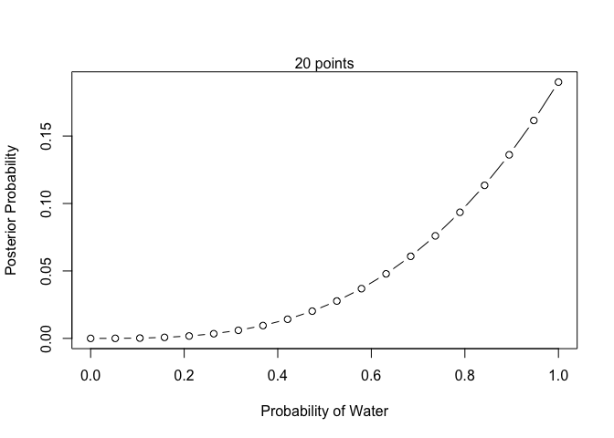
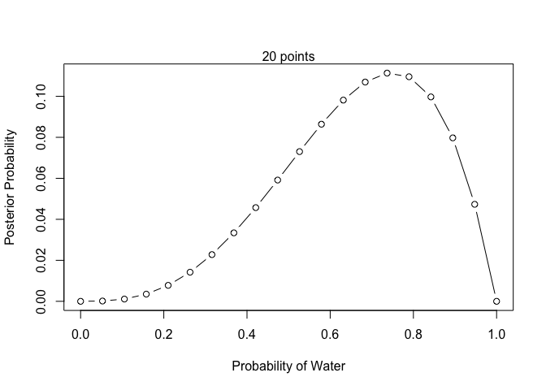
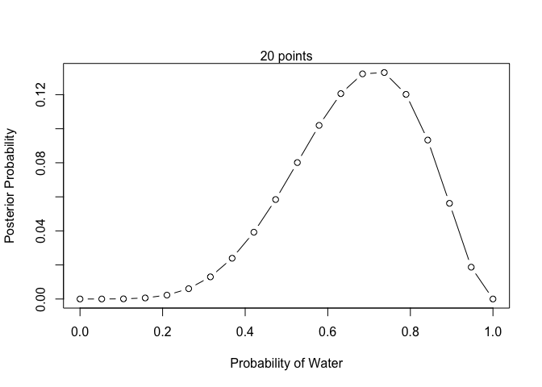
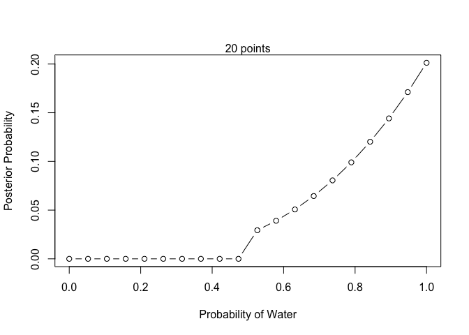
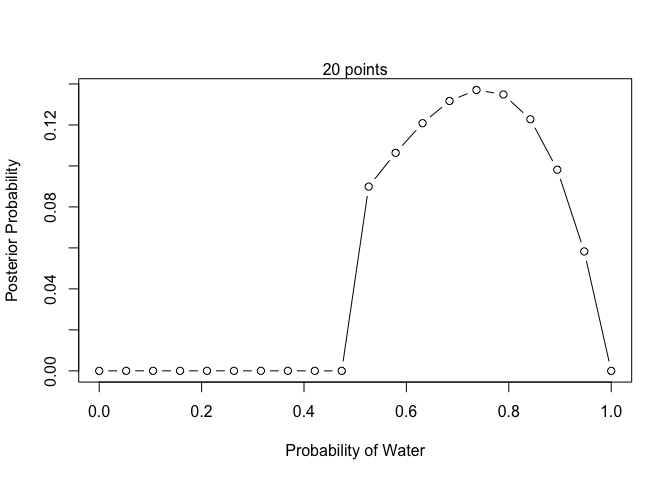
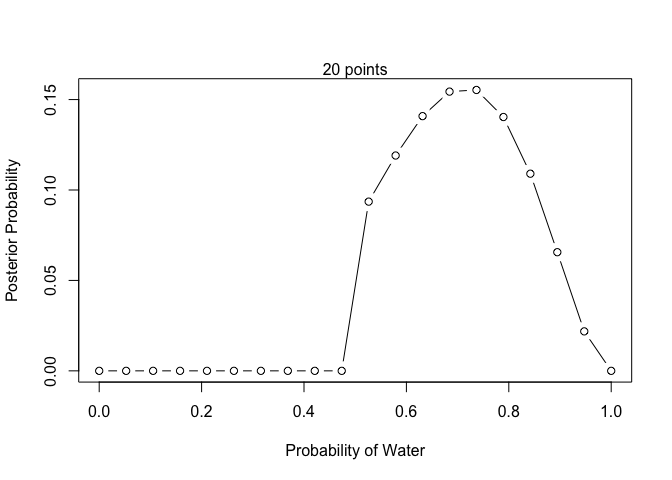

Chapter 2 Exercises
================
Usman Khaliq
2020-04-20

``` r
# Libraries
library(tidyverse)
library(rethinking)
```

2E1. Which of the expressions below correspond to the statement: the
probability of rain on Monday?

1)  Pr(rain)

2)  Pr(rain|Monday)

3)  Pr(Monday|rain)

4)  Pr(rain, Monday)/ Pr(Monday)

Answer: (3)

2E2. Which of the following statements corresponds to the expression:
Pr(Monday|rain)?

1)  The probability of rain on Monday.

2)  The probability of rain, given that it is Monday.

3)  The probability that it is Monday, given that it is raining.

4)  The probability that it is Monday and that it is raining.

Answer: (3)

2E3. Which of the expressions below correspond to the statement: the
probability that it is Monday, given that it is raining?

1)  Pr(Monday|rain)

2)  Pr(rain|Monday)

3)  Pr(rain|Monday) Pr(Monday)

4)  Pr(rain|Monday) Pr(Monday)/ Pr(rain)

5)  Pr(Monday|rain) Pr(rain)/ Pr(Monday)

Answer: (1) and (4)

2E4. The Bayesian statistician Bruno de Finetti (1906–1985) began his
book on probability theory with the declaration: “PROBABILITY DOES NOT
EXIST” The capitals appeared in the original, so I imagine de Finetti
wanted us to shout this statement. What he meant is that probability is
a device for describing uncertainty from the perspective of an observer
with limited knowledge; it has no objective reality. Discuss the globe
tossing example from the chapter, in light of this statement. What does
it mean to say “the probability of water is 0.7”?

In light of the above statement by de Finetti, saying that the
probability of water is 0.7 means that when a person tosses a globe,
there is a 0.7 chance that his index finger will land on water on the
globe, instead of land. The globe tossing experiment is then used as a
model to determine the proportion of land and water that exist in the
world.Therefore, we can interpret that under de Finetti’s statement, the
0.7 probability value doesnt really exist, since it is just an
approximation that our model uses to determine what proportion of the
globe’s surface is actually covered by water.

2M1. Recall the globe tossing model from the chapter. Compute and plot
the grid approximate posterior distribution for each of the following
sets of observations. In each case, assume a uniform prior for p.

1)  W,W,W

<!-- end list -->

``` r
#define grid
p_grid <- seq(from = 0, to = 1, length.out = 20)

#define prior
prior <- rep(1, 20)

#compute likelihood
likelihood <- dbinom(3, 3, prob = p_grid)

#compute product of likelihood and prior
unstd.posterior <- prior * likelihood

#standardise the posterior, so that it sums to 1
posterior <- unstd.posterior / sum(unstd.posterior)

#display the posteriors calculated
plot(
  p_grid,
  posterior,
  type = "b",
  xlab = "Probability of Water",
  ylab = "Posterior Probability"
) 
mtext("20 points")
```

<!-- -->

2)  W, W, W, L

<!-- end list -->

``` r
#define grid
p_grid <- seq(from = 0, to = 1, length.out = 20)

#define prior
prior <- rep(1, 20)

#compute likelihood
likelihood <- dbinom(3, 4, prob = p_grid)

#compute product of likelihood and prior
unstd.posterior <- prior * likelihood

#standardise the posterior, so that it sums to 1
posterior <- unstd.posterior / sum(unstd.posterior)

#display the posteriors calculated
plot(
  p_grid,
  posterior,
  type = "b",
  xlab = "Probability of Water",
  ylab = "Posterior Probability"
) 
mtext("20 points")
```

<!-- -->

3)  L, W, W, L, W, W, W

<!-- end list -->

``` r
#define grid
p_grid <- seq(from = 0, to = 1, length.out = 20)

#define prior
prior <- rep(1, 20)

#compute likelihood
likelihood <- dbinom(5, 7, prob = p_grid)

#compute product of likelihood and prior
unstd.posterior <- prior * likelihood

#standardise the posterior, so that it sums to 1
posterior <- unstd.posterior / sum(unstd.posterior)

#display the posteriors calculated
plot(
  p_grid,
  posterior,
  type = "b",
  xlab = "Probability of Water",
  ylab = "Posterior Probability"
) 
mtext("20 points")
```

<!-- -->

2M2. Now assume a prior for p that is equal to zero when p \< 0.5 and is
a positive constant when p ≥ 0.5. Again compute and plot the grid
approximate posterior distribution for each of the sets of observations
in the problem just above.

1)  W,W,W

<!-- end list -->

``` r
#define grid
p_grid <- seq(from = 0, to = 1, length.out = 20)

#define prior
prior <- if_else(p_grid < 0.5, 0, 1)

#compute likelihood
likelihood <- dbinom(3, 3, prob = p_grid)

#compute product of likelihood and prior
unstd.posterior <- prior * likelihood

#standardise the posterior, so that it sums to 1
posterior <- unstd.posterior / sum(unstd.posterior)

#display the posteriors calculated
plot(
  p_grid,
  posterior,
  type = "b",
  xlab = "Probability of Water",
  ylab = "Posterior Probability"
) 
mtext("20 points")
```

<!-- -->

2)  W, W, W, L

<!-- end list -->

``` r
#define grid
p_grid <- seq(from = 0, to = 1, length.out = 20)

#define prior
prior <- if_else(p_grid < 0.5, 0, 1)

#compute likelihood
likelihood <- dbinom(3, 4, prob = p_grid)

#compute product of likelihood and prior
unstd.posterior <- prior * likelihood

#standardise the posterior, so that it sums to 1
posterior <- unstd.posterior / sum(unstd.posterior)

#display the posteriors calculated
plot(
  p_grid,
  posterior,
  type = "b",
  xlab = "Probability of Water",
  ylab = "Posterior Probability"
) 
mtext("20 points")
```

<!-- -->

3)  L, W, W, L, W, W, W

<!-- end list -->

``` r
#define grid
p_grid <- seq(from = 0, to = 1, length.out = 20)

#define prior
prior <- if_else(p_grid < 0.5, 0, 1)

#compute likelihood
likelihood <- dbinom(5, 7, prob = p_grid)

#compute product of likelihood and prior
unstd.posterior <- prior * likelihood

#standardise the posterior, so that it sums to 1
posterior <- unstd.posterior / sum(unstd.posterior)

#display the posteriors calculated
plot(
  p_grid,
  posterior,
  type = "b",
  xlab = "Probability of Water",
  ylab = "Posterior Probability"
) 
mtext("20 points")
```

<!-- -->

2M3. Suppose there are two globes, one for Earth and one for Mars. The
Earth globe is 70% covered in water. The Mars globe is 100% land.
Further suppose that one of these globes—you don’t know which—was tossed
in the air and produced a “land” observation. Assume that each globe was
equally likely to be tossed. Show that the posterior probability that
the globe was the Earth, conditional on seeing “land” (Pr(Earth|land)),
is 0.23.

We can calculate this answer by using Bayes Theorem. To calculate
Pr(Earth|land), we can use the following:

Pr(Earth|land) = (Pr(Land|Earth) \* Pr(Earth)) / Pr(Land)

Pr(Land) can be regarded as the average likelihood of land. This is
calculated as follows:

``` r
0.5 * 0.3 + 0.5
```

    ## [1] 0.65

Pr(land|Earth) is 0.3, since 70% of the earth is covered in water. Also,
Pr(Earth) is 0.5, because there is a 1 in 2 chance that either the Earth
or the Mars globe was tossed. Therefore, Pr(Earth|land) is as follows:

``` r
(0.5 * 0.3) / (0.5 * 0.3 + 0.5)
```

    ## [1] 0.2307692

2M4. Suppose you have a deck with only three cards. Each card has two
sides, and each side is either black or white. One card has two black
sides. The second card has one black and one white side. The third card
has two white sides. Now suppose all three cards are placed in a bag and
shuffled. Someone reaches into the bag and pulls out a card and places
it flat on a table. A black side is shown facing up, but you don’t know
the color of the side facing down. Show that the probability that the
other side is also black is 2/3. Use the counting method (Section 2 of
the chapter) to approach this problem. This means counting up the ways
that each card could produce the observed data (a black side facing up
on the table).

``` r
likelihood <- c(2, 1, 0)
prior <- rep(1, 3)
unstd.posterior <- likelihood * prior
posterior <- unstd.posterior / sum(unstd.posterior)
posterior[1]
```

    ## [1] 0.6666667

2M5. Now suppose there are four cards: B/B, B/W, W/W, and another B/B.
Again suppose a card is drawn from the bag and a black side appears face
up. Again calculate the probability that the other side is black.

``` r
likelihood <- c(2, 1, 0, 2)
prior <- rep(1, length(likelihood))
unstd.posterior <- likelihood * prior
posterior <- unstd.posterior / sum(unstd.posterior)
posterior[1] + posterior[4]
```

    ## [1] 0.8

2M6. Imagine that black ink is heavy, and so cards with black sides are
heavier than cards with white sides. As a result, it’s less likely that
a card with black sides is pulled from the bag. So again assume there
are three cards: B/B, B/W, and W/W. After experimenting a number of
times, you conclude that for every way to pull the B/B card from the
bag, there are 2 ways to pull the B/W card and 3 ways to pull the W/W
card. Again suppose that a card is pulled and a black side appears face
up. Show that the probability the other side is black is now 0.5. Use
the counting method, as before.

``` r
likelihood <- c(2, 1, 0)
prior <- c(1, 2, 3)
unstd.posterior <- likelihood * prior
posterior <- unstd.posterior / sum(unstd.posterior)
posterior[1]
```

    ## [1] 0.5

2M7. Assume again the original card problem, with a single card showing
a black side face up. Before looking at the other side, we draw another
card from the bag and lay it face up on the table. The face that is
shown on the new card is white. Show that the probability that the first
card, the one showing a black side, has black on its other side is now
0.75. Use the counting method, if you can. Hint: Treat this like the
sequence of globe tosses, counting all the ways to see each observation,
for each possible first card.

Lets assume that card 1 has two black sides, card 2 has one black and 1
white side, and card 3 has 2 white sides

``` r
cards_1_2_likelihood <- 2 * 1
cards_1_3_likelihood <- 2 * 2
cards_2_1_likelihood <- 1 * 0
cards_2_3_likelihood <- 1 * 2
cards_3_2_likelihood <- 0 * 1

likelihood <- c(
  cards_1_2_likelihood,
  cards_1_3_likelihood,
  cards_2_1_likelihood,
  cards_2_3_likelihood,
  cards_3_2_likelihood
  ) 
prior <- rep(1, length(likelihood))
unstd.posterior <- likelihood * prior
posterior <- unstd.posterior / sum(unstd.posterior)
posterior[1] + posterior[2]
```

    ## [1] 0.75

2H1. Suppose there are two species of panda bear. Both are equally
common in the wild and live in the same places. They look exactly alike
and eat the same food, and there is yet no genetic assay capable of
telling them apart. They differ however in their family sizes. Species A
gives birth to twins 10% of the time, otherwise birthing a single
infant. Species B births twins 20% of the time, otherwise birthing
singleton infants. Assume these numbers are known with certainty, from
many years of field research.

Now suppose you are managing a captive panda breeding program. You have
a new female panda of unknown species, and she has just given birth to
twins. What is the probability that her next birth will also be twins?

``` r
a_likelihood <- 0.1
b_likelihood <- 0.2 

likelihood <- c(
  a_likelihood,
  b_likelihood
) 

prior <- rep(1, length(likelihood))

unstd.posterior <- likelihood * prior
posterior <- unstd.posterior / sum(unstd.posterior)
posterior[1] * 0.1 + posterior[2] * 0.2
```

    ## [1] 0.1666667

2H2. Recall all the facts from the problem above. Now compute the
probability that the panda we have is from species A, assuming we have
observed only the first birth and that it was twins.

``` r
a_likelihood <- 0.1
b_likelihood <- 0.2  

prior <- rep(1, length(likelihood))

unstd.posterior <- likelihood * prior
posterior <- unstd.posterior / sum(unstd.posterior)
posterior[1]
```

    ## [1] 0.3333333

2H3. Continuing on from the previous problem, suppose the same panda
mother has a second birth and that it is not twins, but a singleton
infant. Compute the posterior probability that this panda is species A.

``` r
a_likelihood <- 0.1 * 0.9
b_likelihood <- 0.2 * 0.8

likelihood <- c(
  a_likelihood,
  b_likelihood
)

prior <- rep(1, length(likelihood))

unstd.posterior <- likelihood * prior
posterior <- unstd.posterior / sum(unstd.posterior)
posterior[1]
```

    ## [1] 0.36

2H4. A common boast of Bayesian statisticians is that Bayesian inference
makes it easy to use all of the data, even if the data are of different
types.

So suppose now that a veterinarian comes along who has a new genetic
test that she claims can identify the species of our mother panda. But
the test, like all tests, is imperfect. This is the information you have
about the test:

• The probability it correctly identifies a species A panda is 0.8.

• The probability it correctly identifies a species B panda is 0.65.

The vet administers the test to your panda and tells you that the test
is positive for species A. First ignore your previous information from
the births and compute the posterior probability that your panda is
species A. Then redo your calculation, now using the birth data as well.

Lets ignore the information about births for calculating the posterior
probability that the panda is species A.

``` r
a_likelihood <- 0.8
b_likelihood <- 0.65

likelihood <- c(
  a_likelihood,
  b_likelihood
)

prior <- rep(1, length(likelihood))

unstd.posterior <- likelihood * prior
posterior <- unstd.posterior / sum(unstd.posterior)

posterior[1]
```

    ## [1] 0.5517241

Now, lets consider the information about births while calculating the
posterior probability that the panda is from species A.

``` r
a_likelihood <- 0.1 * 0.9
b_likelihood <- 0.2 * 0.8

likelihood <- c(
  a_likelihood,
  b_likelihood
)

prior <- rep(1, length(likelihood))

unstd.posterior_births <- likelihood * prior
posterior_births <- unstd.posterior_births / sum(unstd.posterior_births)

composite_unstd_posterior <- posterior * posterior_births
composite_posterior <- composite_unstd_posterior / sum(composite_unstd_posterior)
composite_unstd_posterior[1]
```

    ## [1] 0.1986207
