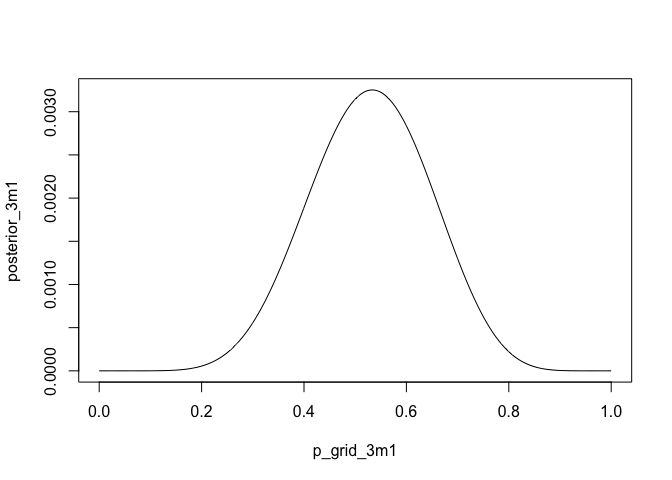
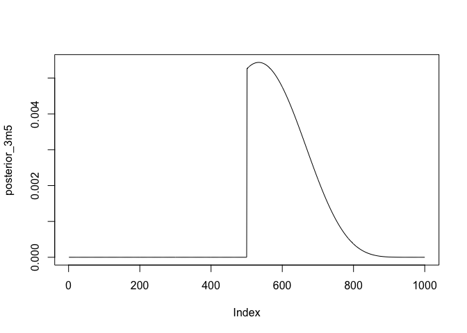
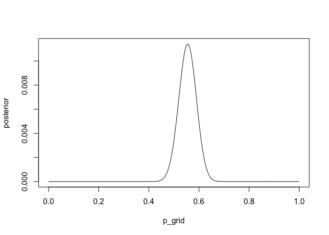
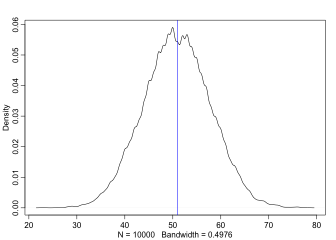
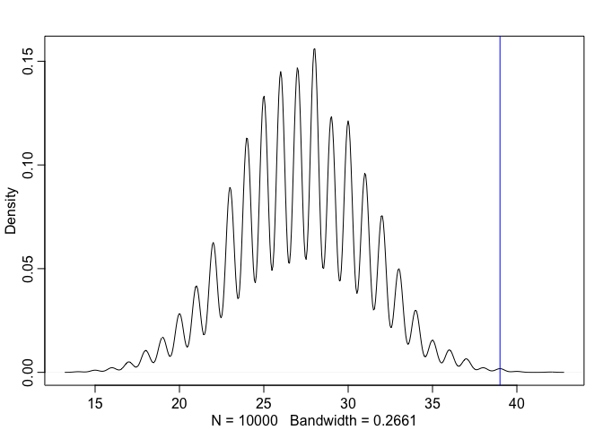

Chapter 3 Exercises
================
Usman Khaliq
2020-04-23

``` r
# Libraries
library(tidyverse)
library(rethinking)
```

``` r
p_grid <- seq(from = 0, to = 1, length.out = 1000)
prior <- rep(1, 1000)
likelihood <- dbinom(6, size = 9, prob = p_grid)
posterior <- likelihood * prior
posterior <- posterior / sum(posterior)
set.seed(100)
samples <- sample(p_grid, prob = posterior, size = 1e4, replace = TRUE)
```

Use the values in `samples` to answer the questions that follow.

3E1. How much posterior probability lies below p = 0.2?

``` r
sum(samples < 0.2) / 1e4 * 100
```

    ## [1] 0.04

0.04% of posterior probability is below 0.2

3E2. How much posterior probability lies above p = 0.8?

``` r
sum(samples > 0.8) / 1e4 * 100
```

    ## [1] 11.16

11.16% of posterior probability lies above 0.8

3E3. How much posterior probability lies between p = 0.2 and p = 0.8?

``` r
sum(samples > 0.2 & samples < 0.8) / 1e4 * 100
```

    ## [1] 88.8

88.8% of posterior probabilities lie between 0.2 and 0.8

3E4. 20% of the posterior probability lies below which value of p?

``` r
quantile(samples, 0.2)
```

    ##       20% 
    ## 0.5185185

20% of posterior probabilities lie below value of 0.5185185

3E5. 20% of the posterior probability lies above which value of p?

``` r
quantile(samples, 0.8)
```

    ##       80% 
    ## 0.7557558

20% of posterior probabilities lie above value of 0.7557558

3E6. Which values of p contain the narrowest interval equal to 66% of
the posterior probability?

``` r
HPDI(samples, prob = 0.66)
```

    ##     |0.66     0.66| 
    ## 0.5085085 0.7737738

0.5085085 and 0.7737738 contain 60% of the posterior probability values.

3E7. Which values of p contain 66% of the posterior probability,
assuming equal posterior probability both below and above the interval?

``` r
PI(samples, prob = 0.60)
```

    ##       20%       80% 
    ## 0.5185185 0.7557558

0.5185185 and 0.7557558 contain 60% of the posterior probability

3M1. Suppose the globe tossing data had turned out to be 8 water in 15
tosses. Construct the posterior distribution, using grid approximation.
Use the same flat prior as before.

``` r
p_grid_3m1 <- seq(from = 0, to = 1, length.out = 1000)
prior <- rep(1, 1000)
likelihood <- dbinom(8, size = 15, prob = p_grid_3m1)
posterior_3m1 <- prior * likelihood
posterior_3m1 <- posterior_3m1 / sum(posterior_3m1)
plot(posterior_3m1 ~ p_grid_3m1, type = "l")
```

<!-- -->

3M2. Draw 10,000 samples from the grid approximation from above. Then
use the samples to calculate the 90% HPDI for p.

``` r
samples <- 
  sample(
    p_grid_3m1,
    prob = posterior_3m1,
    size = 10000,
    replace = TRUE
  ) 

HPDI(samples, prob = 0.90)
```

    ##      |0.9      0.9| 
    ## 0.3293293 0.7167167

The 90% HPDI for p is betwen 0.3413412 and 0.7307307.

3M3. Construct a posterior predictive check for this model and data.
This means simulate the distribution of samples, averaging over the
posterior uncertainty in p. What is the probability of observing 8 water
in 15 tosses?

``` r
posterior_pred_check <- rbinom(10000, size = 15, prob = samples)
sum(posterior_pred_check == 8) / 10000 
```

    ## [1] 0.1444

The probability of observing 8 water in 15 tosses is 15.06%

3M4. Using the posterior distribution constructed from the new (8/15)
data, now calculate the probability of observing 6 water in 9 tosses.

``` r
posterior_pred_check <- rbinom(10000, size = 9, prob = samples)
sum(posterior_pred_check == 6) / 10000 
```

    ## [1] 0.1751

The probability of observing 6 water in 9 tosses is 17.93%

3M5. Start over at 3M1, but now use a prior that is zero below p = 0.5
and a constant above p = 0.5. This corresponds to prior information that
a majority of the Earth’s surface is water. Repeat each problem above
and compare the inferences. What difference does the better prior make?
If it helps, compare inferences (using both priors) to the true value p
= 0.7.

``` r
p_grid_3m5 <- seq(from = 0, to = 1, length.out = 1000)
prior_3m5 <- ifelse(p_grid_3m5 < 0.5, 0, 1)
likelihood <- dbinom(8, size = 15, prob = p_grid_3m5)
posterior_3m5 <- prior_3m5 * likelihood
posterior_3m5 <- posterior_3m5 / sum(posterior_3m5)
plot(posterior_3m5 ~ posterior_3m5, type = "l")
```

    ## Warning in plot.formula(posterior_3m5 ~ posterior_3m5, type = "l"): the formula
    ## 'posterior_3m5 ~ posterior_3m5' is treated as 'posterior_3m5 ~ 1'

<!-- -->

``` r
samples_3m5 <- 
  sample(
    p_grid_3m5,
    prob = posterior_3m5,
    size = 10000,
    replace = TRUE
  ) 

HPDI(samples_3m5, prob = 0.90)
```

    ##      |0.9      0.9| 
    ## 0.5005005 0.7117117

The 90% HPDI for p is betwen 0.5005005 and 0.7127.

``` r
posterior_pred_check_3m5 <- rbinom(10000, size = 15, prob = samples_3m5)
sum(posterior_pred_check_3m5 == 8) / 10000 
```

    ## [1] 0.1589

The probability of observing 8 water in 15 tosses is 15.21%

``` r
data(homeworkch3)
sum(birth1) + sum(birth2)
```

    ## [1] 111

3H1. Using grid approximation, compute the posterior distribution for
the probability of a birth being a boy. Assume a uniform prior
probability. Which parameter value maximizes the posterior probability?

``` r
total_births <- length(birth1) + length(birth2)
total_boys <- sum(birth1) + sum(birth2)
total_girls <- total_births - total_boys

p_grid <- seq(from = 0, to = 1, length.out = 1000)
prior <- rep(1, 1000)
likelihood <- dbinom(x = total_boys, size = total_births, prob = p_grid)
posterior_unstandardised <- likelihood * prior
posterior <- posterior_unstandardised / sum(posterior_unstandardised)
plot(posterior ~ p_grid, type = "l")
```

<!-- -->

``` r
p_grid[which.max(posterior)]
```

    ## [1] 0.5545546

A parameter value of 0.5545546 maximises the posterior probability.

3H2. Using the sample function, draw 10,000 random parameter values from
the posterior distribution you calculated above. Use these samples to
estimate the 50%, 89%, and 97% highest posterior density intervals.

``` r
samples_3h2 <- sample(p_grid, prob = posterior, size = 10000, replace = TRUE)
HPDI(samples_3h2, prob = 0.50)
```

    ##      |0.5      0.5| 
    ## 0.5255255 0.5725726

``` r
HPDI(samples_3h2, prob = 0.89)
```

    ##     |0.89     0.89| 
    ## 0.4964965 0.6076076

``` r
HPDI(samples_3h2, prob = 0.97)
```

    ##     |0.97     0.97| 
    ## 0.4774775 0.6286286

The 50% highest posterior density intervals are 0.5255255 and 0.5725726.
The 89% highest posterior density intervals are 0.4964965 and 0.6076076
The 97% highest posterior density intervals are 0.4794795 and 0.6296296

3H3. Use rbinom to simulate 10,000 replicates of 200 births. You should
end up with 10,000 numbers, each one a count of boys out of 200 births.
Compare the distribution of predicted numbers of boys to the actual
count in the data (111 boys out of 200 births). There are many good ways
to visualize the simulations, but the dens command (part of the
rethinking package) is probably the easiest way in this case. Does it
look like the model fits the data well? That is, does the distribution
of predictions include the actual observation as a central, likely
outcome?

``` r
simulated_births_3h3 <- rbinom(10000, size = 200, prob = samples_3h2)
dens(simulated_births_3h3)
abline(v = total_boys, col = "blue")
```

<!-- -->

Yes, the model fits the data well, since the actual number of boys born
is observed as the central, likely outcome of the model.

3H4. Now compare 10,000 counts of boys from 100 simulated first borns
only to the number of boys in the first births, birth1. How does the
model look in this light?

``` r
likelihood <- dbinom(x = sum(birth1), size = length(birth1), prob = p_grid)
posterior_unstandardised <- likelihood * prior
posterior <- posterior_unstandardised / sum(posterior_unstandardised)
samples_3h4 <- sample(p_grid, prob = posterior, size = 10000, replace = TRUE)
simulated_births_3h4 <- rbinom(10000, size = 100, prob = samples_3h4)
dens(simulated_births_3h4)
abline(v = sum(birth1), col = "blue")
```

<!-- -->

The model has fit the data well.

3H5. The model assumes that sex of first and second births are
independent. To check this assumption, focus now on second births that
followed female first borns. Compare 10,000 simulated counts of boys to
only those second births that followed girls. To do this correctly, you
need to count the number of first borns who were girls and simulate that
many births, 10,000 times. Compare the counts of boys in your
simulations to the actual observed count of boys following girls. How
does the model look in this light? Any guesses what is going on in these
data?

``` r
boys_born_after_girls <- birth2[birth1 == 0]
simulated_births_3h5 <- 
  rbinom(
    10000,
    size = length(boys_born_after_girls),
    prob = samples_3h2
  ) 
dens(simulated_births_3h5)
abline(v = sum(boys_born_after_girls), col = "blue")
```

<!-- -->

The observed value is very far from the majority value suggested by the
model, which hints at the fact that this model does not fit the data
well, and that the sex of first and second children are not independent.
This can either mean that there is some biological factor that dictates
that the sex of the first child determines the sex of the second child,
or it can also mean that the data itself might be biased, and it is most
probably not including data about females that might be born after
females.
