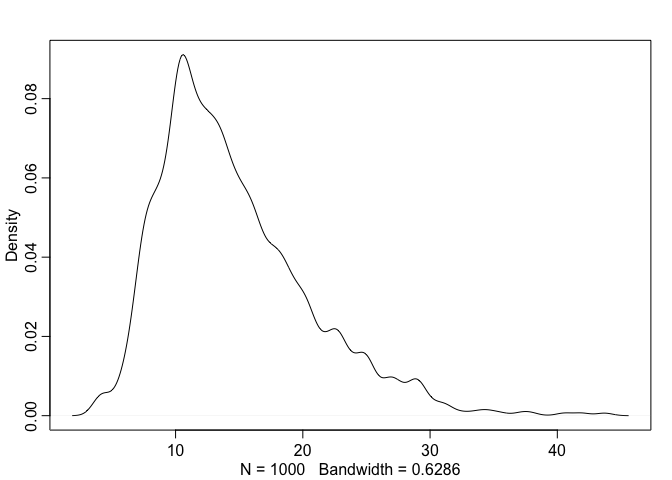
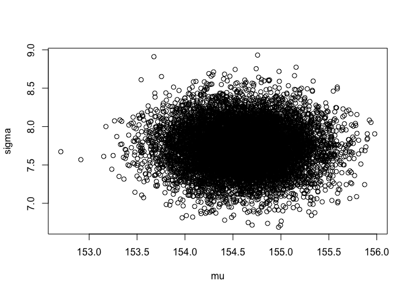
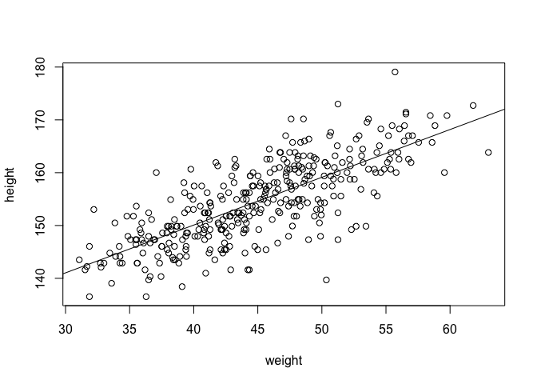

Chapter 4
================
Usman Khaliq
2020-04-26

``` r
# Libraries
library(tidyverse)
library(rethinking)
```

R Code 4.1

``` r
pos <- replicate(1000, sum(runif(16, -1, 1))) 

hist(pos)
```

<!-- -->

``` r
plot(density(pos))
```

<!-- -->

R Code 4.2

``` r
prod(1 + runif(12, 0, 0.1))
```

    ## [1] 1.674814

R code 4.3

``` r
growth <- replicate(1000, prod(1 + runif(12, 0, 0.1)))
dens(growth, norm.comp = TRUE)
```

<!-- -->

R Code 4.4

Small effects that multiple together are approximately additive. Lets
explore this phenomenon visually.

``` r
big <- replicate(1000, prod(1 + runif(12, 0, 0.5)))
small <- replicate(1000, prod(1 + runif(12, 0, 0.01)))
```

``` r
dens(big)
```

<!-- -->

``` r
dens(small)
```

<!-- -->

R Code 4.5

Large deviations tend to produce Gaussean distributions at the log scale

``` r
log.big <- replicate(1000, log(prod(1 + runif(12, 0., 0.5))))
dens(log.big)
```

<!-- -->

R Code 4.7

``` r
data("Howell1")
d <- Howell1
glimpse(d)
```

    ## Rows: 544
    ## Columns: 4
    ## $ height <dbl> 151.7650, 139.7000, 136.5250, 156.8450, 145.4150, 163.8300, 14…
    ## $ weight <dbl> 47.82561, 36.48581, 31.86484, 53.04191, 41.27687, 62.99259, 38…
    ## $ age    <dbl> 63.0, 63.0, 65.0, 41.0, 51.0, 35.0, 32.0, 27.0, 19.0, 54.0, 47…
    ## $ male   <int> 1, 0, 0, 1, 0, 1, 0, 1, 0, 1, 0, 1, 0, 0, 0, 1, 1, 0, 1, 0, 0,…

Filter out heights of adults only from the dataset, since height is
strongly correlated with age before adulthood

``` r
d2 <- 
  d %>% 
  filter(age >= 18) 

glimpse(d2)
```

    ## Rows: 352
    ## Columns: 4
    ## $ height <dbl> 151.7650, 139.7000, 136.5250, 156.8450, 145.4150, 163.8300, 14…
    ## $ weight <dbl> 47.82561, 36.48581, 31.86484, 53.04191, 41.27687, 62.99259, 38…
    ## $ age    <dbl> 63.0, 63.0, 65.0, 41.0, 51.0, 35.0, 32.0, 27.0, 19.0, 54.0, 47…
    ## $ male   <int> 1, 0, 0, 1, 0, 1, 0, 1, 0, 1, 0, 1, 0, 0, 0, 1, 1, 0, 1, 0, 1,…

``` r
d2 %>% 
  ggplot(aes(height)) +
  geom_density()
```

<!-- -->

Adult height seems to be normally distributed, perhaps because height is
a sum of many small growth factors.

R Code 4.11

``` r
curve(dnorm(x, 178, 20), from = 100, to = 250)
```

<!-- -->

The prior above states that the average height is between 140 and 220 cm

R Code 4.12

``` r
curve(dunif(x, 0, 50), from = -10, to = 60)
```

<!-- -->

The above states that a standard deviation of 50 cm means that 95% of
individual heights lie within 100 cm of the average height.

R Code 4.13

We can simulate the prior distribution of individual heights from the
prior probability distribution values of the entire distribution. We can
do this by sampling from the prior.

``` r
sample_mu <- rnorm(1e4, 178, 20)
sample_sigma <- runif(1e4, 0, 50)
prior_h <- rnorm(1e4, sample_mu, sample_sigma)
dens(prior_h)
```

<!-- -->

R Code 4.14

Grid approximation of the posterior distribution

``` r
mu.list <- seq(from = 140, to = 160, length.out = 200)
sigma.list <- seq(from = 4, to = 9, length.out = 200)
post <- expand.grid(mu = mu.list, sigma = sigma.list)
post$LL <- sapply(1:nrow(post), function(i) sum(dnorm(
                  d2$height,
                  mean = post$mu[i],
                  sd = post$sigma[i],
                  log = TRUE)) 
            ) 
post$prod <- post$LL + dnorm(post$mu, 178, 20, TRUE) + 
  dunif(post$sigma, 0, 50, TRUE)

post$prob <- exp(post$prod - max(post$prod))
```

R Code 4.15

Inspect the posterior distribution visually

``` r
contour_xyz(post$mu, post$sigma, post$prob)
```

<!-- -->

R Code 4.16

Inspect the posterior distribution with a heatmap

``` r
image_xyz(post$mu, post$sigma, post$prob)
```

<!-- -->

R Code 4.17

Now, lets sample parameter values from posterior distribution. Since
there are two parameter values and we want to sample combinations of
them, we can start by first randomly sampling row numbers in `post` in
proportion to the values in post$prob.

``` r
sample.rows <- sample(1:nrow(post), size = 1e4, replace = TRUE, prob = post$prob)
sample.mu <- post$mu[sample.rows]
sample.sigma <- post$sigma[sample.rows]
```

R Code 4.18

Lets take a look at the 10000 sampled values of mu and sigma.

``` r
plot(sample.mu, sample.sigma, cex = 0.5, pch = 16, col = col.alpha(rangi2, 0.1))
```

<!-- -->

Now, lets describe the distribution of confidence in each combination of
mu and sigma.

R Code 4.19

``` r
dens(sample.mu)
```

<!-- -->

``` r
dens(sample.sigma)
```

<!-- -->

R Code 4.20

Lets summarise the highest posterior density intervals

``` r
HPDI(sample.mu)
```

    ##    |0.89    0.89| 
    ## 153.8693 155.1759

``` r
HPDI(sample.sigma)
```

    ##    |0.89    0.89| 
    ## 7.266332 8.195980

R Code 4.25

Lets use the `map` function in the rethinking package to use quadratic
approximation to determine the shape of the posterior distribution.

``` r
flist <- alist(
  height ~ dnorm(mu, sigma),
  mu ~ dnorm(178, 20),
  sigma ~ dunif(0, 50)
)
```

``` r
m4.1 <- rethinking::map(flist, data = d2)
```

``` r
precis(m4.1)
```

    ##             mean        sd       5.5%      94.5%
    ## mu    154.606843 0.4120133 153.948367 155.265320
    ## sigma   7.731683 0.2914190   7.265939   8.197427

R Code 4.29

Lets use stronger priors now.

``` r
m4.2 <- rethinking::map(
  alist(
    height ~ dnorm(mu, sigma),
    mu ~ dnorm(178, 0.1),
    sigma ~ dunif(0, 50)
  ), 
  data = d2
)

precis(m4.2)
```

    ##            mean        sd      5.5%     94.5%
    ## mu    177.86370 0.1002354 177.70351 178.02390
    ## sigma  24.51107 0.9283120  23.02744  25.99469

R Code 4.30

To see the variance-covariance matrix, we can run the following

``` r
vcov(m4.1)
```

    ##                 mu        sigma
    ## mu    0.1697549362 0.0002141146
    ## sigma 0.0002141146 0.0849250211

R Code 4.31

The following is a vector of variances of the parameters

``` r
diag(vcov(m4.1))
```

    ##         mu      sigma 
    ## 0.16975494 0.08492502

The following is a correlation matrix that tells us how changes in one
parameter leads to corresponding changes in the other parameter

``` r
cov2cor(vcov(m4.1))
```

    ##                mu       sigma
    ## mu    1.000000000 0.001783271
    ## sigma 0.001783271 1.000000000

R Code 4.32

Here is how we can get samples from multi-dimensional posterior
distributions.

``` r
post <- extract.samples(m4.1, n = 1e4)
head(post)
```

    ##         mu    sigma
    ## 1 154.9494 7.484731
    ## 2 155.1267 8.099193
    ## 3 154.2801 7.286260
    ## 4 154.7702 7.693325
    ## 5 154.0143 7.858913
    ## 6 154.3117 8.012382

``` r
plot(post)
```

<!-- -->

R Code 4.37

``` r
plot(d2$height ~ d2$weight)
```

<!-- -->

R Code 4.38

Fit a linear model.

``` r
m4.3 <- rethinking::map(
  alist(
    height ~ dnorm(mu, sigma),
    mu <- a + b * weight,
    a ~ dnorm(178, 100),
    b ~ dnorm(0, 10),
    sigma ~ dunif(0, 50)
  ),
data = d2
)
```

R code 4.40

``` r
precis(m4.3)
```

    ##              mean         sd        5.5%       94.5%
    ## a     113.9036904 1.90528367 110.8586791 116.9487017
    ## b       0.9044931 0.04192046   0.8374961   0.9714901
    ## sigma   5.0719110 0.19115737   4.7664046   5.3774174

R Code 4.41

``` r
cov2cor(vcov(m4.3))
```

    ##                   a             b         sigma
    ## a      1.0000000000 -0.9898830275  0.0009608935
    ## b     -0.9898830275  1.0000000000 -0.0009634135
    ## sigma  0.0009608935 -0.0009634135  1.0000000000

R Code 4.42

Lets center the values now using Centering

``` r
d2$weight.c <- d2$weight - mean(d2$weight)
```

R Code 4.43

Now, lets refit the model using the centered values of the weights

``` r
m4.4 <- rethinking::map(
  alist(
    height ~ dnorm(mu, sigma),
    mu <- a + b * weight.c,
    a ~ dnorm(178, 100),
    b ~ dnorm(0, 10),
    sigma ~ dunif(0, 50)
  ),
  data = d2
)
```

``` r
precis(m4.4, corr = TRUE)
```

    ##              mean         sd       5.5%       94.5%
    ## a     154.5972648 0.27033119 154.165223 155.0293063
    ## b       0.9050104 0.04192765   0.838002   0.9720189
    ## sigma   5.0718813 0.19115455   4.766379   5.3773832

``` r
cov2cor(vcov(m4.4))
```

    ##                   a             b         sigma
    ## a      1.000000e+00 -2.255427e-09  4.802626e-05
    ## b     -2.255427e-09  1.000000e+00 -3.354715e-05
    ## sigma  4.802626e-05 -3.354715e-05  1.000000e+00

R Code 4.45

Lets superimpose the MAP values for mean height over the actual data

``` r
plot(height ~ weight, data = d2)
abline(a = coef(m4.3)["a"], b = coef(m4.3)["b"])
```

<!-- -->

R Code 4.46

Lets appreciate that the posterior distribution contains multiple fit
lines and not just one. Lets extract some samples from the model.

``` r
post <- extract.samples(m4.3)
```

``` r
post[1:5,]
```

    ##          a         b    sigma
    ## 1 110.5875 0.9726238 5.374387
    ## 2 110.6633 0.9791111 5.232169
    ## 3 115.5391 0.8710168 4.950270
    ## 4 115.0610 0.8869631 5.125474
    ## 5 113.5718 0.9194315 5.004538

R Code 4.48

Lets display the scatter lines for specific chunks of the points, to
show how the fit lines converge as more data is added.

``` r
N <- 10
dN <- d2[1:N, ]
mN <- rethinking::map(
  alist(
    height ~ dnorm(mu, sigma),
    mu <- a + b * weight,
    a ~ dnorm(178, 100),
    b ~ dnorm(0, 10),
    sigma ~ dunif(0, 50)
  ), 
  data = dN
)
```

Lets plot the first 20 lines

``` r
#extract 20 samples from the posterior
post <- extract.samples(mN, n = 20)

#display raw data and sample size
plot(
  dN$weight,
  dN$height,
  xlim = range(d2$weight),
  ylim = range(d2$height),
  col = rangi2,
  xlab = "weight",
  ylab = "height"
  ) 
mtext(concat("N =", N)) 

#plot the lines with transparency
for(i in 1:20)
  abline(a = post$a[i], b = post$b[i], col = col.alpha("black", 0.3))
```

<!-- -->

Lets plot 20 lines for N = 50

``` r
N <- 50
dN <- d2[1:N, ]
mN <- rethinking::map(
  alist(
    height ~ dnorm(mu, sigma),
    mu <- a + b * weight,
    a ~ dnorm(178, 100),
    b ~ dnorm(0, 10),
    sigma ~ dunif(0, 50)
  ), 
  data = dN
)
```

``` r
#extract 20 samples from the posterior
post <- extract.samples(mN, n = 20)

#display raw data and sample size
plot(
  dN$weight,
  dN$height,
  xlim = range(d2$weight),
  ylim = range(d2$height),
  col = rangi2,
  xlab = "weight",
  ylab = "height"
  ) 
mtext(concat("N =", N)) 

#plot the lines with transparency
for(i in 1:20)
  abline(a = post$a[i], b = post$b[i], col = col.alpha("black", 0.3))
```

<!-- -->

Lets plot 20 lines for N = 150

``` r
N <- 150
dN <- d2[1:N, ]
mN <- rethinking::map(
  alist(
    height ~ dnorm(mu, sigma),
    mu <- a + b * weight,
    a ~ dnorm(178, 100),
    b ~ dnorm(0, 10),
    sigma ~ dunif(0, 50)
  ), 
  data = dN
)
```

``` r
#extract 20 samples from the posterior
post <- extract.samples(mN, n = 20)

#display raw data and sample size
plot(
  dN$weight,
  dN$height,
  xlim = range(d2$weight),
  ylim = range(d2$height),
  col = rangi2,
  xlab = "weight",
  ylab = "height"
  ) 
mtext(concat("N =", N)) 

#plot the lines with transparency
for(i in 1:20)
  abline(a = post$a[i], b = post$b[i], col = col.alpha("black", 0.3))
```

<!-- -->

Lets plot 20 lines for N = 352

``` r
N <- 352
dN <- d2[1:N, ]
mN <- rethinking::map(
  alist(
    height ~ dnorm(mu, sigma),
    mu <- a + b * weight,
    a ~ dnorm(178, 100),
    b ~ dnorm(0, 10),
    sigma ~ dunif(0, 50)
  ), 
  data = dN
)
```

``` r
#extract 20 samples from the posterior
post <- extract.samples(mN, n = 20)

#display raw data and sample size
plot(
  dN$weight,
  dN$height,
  xlim = range(d2$weight),
  ylim = range(d2$height),
  col = rangi2,
  xlab = "weight",
  ylab = "height"
  ) 
mtext(concat("N =", N)) 

#plot the lines with transparency
for(i in 1:20)
  abline(a = post$a[i], b = post$b[i], col = col.alpha("black", 0.3))
```

<!-- -->

From the above plots, we can see that as the sample size increases, the
cloud of regression lines grows more compact since the model becomes
more confident about the location of the mean.

R Code 4.50

Lets look at plotting regression intervals and countours. The interval
around regression incorporates uncertainty in both alpha and beta
values. To understand this, lets look on a single weight value, eg 50kg.
Lets make a list of 10,000 values for mu for a weight of 50kg.

``` r
mu_at_50 <- post$a + post$b * 50
dens(mu_at_50, col = rangi2, lwd = 2, xlab = "mu|weight = 50kg")
```

<!-- -->

Now, lets find the 89% highest posterior density interval for mu at
50kg.

``` r
HPDI(mu_at_50, prob = 0.89)
```

    ##    |0.89    0.89| 
    ## 158.6862 159.5913

R Code 4.53 The following code draws up 1000 samples by default from
posterior distribution. Each column is a case(row) in the data, since
there are 352 rows in d2, there will be 352 columns in the following

``` r
mu <- link(m4.3)
str(mu)
```

    ##  num [1:1000, 1:352] 157 157 157 156 157 ...

R Code 4.54

With the following code block, we want to find a distribution of mu for
each unique weight value on the horizontal axis.

``` r
#define sequence of weights to compute predictions for . These values will be on the horizontal axis
weight.seq <- seq(from = 25, to = 70, by = 1)

mu <- link(m4.3, data = data.frame(weight = weight.seq))
str(mu)
```

    ##  num [1:1000, 1:46] 136 136 137 136 136 ...

R Code 4.55

Lets plot the distribution of the values of mu for each height value.

``` r
#use type "n" to hide raw data
plot(height ~ weight, d2, type = "n")

for(i in 1:100)
  points(weight.seq, mu[i,], pch = 16, col = col.alpha(rangi2, 0.1))
```

<!-- -->

In the above, each pile of points shows the Gaussean uncertainty in the
value of mu at a specific weight value.

R Code 4.56

Finally, sumarise the distribution for each weight value.

``` r
mu.mean <- apply(mu, 2, mean)
mu.HPDI <- apply(mu, 2, HPDI, prob = 0.89)
```

R Code 4.57

Finally, plot `mu.mean` and `mu.HPDI` on top of the original data.

``` r
plot(height ~ weight, data = d2, col = col.alpha(rangi2, 0.5))

#plot the MAP line, aka the mean mu for each weight
lines(weight.seq, mu.mean)

#plot a shaded region for 89% HPDI
shade(mu.HPDI, weight.seq)
```

<!-- -->

R Code 4.59

To plot the 89% prediction interval for actual heights, we need to
incorporate the sigma in the predictions of the heights. To do this, we
imagine simulated heights. For any unique weight value, sample from the
Gaussean distribution with the correct mean mu, using the value of sigma
that was stated in the model.

``` r
sim.height <- sim(m4.3, data = list(weight = weight.seq))
str(sim.height)
```

    ##  num [1:1000, 1:46] 135 139 146 144 135 ...

R Code 4.60

Summarise the simulated heights

``` r
height.PI <- apply(sim.height, 2, PI, prob = 0.89)
```

`height.PI` contains the 89% posterior prediction interval of observable
heights across the values of weights in `weight.seq`.

R Code 4.61

Lets plot everything.

1.  The MAP line
2.  The shaded region of 89% of plausible mu values 3 . The boundaries
    of the simulated heights that the model expects.

<!-- end list -->

``` r
plot(height ~ weight, data = d2, col = col.alpha(rangi2, 0.5))

#draw MAP line
lines(weight.seq, mu.mean)

#draw HPDI region for line
shade(mu.HPDI, weight.seq)

# draw PI region for simulated heights
shade(height.PI, weight.seq)
```

<!-- -->

R Code 4.65

``` r
d$weight.s <- (d$weight - mean(d$weight)) / sd(d$weight)
```

R Code 4.66

``` r
d$weight.s2 <- d$weight.s^2

m4.5 <- rethinking::map(
  alist(
    height ~ dnorm(mu, sigma),
    mu <- a + b1 * weight.s + b2 * weight.s2,
    a ~ dnorm(178, 100),
    b1 ~ dnorm(0, 10),
    b2 ~ dnorm(0, 10),
    sigma ~ dunif(0, 50)
  ),
  data = d
)
```

R Code 4.68

``` r
weight.seq <- seq(from = -2.2, to = 2, length.out = 30)
pred_dat <- list(weight.s = weight.seq, weight.s2 = weight.seq^2)
mu <- link(m4.5, data = pred_dat)
mu.mean <- apply(mu, 2, mean)
mu.PI <- apply(mu, 2, PI, prob = 0.89)
sim.height <- sim(m4.5, data = pred_dat)
height.PI <- apply(sim.height, 2, PI, prob = 0.89)
```

``` r
plot(height ~ weight.s, d, col = col.alpha(rangi2, 0.5))
lines(weight.seq, mu.mean)
shade(mu.PI, weight.seq)
shade(height.PI, weight.seq)
```

<!-- -->
