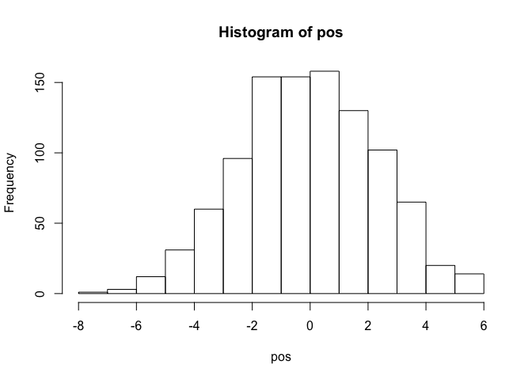
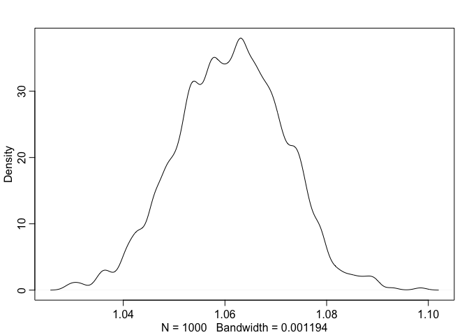
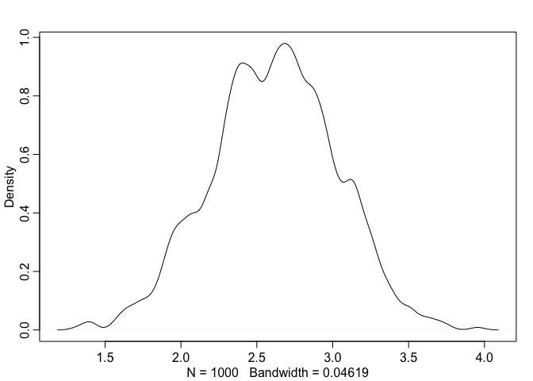

Chapter 4
================
Usman Khaliq
2020-04-25

``` r
# Libraries
library(tidyverse)
library(rethinking)
```

R Code 4.1

``` r
pos <- replicate(1000, sum(runif(16, -1, 1))) 

hist(pos)
```

<!-- -->

``` r
plot(density(pos))
```

<!-- -->

R Code 4.2

``` r
prod(1 + runif(12, 0, 0.1))
```

    ## [1] 1.726763

R code 4.3

``` r
growth <- replicate(1000, prod(1 + runif(12, 0, 0.1)))
dens(growth, norm.comp = TRUE)
```

<!-- -->

R Code 4.4

Small effects that multiple together are approximately additive. Lets
explore this phenomenon visually.

``` r
big <- replicate(1000, prod(1 + runif(12, 0, 0.5)))
small <- replicate(1000, prod(1 + runif(12, 0, 0.01)))
```

``` r
dens(big)
```

<!-- -->

``` r
dens(small)
```

<!-- -->

R Code 4.5

Large deviations tend to produce Gaussean distributions at the log scale

``` r
log.big <- replicate(1000, log(prod(1 + runif(12, 0., 0.5))))
dens(log.big)
```

<!-- -->

R Code 4.7

``` r
data("Howell1")
d <- Howell1
glimpse(d)
```

    ## Rows: 544
    ## Columns: 4
    ## $ height <dbl> 151.7650, 139.7000, 136.5250, 156.8450, 145.4150, 163.8300, 14…
    ## $ weight <dbl> 47.82561, 36.48581, 31.86484, 53.04191, 41.27687, 62.99259, 38…
    ## $ age    <dbl> 63.0, 63.0, 65.0, 41.0, 51.0, 35.0, 32.0, 27.0, 19.0, 54.0, 47…
    ## $ male   <int> 1, 0, 0, 1, 0, 1, 0, 1, 0, 1, 0, 1, 0, 0, 0, 1, 1, 0, 1, 0, 0,…

Filter out heights of adults only from the dataset, since height is
strongly correlated with age before adulthood

``` r
d2 <- 
  d %>% 
  filter(age >= 18) 

glimpse(d2)
```

    ## Rows: 352
    ## Columns: 4
    ## $ height <dbl> 151.7650, 139.7000, 136.5250, 156.8450, 145.4150, 163.8300, 14…
    ## $ weight <dbl> 47.82561, 36.48581, 31.86484, 53.04191, 41.27687, 62.99259, 38…
    ## $ age    <dbl> 63.0, 63.0, 65.0, 41.0, 51.0, 35.0, 32.0, 27.0, 19.0, 54.0, 47…
    ## $ male   <int> 1, 0, 0, 1, 0, 1, 0, 1, 0, 1, 0, 1, 0, 0, 0, 1, 1, 0, 1, 0, 1,…

``` r
d2 %>% 
  ggplot(aes(height)) +
  geom_density()
```

<!-- -->

Adult height seems to be normally distributed, perhaps because height is
a sum of many small growth factors.

R Code 4.11

``` r
curve(dnorm(x, 178, 20), from = 100, to = 250)
```

<!-- -->

The prior above states that the average height is between 140 and 220 cm

R Code 4.12

``` r
curve(dunif(x, 0, 50), from = -10, to = 60)
```

<!-- -->

The above states that a standard deviation of 50 cm means that 95% of
individual heights lie within 100 cm of the average height.

R Code 4.13

We can simulate the prior distribution of individual heights from the
prior probability distribution values of the entire distribution. We can
do this by sampling from the prior.

``` r
sample_mu <- rnorm(1e4, 178, 20)
sample_sigma <- runif(1e4, 0, 50)
prior_h <- rnorm(1e4, sample_mu, sample_sigma)
dens(prior_h)
```

<!-- -->

R Code 4.14

Grid approximation of the posterior distribution

``` r
mu.list <- seq(from = 140, to = 160, length.out = 200)
sigma.list <- seq(from = 4, to = 9, length.out = 200)
post <- expand.grid(mu = mu.list, sigma = sigma.list)
post$LL <- sapply(1:nrow(post), function(i) sum(dnorm(
                  d2$height,
                  mean = post$mu[i],
                  sd = post$sigma[i],
                  log = TRUE)) 
            ) 
post$prod <- post$LL + dnorm(post$mu, 178, 20, TRUE) + 
  dunif(post$sigma, 0, 50, TRUE)

post$prob <- exp(post$prod - max(post$prod))
```

R Code 4.15

Inspect the posterior distribution visually

``` r
contour_xyz(post$mu, post$sigma, post$prob)
```

<!-- -->

R Code 4.16

Inspect the posterior distribution with a heatmap

``` r
image_xyz(post$mu, post$sigma, post$prob)
```

<!-- -->

R Code 4.17

Now, lets sample parameter values from posterior distribution. Since
there are two parameter values and we want to sample combinations of
them, we can start by first randomly sampling row numbers in `post` in
proportion to the values in post$prob.

``` r
sample.rows <- sample(1:nrow(post), size = 1e4, replace = TRUE, prob = post$prob)
sample.mu <- post$mu[sample.rows]
sample.sigma <- post$sigma[sample.rows]
```

R Code 4.18

Lets take a look at the 10000 sampled values of mu and sigma.

``` r
plot(sample.mu, sample.sigma, cex = 0.5, pch = 16, col = col.alpha(rangi2, 0.1))
```

<!-- -->

Now, lets describe the distribution of confidence in each combination of
mu and sigma.

R Code 4.19

``` r
dens(sample.mu)
```

<!-- -->

``` r
dens(sample.sigma)
```

<!-- -->

R Code 4.20

Lets summarise the highest posterior density intervals

``` r
HPDI(sample.mu)
```

    ##    |0.89    0.89| 
    ## 153.8693 155.1759

``` r
HPDI(sample.sigma)
```

    ##    |0.89    0.89| 
    ## 7.266332 8.195980

R Code 4.25

Lets use the `map` function in the rethinking package to use quadratic
approximation to determine the shape of the posterior distribution.

``` r
flist <- alist(
  height ~ dnorm(mu, sigma),
  mu ~ dnorm(178, 20),
  sigma ~ dunif(0, 50)
)
```

``` r
m4.1 <- rethinking::map(flist, data = d2)
```

``` r
precis(m4.1)
```

    ##             mean        sd       5.5%      94.5%
    ## mu    154.606790 0.4120104 153.948318 155.265262
    ## sigma   7.731629 0.2914139   7.265893   8.197365

R Code 4.29

Lets use stronger priors now.

``` r
m4.2 <- rethinking::map(
  alist(
    height ~ dnorm(mu, sigma),
    mu ~ dnorm(178, 0.1),
    sigma ~ dunif(0, 50)
  ), 
  data = d2
)

precis(m4.2)
```

    ##            mean        sd      5.5%     94.5%
    ## mu    177.86375 0.1002354 177.70356 178.02395
    ## sigma  24.51753 0.9289204  23.03294  26.00213

R Code 4.30

To see the variance-covariance matrix, we can run the following

``` r
vcov(m4.1)
```

    ##                 mu        sigma
    ## mu    0.1697525732 0.0002129423
    ## sigma 0.0002129423 0.0849220706

R Code 4.31

The following is a vector of variances of the parameters

``` r
diag(vcov(m4.1))
```

    ##         mu      sigma 
    ## 0.16975257 0.08492207

The following is a correlation matrix that tells us how changes in one
parameter leads to corresponding changes in the other parameter

``` r
cov2cor(vcov(m4.1))
```

    ##               mu      sigma
    ## mu    1.00000000 0.00177355
    ## sigma 0.00177355 1.00000000

R Code 4.32

Here is how we can get samples from multi-dimensional posterior
distributions.

``` r
post <- extract.samples(m4.1, n = 1e4)
head(post)
```

    ##         mu    sigma
    ## 1 154.8877 8.063421
    ## 2 154.2290 7.434237
    ## 3 154.4346 8.160725
    ## 4 153.9413 7.566373
    ## 5 154.4845 7.397681
    ## 6 154.3235 7.481701

``` r
plot(post)
```

<!-- -->
