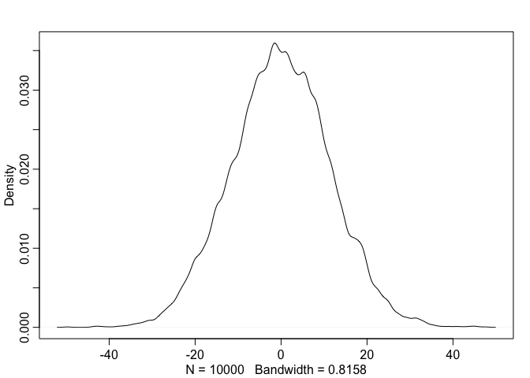
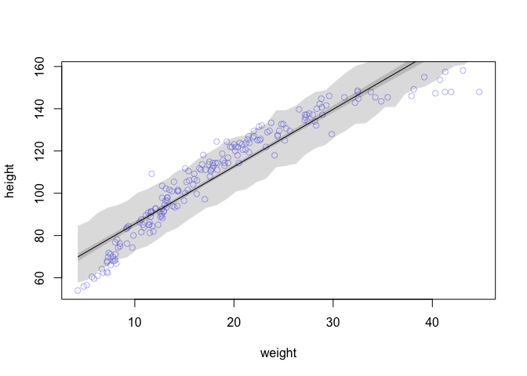
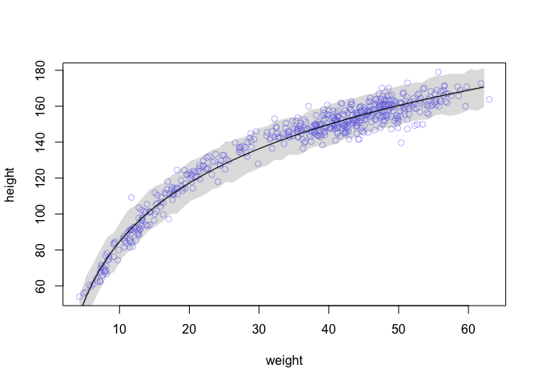

Chapter 4 Exercise Questions
================
Usman Khaliq
2020-04-27

``` r
# Libraries
library(tidyverse)
library(rethinking)
data("Howell1")

#===============================================================================
```

4E1. In the model definition below, which line is the likelihood?

yi\~Normal(μ,σ) μ\~Normal(0,10) σ\~Uniform(0,10)

Answer: The first line is the likelihood.

4E2. In the model definition just above, how many parameters are in the
posterior distribution?

Answer: There are two parameters in the posterior distribution.

4E3. Using the model definition above, write down the appropriate form
of Bayes’ theorem that includes the proper likelihood and priors.

Answer:
\[\Pr(\mu,\sigma|y) = \frac{\prod_i \mathrm{Normal} (y_i|\mu,\sigma) \mathrm{Normal} (\mu|0,10) \mathrm{Uniform}(\sigma|0,10)}{\int \int \prod_i \mathrm{Normal}(h_i|\mu,\sigma) \mathrm{Normal}(\mu|0,10) \mathrm{Uniform}(\sigma|0,10)d\mu d\sigma}\]

4E4. In the model definition below, which line is the linear model?

yi\~Normal(μ,σ) μi=α+βxiα\~Normal(0,10) β\~Normal(0,1) σ\~Uniform(0,10)

Answer: The second line is the linear model.

4E5. In the model definition just above, how many parameters are in the
posterior distribution?

Answer: There are three parameters in the posterior distribution.

4M1. For the model definition below, simulate observed heights from the
prior (not the posterior).

yi\~Normal(μ,σ) μ\~Normal(0,10) σ\~Uniform(0,10)

``` r
sample_mu <- rnorm(1e4, 0, 10)
sample_sigma <- runif(1e4, 0, 10)
prior_y <- rnorm(1e4, sample_mu, sample_sigma)
dens(prior_y)
```

<!-- -->

4M2. Translate the model just above into a map formula.

``` r
model <-alist(
    y ~ dnorm(mu, sigma),
    mu ~ dnorm(0, 10),
    sigma ~ dunif(0, 10)
  )
```

4M3. Translate the map model formula below into a mathematical model
definition.

flist \<- alist(

y \~ dnorm( mu , sigma ),

mu \<- a + b\*x,

a \~ dnorm( 0 , 50 ),

b \~ dunif( 0, 10 sigma \~ dunif( 0, 50)

)

\[
\begin{aligned}
y_i &\sim \mathrm{Normal}(\mu, \sigma) \\
\mu_i &= \alpha + \beta x_i \\
\alpha &\sim \mathrm{Normal}(0, 50) \\
\beta &\sim \mathrm{Uniform}(0, 10) \\
\sigma &\sim \mathrm{Uniform}(0, 50)
\end{aligned}
\]

4M4. A sample of students is measured for height each year for 3 years.
After the third year, you want to fit a linear regression predicting
height using year as a predictor. Write down the mathematical model
definition for this regression, using any variable names and priors you
choose. Be prepared to defend your choice of priors.

Answer. My mathematical model will be as follows: yi\~Normal(μi,σ)
μi=α+β \* age α \~ Normal(120, 10) β\~Normal(4,2) σ\~Uniform(0,50)

4M5. Now suppose I tell you that the average height in the first year
was 120 cm and that every student got taller each year. Does this
information lead you to change your choice of priors? How?

This information just makes me more confident about the average height
of the students that I chose.

4M6. Now suppose I tell you that the variance among heights for students
of the same age is never more than 64cm. How does this lead you to
revise your priors?

I would adjust the prior of σ as follows: σ \~ Uniform(0, 8)

4H1 The weights listed below were recorded in the \!Kung census, but
heights were not recorded for these individuals. Provide predicted
heights and 89% intervals (either HPDI or PI) for each of these
individuals. That is, fill in the table below, using model-based
predictions.

> 
> 
> | Individual | weight | expected height | 89% interval |
> | ---------- | ------ | --------------- | ------------ |
> | 1          | 46.95  |                 |              |
> | 2          | 43.72  |                 |              |
> | 3          | 64.78  |                 |              |
> | 4          | 32.59  |                 |              |
> | 5          | 54.63  |                 |              |
> 

``` r
d <- Howell1
model <- rethinking::map(
  alist(
    height ~ dnorm(mu, sigma),
    mu ~ a + b * weight,
    a ~ dnorm(140, 30),
    b ~ dnorm(0, 10),
    sigma ~ dunif(0, 50)
  ),
  data = d
) 

values <- c(46.95, 43.72, 64.78, 32.59, 54.63)
predicted_heights <- link(model, data = data.frame(weight = values))
```

``` r
predicted_heights_means <- apply(predicted_heights, 2, mean)
predicted_hpdi <- apply(predicted_heights, 2, HPDI, prob = 0.89)
```

``` r
data.frame(
  individual = 1:5,
  weight = values,
  expected_height = predicted_heights_means,
  lower_interval = predicted_hpdi[1,],
  upper_interval = predicted_hpdi[2,]
)
```

    ##   individual weight expected_height lower_interval upper_interval
    ## 1          1  46.95        158.2527       157.4222       159.0582
    ## 2          2  43.72        152.5590       151.8915       153.3895
    ## 3          3  64.78        189.6826       188.2684       191.1695
    ## 4          4  32.59        132.9395       132.2382       133.5545
    ## 5          5  54.63        171.7907       170.6713       172.7964

4H2. Select out all the rows in the Howelll data with ages below 18
years of age. If you do it right, you should end up with a new data
frame with 192 rows in it.

``` r
filtered_data <- 
  d %>% 
  filter(age < 18)
nrow(filtered_data)
```

    ## [1] 192

1)  Fit a linear regression to these data, using map. Present and
    interpret the estimates. For every 10 units of increase in weight,
    how much taller does the model predict a child gets?

<!-- end list -->

``` r
model <- rethinking::map(
  alist(
    height ~ dnorm(mu, sigma),
    mu <- a + b * weight,
    a ~ dnorm(110, 30),
    b ~ dnorm(0, 10),
    sigma ~ dunif(0, 60)
  ),
  data = filtered_data
)
```

``` r
precis(model, corr = TRUE)
```

    ##            mean         sd      5.5%     94.5%
    ## a     58.344976 1.39573963 56.114314 60.575637
    ## b      2.715034 0.06823405  2.605983  2.824085
    ## sigma  8.437249 0.43057644  7.749104  9.125393

For every 10 unit increase in weight, the model assumes an increase of
height of 27.2 cm.

2)  Plot the raw data, with height on the vertical axis and weight on
    the horizontal axis. Superimpose the MAP regression line and 89%
    HPDI for the mean. Also superimpose the 89% HPDI for predicted
    heights.

<!-- end list -->

``` r
weight.seq <- 
  seq(
    from = min(filtered_data$weight),
    to = max(filtered_data$weight),
    by = 1
  )

mu <- link(model, data = data.frame(weight = weight.seq))
mu.mean <- apply(mu, 2, mean)
mu.HPDI <- apply(mu, 2, HPDI, prob = 0.89) 
sim.height <- sim(model, data = list(weight = weight.seq))
height.HPDI <- apply(sim.height, 2, HPDI, prob = 0.89)
```

``` r
plot(height ~ weight, data = filtered_data, col = col.alpha(rangi2, 0.5))

lines(weight.seq, mu.mean)

shade(mu.HPDI, weight.seq) 

shade(height.HPDI, weight.seq)
```

<!-- -->

3)  What aspects of the model fit concern you? Describe the kinds of
    assumptions you would change, if any, to improve the model. You
    don’t have to write any new code. Just explain what the model
    appears to be doing a bad job of, and what you hypothesize would be
    a better model.

The linear model is doing a poor job of fitting the data, both at higher
and lower values of weights. It seems like the linear model is a poor
fit for the data.

4H3. Suppose a colleague of yours, who works on allometry, glances at
the practice problems just above. Your colleague exclaims, “That’s
silly. Everyone knows that it’s only the logarithm of body weight that
scales with height\!” Let’s take your colleague’s advice and see what
happens.

1)  Model the relationship between height (cm) and the natural logarithm
    of weight (log-kg). Use the entire Howelll data frame, all 544 rows,
    adults and non-adults. Fit this model, using quadratic
    approximation:

hi\~Normal(μi,σ)

μi=α+βlog(wi)

α\~Normal(178,100)

β\~Normal(0,100)

σ\~Uniform(0,50)

where hi is the height of individual i and wi is the weight (in kg) of
individual i. The function for computing a natural log in R is just log.
Can you interpret the resulting estimates?

``` r
model <- rethinking::map(
  alist(
    height ~ dnorm(mu, sigma),
    mu <- a + b * log(weight),
    a ~ dnorm(178, 100),
    b ~ dnorm(0, 100),
    sigma ~ dunif(0, 50)
  ),
  data = d
)
```

Then use samples from the quadratic approximate posterior of the model
in (a) to superimpose on the plot: (1) the predicted mean height as a
function of weight, (2) the 97% HPDI for the mean, and (3) the 97% HPDI
for predicted heights.

``` r
weight.seq <- 
  seq(
    from = min(d$weight),
    to = max(d$weight),
    by = 1
  )

mu <- link(model, data = data.frame(weight = weight.seq))
mu.mean <- apply(mu, 2, mean)
mu.HPDI <- apply(mu, 2, HPDI, prob = 0.97) 
sim.height <- sim(model, data = list(weight = weight.seq))
height.HPDI <- apply(sim.height, 2, HPDI, prob = 0.97)
```

``` r
plot(height ~ weight, data = d, col = col.alpha(rangi2, 0.5))

lines(weight.seq, mu.mean)

shade(mu.HPDI, weight.seq) 

shade(height.HPDI, weight.seq)
```

<!-- -->
