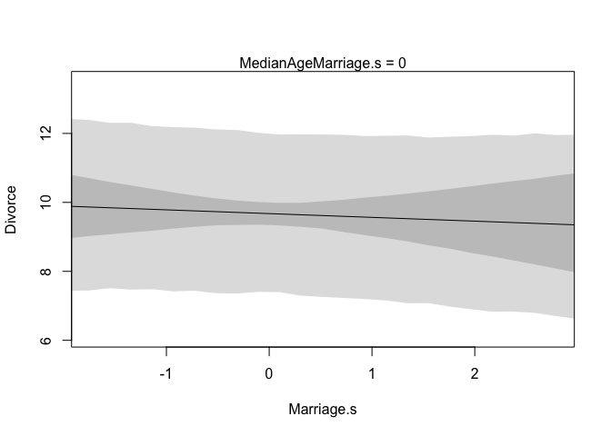
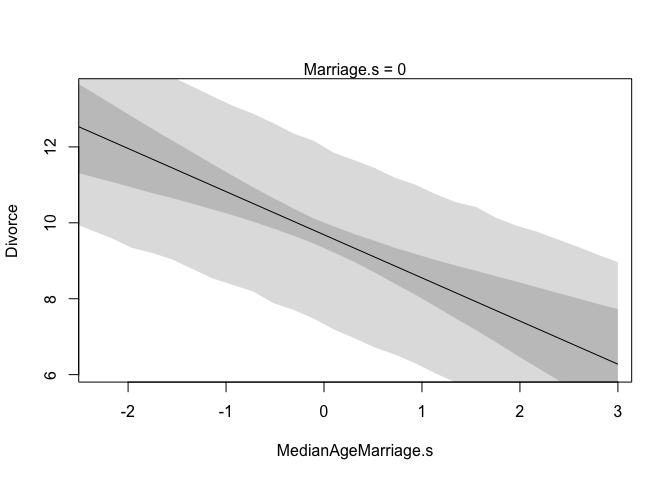
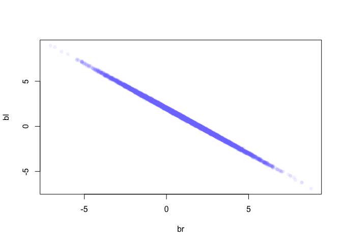

Chapter 5
================
Usman Khaliq
2020-04-30

``` r
# Libraries
library(tidyverse)
library(rethinking)
```

R Code 5.1

``` r
data("WaffleDivorce")
d <- WaffleDivorce

#standardise predictor
d$MedianAgeMarriage.s <- 
  (d$MedianAgeMarriage - mean(d$MedianAgeMarriage)) / sd(d$MedianAgeMarriage) 

#fit model
m5.1 <- rethinking::map(
  alist(
    Divorce ~ dnorm(mu, sigma),
    mu <- a + bA * MedianAgeMarriage.s,
    a ~ dnorm(10, 10),
    bA ~ dnorm(0, 1),
    sigma ~ dunif(0, 10)
  ), 
  data = d
)
```

R Code 5.2

Now, plot the raw data, draw the posterior mean regression line, and
draw the shaded confidence region.

``` r
#compute percentile interval of mean
MAM.seq <- seq(from = -3, to = 3.5, length.out = 30)
mu <- link(m5.1, data = data.frame(MedianAgeMarriage.s = MAM.seq))
mu.PI <- apply(mu, 2, PI)

#plot all
plot(Divorce ~ MedianAgeMarriage.s, data = d, col = rangi2)
abline(m5.1)
```

    ## Warning in abline(m5.1): only using the first two of 3 regression coefficients

``` r
shade(mu.PI, MAM.seq)
```

<!-- -->

R Code 5.3 Now, lets fit a regression line for relationship between the
rate of marriage and the divorce rate.

``` r
d$Marriage.s <- (d$Marriage - mean(d$Marriage)) / sd(d$Marriage)

m5.2 <- rethinking::map(
  alist(
    Divorce ~ dnorm(mu, sigma),
    mu <- a + bR * Marriage.s,
    a ~ dnorm(10, 10),
    bR ~ dnorm(0, 1),
    sigma ~ dunif(0, 10)
  ),
  data = d
)
```

``` r
#compute percentile interval of mean
MAM.seq <- seq(from = -2.5, to = 3, length.out = 30)
mu <- link(m5.2, data = data.frame(Marriage.s = MAM.seq))
mu.PI <- apply(mu, 2, PI)

#plot
plot(Divorce ~ Marriage.s, data = d, col = rangi2)
abline(m5.2)
```

    ## Warning in abline(m5.2): only using the first two of 3 regression coefficients

``` r
shade(mu.PI, MAM.seq)
```

<!-- -->

R Code 5.4

Lets fit a miltivariate model for association between marriage rate and
age of marriage on divorce rates.

``` r
m5.3 <- rethinking::map(
  alist(
    Divorce ~ dnorm(mu, sigma),
    mu <- a + bR * Marriage.s + bA * MedianAgeMarriage.s,
    a ~ dnorm(0, 10),
    bR ~ dnorm(0, 1),
    bA ~ dnorm(0, 1),
    sigma ~ dunif(0, 10)
  ),
  data = d
)

precis(m5.3)
```

    ##             mean        sd       5.5%      94.5%
    ## a      9.6839827 0.2036149  9.3585668 10.0093987
    ## bR    -0.1321727 0.2794294 -0.5787548  0.3144094
    ## bA    -1.1347457 0.2797181 -1.5817892 -0.6877022
    ## sigma  1.4400620 0.1443478  1.2093664  1.6707576

Lets visualize the above posterior distribution estimates

``` r
plot(precis(m5.3))
```

<!-- -->

The above plot can be interpreted as saying that once the median age of
marriage for a state is known, little or no additinal predictive power
is gained by also knowing the rate of marrianges in that state.

R Code 5.6

Lets calculate the predictor variable residuals for the marraige rates.

``` r
m5.4 <- rethinking::map(
  alist(
    Marriage.s ~ dnorm(mu, sigma),
    mu <- a + b * MedianAgeMarriage.s,
    a ~ dnorm(0, 10),
    b ~ dnorm(0, 1),
    sigma ~ dunif(0, 10)
  ),
  data = d
)
```

R Code 5.7

Now, calculate the residuals by subtracting observed marriage rate in
each state from predicted marriage rate.

``` r
#compute expected value of MAP, for each state
mu <- coef(m5.4)['a'] + coef(m5.4)['b'] * d$MedianAgeMarriage.s

#compute residual for each state
m.resid <- d$Marriage.s - mu
```

R Code 5.8

Lets plot the relationship between the residuals and the age of
marriage.

``` r
plot(Marriage.s ~ MedianAgeMarriage.s, d, col = rangi2)
abline(m5.4)
```

    ## Warning in abline(m5.4): only using the first two of 3 regression coefficients

``` r
#loop over states
for (i in 1:length(m.resid)) {
  #location of line segment
  x <- d$MedianAgeMarriage.s[i]
  #observed endpoint of line segment
  y <- d$Marriage.s[i]
  #draw the line segment
  lines(
    c(x, x),
    c(mu[i], y),
    lwd = 0.5,
    col = col.alpha("black", 0.7)
  )
}
```

<!-- -->

R Code 5.9

Lets plot a counterfactual plot for the divorce model, with this model
showcasing the impact of the rate of marriage on divorce rate(while
keeping other parameters constant)

``` r
#prepare new counterfactual data
A.avg <- mean(d$MedianAgeMarriage.s)
R.seq <- seq(from = -3, to = 3, length.out = 30)

pred.data <- data.frame(
  Marriage.s = R.seq,
  MedianAgeMarriage.s = A.avg
)

#compute counterfactual mean divorce (mu)
mu <- link(m5.3, data = pred.data)
mu.mean <- apply(mu, 2, mean)
mu.PI <- apply(mu, 2, PI)

#simulate counterfactual divorce outcomes
R.sim <- sim(m5.3, data = pred.data, n = 1e4)

R.PI <- apply(R.sim, 2, PI)

#display predictions, hiding raw data with type = "n"
plot(Divorce ~ Marriage.s, data = d, type = "n")
mtext("MedianAgeMarriage.s = 0")
lines(R.seq, mu.mean)
shade(mu.PI, R.seq)
shade(R.PI, R.seq)
```

<!-- -->

Now, lets plot a counterfactual plot for the divorce model, with this
model showcasing the impact of the median age of marriage on divorce
rate(while keeping other parameters constant)

``` r
#prepare new counterfactual data
R.avg <- mean(d$Marriage.s)
A.seq <- seq(from = -3, to = 3, length.out = 30)

pred.data <- data.frame(
  Marriage.s = R.avg,
  MedianAgeMarriage.s = A.seq
)

#compute the counterfactual mean (mu)
mu <- link(m5.3, data = pred.data)
mu.mean <- apply(mu, 2, mean)
mu.PI <- apply(mu, 2, PI)

#simulate counterfactual divorce outcomes
R.sim <- sim(m5.3, data = pred.data, n = 1e4)
R.PI <- apply(R.sim, 2, PI)

#display predictions
plot(Divorce ~ MedianAgeMarriage.s, data = d, type = "n")
mtext("Marriage.s = 0")
lines(R.seq, mu.mean)
shade(mu.PI, R.seq)
shade(R.PI, R.seq)
```

<!-- -->

R Code 5.11

Lets simulate predictions, averaging over the posterior.

``` r
#call link without specifying new data so that it uses original data
mu <- link(m5.3) 

#summarise samples across cases
mu.mean <- apply(mu, 2, mean)
mu.PI <- apply(mu, 2, PI)

#simulate observations 
divorce.sim <- sim(m5.3, n = 1e4)
divorce.PI <- apply(divorce.sim, 2, PI)
```

5 Code 5.12

Now, lets plot predictions against observations

``` r
plot(
  mu.mean ~ d$Divorce,
  col = rangi2,
  ylim = range(mu.PI),
  xlab = "Observed divorce",
  ylab = "Predicted divorce"
)
abline(a = 0, b = 1, lty = 2)
for(i in nrow(d))
  lines(rep(d$Divorce[i], 2), c(mu.PI[1, i], mu.PI[2, i]), col = rangi2)
```

<!-- -->

The moderl underpredicts for states with very high divorce rates and
overpredicts for states with very low divorce rates.

R Code 5.14

Compute residuals.

``` r
#compute residuals
divorce.resid <- d$Divorce - mu.mean

#get ordering by divorce rate
o <- order(divorce.resid)

#make the plot
dotchart(divorce.resid[o], labels = d$Loc[o], xlim = c(-6, 5), cex = 0.6)
abline(v = 0, col = col.alpha("black", 0.2))
for(i in 1:nrow(d)){
  j <- o[i] #which state in order
  lines(d$Divorce[j] - c(mu.PI[1, j], mu.PI[2, j]), rep(i, 2))
  points(
    d$Divorce[j] - c(divorce.PI[1, j], divorce.PI[2, j]),
    rep(i, 2),
    pch = 3,
    cex = 0.6,
    col = "gray"
  )
}
```

<!-- -->

R Code 5.16

``` r
data(milk)
d <- milk
glimpse(d)
```

    ## Rows: 29
    ## Columns: 8
    ## $ clade          <fct> Strepsirrhine, Strepsirrhine, Strepsirrhine, Strepsirr…
    ## $ species        <fct> Eulemur fulvus, E macaco, E mongoz, E rubriventer, Lem…
    ## $ kcal.per.g     <dbl> 0.49, 0.51, 0.46, 0.48, 0.60, 0.47, 0.56, 0.89, 0.91, …
    ## $ perc.fat       <dbl> 16.60, 19.27, 14.11, 14.91, 27.28, 21.22, 29.66, 53.41…
    ## $ perc.protein   <dbl> 15.42, 16.91, 16.85, 13.18, 19.50, 23.58, 23.46, 15.80…
    ## $ perc.lactose   <dbl> 67.98, 63.82, 69.04, 71.91, 53.22, 55.20, 46.88, 30.79…
    ## $ mass           <dbl> 1.95, 2.09, 2.51, 1.62, 2.19, 5.25, 5.37, 2.51, 0.71, …
    ## $ neocortex.perc <dbl> 55.16, NA, NA, NA, NA, 64.54, 64.54, 67.64, NA, 68.85,…

Hypothesis to test: primates with larger brains produce more energetic
milk so that their braiins can grow quickly.

Variables of interest: kcal.per.g : Kilocalories of energy per gram of
milk mass: Average female body mass, in kg neocortex.perc: percentage of
total brain mass that is neocortex mass

``` r
dcc <-
  d %>% 
  drop_na()
```

R Code 5.20

``` r
m5.5 <- rethinking::map(
  alist(
    kcal.per.g ~ dnorm(mu, sigma),
    mu <- a + bn * neocortex.perc,
    a ~ dnorm(0, 100),
    bn ~ dnorm(0, 1),
    sigma ~ dunif(0, 1)
  ),
  data = dcc
)
```

Now, lets observe the quadratic approximate posterior

``` r
precis(m5.5, digits = 3)
```

    ##              mean          sd         5.5%      94.5%
    ## a     0.353342215 0.470717675 -0.398955544 1.10563997
    ## bn    0.004503161 0.006940331 -0.006588829 0.01559515
    ## sigma 0.165702382 0.028414304  0.120290836 0.21111393

R Code 5.23

Lets now plot the predicted mean and the 89% interval for the mean

``` r
np.seq <- 0:100
pred.data <- data.frame(neocortex.perc = np.seq)

mu <- link(m5.5, data = pred.data, n = 1e4)
mu.mean <- apply(mu, 2, mean)
mu.PI <- apply(mu, 2, PI)

plot(kcal.per.g ~ neocortex.perc, data = dcc, col = rangi2)
lines(np.seq, mu.mean)
lines(np.seq, mu.PI[1,], lty = 2)
lines(np.seq, mu.PI[2,], lty = 2)
```

<!-- -->

From the above, we can see that the MAP line is weakly positive.
However, the error range is quite high.

``` r
dcc$log.mass <- log(dcc$mass)

m5.6 <- rethinking::map(
  alist(
    kcal.per.g ~ dnorm(mu, sigma),
    mu <- a + bm * log.mass,
    a ~ dnorm(0, 100),
    bm ~ dnorm(0, 1),
    sigma ~ dunif(0, 1)
  ),
  data = dcc
) 

precis(m5.6)
```

    ##              mean         sd        5.5%       94.5%
    ## a      0.70513064 0.04870516  0.62729038 0.782970902
    ## bm    -0.03167317 0.02028314 -0.06408955 0.000743209
    ## sigma  0.15686103 0.02689722  0.11387409 0.199847978

Now, lets plot this relationship.

``` r
np.seq <- -100:100
pred.data <- data.frame(log.mass = np.seq)

mu <- link(m5.6, data = pred.data, n = 1e4)
mu.mean <- apply(mu, 2, mean)
mu.PI <- apply(mu, 2, PI)

plot(kcal.per.g ~ log.mass, data = dcc, col = rangi2)
lines(np.seq, mu.mean)
lines(np.seq, mu.PI[1,], lty = 2)
lines(np.seq, mu.PI[2,], lty = 2)
```

<!-- -->

Stronger negative relationship, but the confidence interval is still
quite wide.

R Code 5.26

Now, add both predictor variables at the same time.

``` r
m5.7 <- rethinking::map(
  alist(
    kcal.per.g ~ dnorm(mu, sigma),
    mu <- a + bn * neocortex.perc + bm * log.mass,
    a ~ dnorm(0, 100),
    bn ~ dnorm(0, 1),
    bm ~ dnorm(0, 1),
    sigma ~ dunif(0, 1)
  ), 
  data = dcc
) 

precis(m5.7)
```

    ##              mean          sd        5.5%       94.5%
    ## a     -1.08453564 0.467496939 -1.83168604 -0.33738524
    ## bn     0.02791901 0.007271707  0.01629742  0.03954060
    ## bm    -0.09635817 0.022451154 -0.13223945 -0.06047689
    ## sigma  0.11477742 0.019675245  0.08333257  0.14622226

Now, we can see that the estimate association of both predictors with
the outcome variables has increased. Lets visualise this relationship.

R Code 5.27

``` r
mean.log.mass <- mean(log(dcc$mass))
np.seq <- 0:100
pred.data <- data.frame(
  neocortex.perc = np.seq,
  log.mass = mean.log.mass
)

mu <- link(m5.7, data = pred.data, n = 1e4)
mu.mean <- apply(mu, 2, mean)
mu.PI <- apply(mu, 2, PI)

plot(kcal.per.g ~ neocortex.perc, data = dcc, type = "n")
lines(np.seq, mu.mean)
lines(np.seq, mu.PI[1,], lty = 2)
lines(np.seq, mu.PI[2,], lty = 2)
```

<!-- -->

``` r
mean.neocortex.perc <- mean(dcc$neocortex.perc)
np.seq <- -100:100
pred.data <- data.frame(
  neocortex.perc = mean.neocortex.perc,
  log.mass = np.seq
)

mu <- link(m5.7, data = pred.data, n = 1e4)
mu.mean <- apply(mu, 2, mean)
mu.PI <- apply(mu, 2, PI)

plot(kcal.per.g ~ log.mass, data = dcc, type = "n")
lines(np.seq, mu.mean)
lines(np.seq, mu.PI[1,], lty = 2)
lines(np.seq, mu.PI[2,], lty = 2)
```

<!-- -->

The phenomena above can be described as follows:

  - The two variables(neocortex size and body mass) are correlated with
    the outcome, but in opposite directions
  - Both of the explanatory variables are positively correlated with
    each other
  - Due to this, they tend to cancel each other out, unless both of the
    are explictly accounted for in a regression model.

R Code 5.29

Lets explore milticollinearity by looking at predicting individual’s
heights using the length of their legs as predictor variables.

``` r
#number of individuals
N <- 100

#simulate total height of each individual
height <- rnorm(N, 10, 2)

#leg as proportion of height
leg_prop <- runif(N, 0.4, 0.5)

#sim left leg as proportion + error
leg_left <- leg_prop * height + rnorm(N, 0, 0.02)

#sim right leg as proportion + error
leg_right <- leg_prop * height + rnorm(N, 0, 0.02)

#combine into data frame
d <- data.frame(height, leg_left, leg_right)
```

R Code 5.30

Now, let us explore the predicted heights from the simulated model
above. On average, an individuals’ legs are 45% of their height.
According to this, the beta coefficinet of our model should be the
average height(10) divided by 45% of the average height, so this would
be 10 / 4.5 = 2.2

``` r
m5.8 <- rethinking::map(
  alist(
    height ~ dnorm(mu, sigma),
    mu <- a + bl * leg_left + br * leg_right,
    a ~ dnorm(10, 100),
    bl ~ dnorm(2, 10),
    br ~ dnorm(2, 10),
    sigma ~ dunif(0, 10)
  ),
  data = d
) 

plot(precis(m5.8))
```

<!-- -->

The visualization above shows a massive variation in the posterior
distribution values for the parameter. Lets explore this in more detail.

Lets look at the bivariate posterior distributioin for `bl` and `br`.

R Code 5.32

``` r
post <- extract.samples(m5.8)

plot(bl ~ br, post, col = col.alpha(rangi2, 0.1), pch = 16)
```

<!-- -->

In the above, `bl` are `br` are very highly correlated. Since both the
legs contain almost exactly the same information, when we insist on
having both of them in the model, then there will be practically
infinite number of combinations of bl and br that produce the same
predictions.

Lets plot the posterior distribution of the sum of `bl` and `br`.

R Code 5.33

``` r
sum_blbr <- post$bl + post$br
dens(sum_blbr, col = rangi2, lwd = 2, xlab = "sum of bl and br")
```

<!-- -->

From the above density plot, the mean value is in the 2.0 range. Lets
see that this is also the mean value when we model the prediction by
using just one leg length value.

R code 5.34

``` r
m5.9 <- rethinking::map(
  alist(
    height ~ dnorm(mu, sigma),
    mu <- a + bl * leg_left,
    a ~ dnorm(10, 100),
    bl ~ dnorm(2, 10),
    sigma ~ dunif(0, 10)
  ),
  data = d
)
precis(m5.9)
```

    ##            mean         sd      5.5%     94.5%
    ## a     1.2127185 0.33618009 0.6754378 1.7499992
    ## bl    1.9827877 0.07328840 1.8656587 2.0999168
    ## sigma 0.6068487 0.04291018 0.5382699 0.6754274

When two predictor variables are very strongly correlated, including
them both may lead to confusion.

R code 5.35

``` r
data(milk)
d <- milk
```

R code 5.36

Lets model perc.fat and perc.lactose to predict kcal.per.g .

``` r
#kcal.per.g regressed on perc.fat
m5.10 <- rethinking::map(
  alist(
    kcal.per.g ~ dnorm(mu, sigma),
    mu <- a + bf * perc.fat,
    a ~ dnorm(0.6, 10),
    bf ~ dnorm(0, 1),
    sigma ~ dunif(0, 10)
  ),
  data = d
) 

#kcal.per.g regressed on perc.lactose
m5.11 <- rethinking::map(
  alist(
    kcal.per.g ~ dnorm(mu, sigma),
    mu <- a + bl * perc.lactose,
    a ~ dnorm(0.6, 10),
    bl ~ dnorm(0, 1),
    sigma ~ dunif(0, 10)
  ),
  data = d
)  

precis(m5.10, digits = 3)
```

    ##             mean           sd        5.5%      94.5%
    ## a     0.30113663 0.0356367492 0.244182217 0.35809103
    ## bf    0.01002009 0.0009690442 0.008471371 0.01156881
    ## sigma 0.07325819 0.0096125601 0.057895463 0.08862092

``` r
precis(m5.11, digits = 3)
```

    ##              mean           sd        5.5%        94.5%
    ## a      1.16642775 0.0427533202  1.09809969  1.234755813
    ## bl    -0.01057745 0.0008302777 -0.01190439 -0.009250503
    ## sigma  0.06175077 0.0081011920  0.04880351  0.074698044

From the above, it seems that bf and bl are like mirror opposites of
each other. Lets make a model where we include both of them.

R Code 5.37

``` r
m5.12 <- rethinking::map(
  alist(
    kcal.per.g ~ dnorm(mu, sigma),
    mu <- a + bl * perc.lactose + bf * perc.fat,
    a ~ dnorm(0.6, 10),
    bl ~ dnorm(0, 1),
    bf ~ dnorm(0, 1),
    sigma ~ dunif(0, 10)
  ),
  data = d
)   

precis(m5.12, digits = 3)
```

    ##               mean          sd         5.5%        94.5%
    ## a      1.007205693 0.199950576  0.687646054  1.326765332
    ## bl    -0.008706821 0.002438326 -0.012603737 -0.004809906
    ## bf     0.001954388 0.002398827 -0.001879401  0.005788176
    ## sigma  0.061058455 0.008010377  0.048256325  0.073860585

``` r
plot(precis(m5.12))
```

<!-- -->

The means for bl and bf are almsot zero.

R Code 5.38

``` r
pairs(
  ~ kcal.per.g + perc.fat + perc.lactose,
  data = d,
  col = rangi2
)
```

<!-- -->

From the above plots, we can see tha per.fat is positively correlated
with kcal.per.g, while perc.lactose is negatively correlated. Also,
perc.fat and perc.lactose are almost perfectly correlated.

``` r
cor(d$perc.fat, d$perc.lactose)
```

    ## [1] -0.9416373

R Code 5.41

Now, lets explore post-treatment bias.

Suppose we need to find out the growth in plants and how thats affected
by fungal growth.

Let’s simulate some data.

``` r
#number of plants
N <- 100

#simulate initial height
h0 <- rnorm(N, 10, 2)

#assign treatments and simulate fungus and growth
treatment <- rep(0:1, each = N / 2)
fungus <- rbinom(N, size = 1, prob = 0.5 - treatment * 0.4)
h1 <- h0 + rnorm(N, 5 - 3 * fungus)

#compose a clean data frame
d <- data.frame(h0 = h0, h1 = h1, treatment = treatment, fungus = fungus)
```

R Code 5.42

Now, lets fit the simulated data into a model

``` r
m5.13 <- rethinking::map(
  alist(
    h1 ~ dnorm(mu, sigma),
    mu <- a + bh * h0 + bt * treatment + bf * fungus,
    a ~ dnorm(0, 100),
    c(bh, bt, bf) ~ dnorm(0, 10),
    sigma ~ dunif(0, 10)
  ),
  data = d
)

precis(m5.13)
```

    ##             mean         sd        5.5%      94.5%
    ## a      4.8334117 0.56440153  3.93138907  5.7354344
    ## bh     0.9937330 0.05224574  0.91023418  1.0772317
    ## bt     0.3352208 0.21779601 -0.01285929  0.6833009
    ## bf    -2.6641370 0.22758716 -3.02786527 -2.3004088
    ## sigma  0.9504526 0.06720686  0.84304304  1.0578621

Above, we can see that the coefficient for bt is low, whereas the
coefficient for bf is negative and high. This is because fungus is a
post-treatment effect, since soli treatment has its affect on growth by
reducing fungus. To properly model the effect of soil treatment on
growth, we need to model again, but this time removing fungus from the
model.

``` r
m5.14 <- rethinking::map(
  alist(
    h1 ~ dnorm(mu, sigma),
    mu <- a + bh * h0 + bt * treatment,
    a ~ dnorm(0, 100),
    c(bh, bt) ~ dnorm(0, 10),
    sigma ~ dunif(0, 10)
  ),
  data = d
)

precis(m5.14)
```

    ##           mean         sd      5.5%    94.5%
    ## a     3.032951 0.83606486 1.6967579 4.369144
    ## bh    1.019119 0.08037206 0.8906691 1.147569
    ## bt    1.566877 0.29349104 1.0978215 2.035932
    ## sigma 1.463448 0.10348130 1.2980653 1.628832

Now, we can see that bt has a bigger and more positive effect on plant
growth.

R Code 5.45

Now, lets fit a categorical variable into a model.

``` r
data("Howell1")
d <- Howell1
glimpse(d)
```

    ## Rows: 544
    ## Columns: 4
    ## $ height <dbl> 151.7650, 139.7000, 136.5250, 156.8450, 145.4150, 163.8300, 14…
    ## $ weight <dbl> 47.82561, 36.48581, 31.86484, 53.04191, 41.27687, 62.99259, 38…
    ## $ age    <dbl> 63.0, 63.0, 65.0, 41.0, 51.0, 35.0, 32.0, 27.0, 19.0, 54.0, 47…
    ## $ male   <int> 1, 0, 0, 1, 0, 1, 0, 1, 0, 1, 0, 1, 0, 0, 0, 1, 1, 0, 1, 0, 0,…

``` r
m5.15 <- rethinking::map(
  alist(
    height ~ dnorm(mu, sigma),
    mu <- a + bm * male,
    a ~ dnorm(178, 100),
    bm ~ dnorm(0, 10),
    sigma ~ dunif(0, 50)
  ),
  data = d
)

precis(m5.15)
```

    ##             mean        sd       5.5%     94.5%
    ## a     134.826223 1.5918779 132.282095 137.37035
    ## bm      7.286983 2.2833484   3.637751  10.93621
    ## sigma  27.309293 0.8279808  25.986020  28.63257

The average expected height of females is 134.83. The average difference
between male and female heights is 7.28.

The posterior mean of average male height is 134.83 + 7.28. However, to
calculate the posterior spread of average male heights, we cannot simply
add the intervals for a and bm. Instead, we can derive samples from the
posterior and then calculate their intervals.

R Code 5.46

``` r
post <- extract.samples(m5.15)
mu.male <- post$a + post$bm
PI(mu.male)
```

    ##       5%      94% 
    ## 139.4316 144.7952

R Code 5.4.2

Lets explore a case where there are many categories that need to be
included in a linear model.

As a reference, if one has to include `k` categories in a linear model,
one needs `k - 1` dummy variables.

``` r
data(milk)
d <- milk
unique(d$clade)
```

    ## [1] Strepsirrhine    New World Monkey Old World Monkey Ape             
    ## Levels: Ape New World Monkey Old World Monkey Strepsirrhine

Lets create dummy variables for the categories in `clade`

``` r
d$clade.NWM <- ifelse(d$clade == "New World Monkey", 1, 0)
d$clade.OWM <- ifelse(d$clade == "Old World Monkey", 1, 0)
d$clade.S <- ifelse(d$clade == "Strepsirrhine", 1, 0)
```

Now, lets fit the model

``` r
m5.16 <- rethinking::map(
  alist(
    kcal.per.g ~ dnorm(mu, sigma),
    mu <- a + b.NWM * clade.NWM + b.OWM * clade.OWM + b.S * clade.S,
    a ~ dnorm(0.6, 10),
    b.NWM ~ dnorm(0, 1),
    b.OWM ~ dnorm(0, 1),
    b.S ~ dnorm(0, 1),
    sigma ~ dunif(0, 10)
  ),
  data = d
) 

precis(m5.16)
```

    ##             mean         sd        5.5%      94.5%
    ## a      0.5460975 0.03808262  0.48523411 0.60696086
    ## b.NWM  0.1681018 0.05385708  0.08202777 0.25417579
    ## b.OWM  0.2417067 0.06020117  0.14549362 0.33791980
    ## b.S   -0.0379983 0.06370045 -0.13980392 0.06380732
    ## sigma  0.1144967 0.01502809  0.09047894 0.13851451

`a` is the average milk energy for apes, and the rest are differences
from apes.

Now, lets get the posterior distribution of average milk in each
categories.

R Code 5.52

``` r
#sample posterior 
post <- extract.samples(m5.16)

#compute averages for each category
mu.ape <- post$a
mu.NWM <- post$a + post$b.NWM
mu.OWM <- post$a + post$b.OWM
mu.S <- post$a + post$b.S

#summarise using precis
precis(data.frame(mu.ape, mu.NWM, mu.OWM, mu.S))
```

    ##             mean         sd      5.5%     94.5% histogram
    ## mu.ape 0.5457300 0.03800722 0.4856528 0.6062366   ▁▁▂▇▇▁▁
    ## mu.NWM 0.7140864 0.03826873 0.6526222 0.7752763   ▁▁▅▇▂▁▁
    ## mu.OWM 0.7874116 0.04614242 0.7138403 0.8611132 ▁▁▁▃▇▅▂▁▁
    ## mu.S   0.5077163 0.05113366 0.4267826 0.5907816  ▁▁▂▇▇▃▁▁

Another approach for modelling multiple categorical variables - use
unique intercepts.

R Code 5.54

``` r
d$clade_id <- coerce_index(d$clade) 

m5.16_alt <- rethinking::map(
  alist(
    kcal.per.g ~ dnorm(mu, sigma),
    mu <- a[clade_id],
    a[clade_id] ~ dnorm(0.6, 10),
    sigma ~ dunif(0, 10)
  ),
  data = d
) 
precis(m5.16_alt, depth = 2)
```

    ##            mean         sd       5.5%     94.5%
    ## a[1]  0.5455550 0.03816817 0.48455492 0.6065551
    ## a[2]  0.7144440 0.03816817 0.65344392 0.7754441
    ## a[3]  0.7883283 0.04674610 0.71361904 0.8630376
    ## a[4]  0.5080091 0.05120768 0.42616931 0.5898488
    ## sigma 0.1145054 0.01503087 0.09048312 0.1385276
