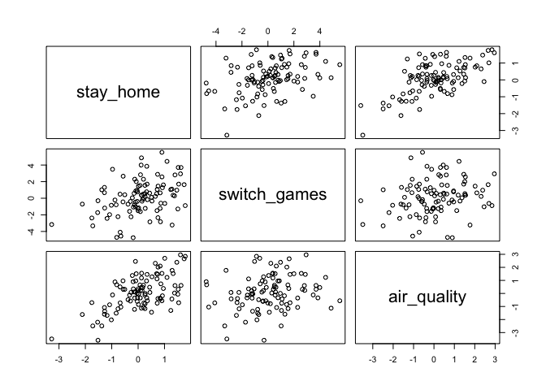
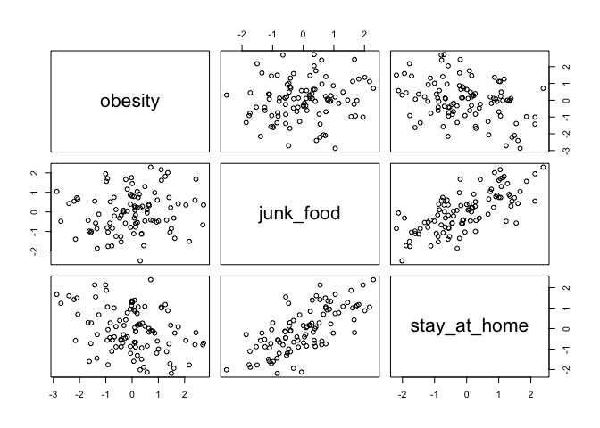

Chapter 5 Exercise Questions
================
Usman Khaliq
2020-05-03

``` r
# Libraries
library(tidyverse)
library(rethinking)
```

5E1. Which of the linear models below are multiple linear regressions?

1)  μi = α + βxi

2)  μi = βxxi + βzzi

3)  μi = α + β(xi − zi)

4)  μi = α + βxxi + βzzi

Answer: 2, 3, 4.

5E2. Write down a multiple regression to evaluate the claim: Animal
diversity is linearly related to latitude, but only after controlling
for plant diversity. You just need to write down the model definition.

Answer μi = α + βlxl + βpxp,

where l is latitude and p is plant diversity, and the outcome variable
is animal diversity.

5E3. Write down a multiple regression to evaluate the claim: Neither
amount of funding nor size of laboratory is by itself a good predictor
of time to PhD degree; but together these variables are both positively
associated with time to degree. Write down the model definition and
indicate which side of zero each slope parameter should be on.

Answer μi = α + βfxf + βsxs,

where f is funding and s is size of laboratory. Each slope parameter
should be positive.

5E4. Suppose you have a single categorical predictor with 4 levels
(unique values), labeled A, B, C and D. Let Ai be an indicator variable
that is 1 where case i is in category A. Also suppose Bi, Ci, and Di for
the other categories. Now which of the following linear models are
inferentially equivalent ways to include the categorical variable in a
regression? Models are inferentially equivalent when it’s possible to
compute one posterior distribution from the posterior distribution of
another model.

1)  μi = α + βAAi + βBBi + βDDi

2)  μi = α + βAAi + βBBi + βCCi + βDDi

3)  μi = α + βBBi + βCCi + βDDi

4)  μi = αAAi + αBBi + αCCi + αDDi

5)  μi = αA(1 − Bi − Ci − Di) + αBBi + αCCi + αDDi

The first model includes an intercept for label C and slopes for labels
A, B and D. The second model is non-identifiable because it includes a
slope for all possible categories. The third model includes an incercept
for label A and slopes for labels B, C and D. The fourth model includes
intercepts for all four labels by using the unique index approach. The
fifth model multiples the intercept of A by 1 for category A and with 0
for all other categories.

5M1. Invent your own example of a spurious correlation. An outcome
variable should be correlated with both predictor variables. But when
both predictors are entered in the same model, the correlation between
the outcome and one of the predictors should mostly vanish (or at least
be greatly reduced).

An example of a spurios relationship can be relationship between ice
cream consumption and drowning. Both of these are in fact caused by
higher weather in summers and the fact that more people end up going to
swimming in the ocean, which increases their probability of drowning.

5M2. Invent your own example of a masked relationship. An outcome
variable should be correlated with both predictor variables, but in
opposite directions. And the two predictor variables should be
correlated with one another.

An example of a spurious relationship is the correlation between playing
more Nintendo Switch games and an improvement in air quality in
California. This correlation vanishes when the number of people who are
staying at home due to COVID-19 shelter-in-place orders is included in
the model.

Lets simulate the data for this example:

``` r
N <- 100
stay_home <- rnorm(n = N, mean = 0, sd = 1)
switch_games <- rnorm(n = N, mean = stay_home, sd = 2)
air_quality <- rnorm(n = N, mean = stay_home, sd = 1)
d <- data.frame(stay_home, switch_games, air_quality)
pairs(d)
```

<!-- -->

Now, lets demonstrate that theres a spurious relationship between the
number of Switch games played and air quality

``` r
m <- rethinking::map(
  alist(
    air_quality ~ dnorm(mu, sigma),
    mu <- a + bo * switch_games,
    a ~ dnorm(0, 5),
    bo ~ dnorm(0, 5),
    sigma ~ dunif(0, 5)
  ),
  data = d
) 

precis(m)
```

    ##             mean         sd        5.5%     94.5%
    ## a     0.05442429 0.12802693 -0.15018748 0.2590361
    ## bo    0.12874528 0.06169795  0.03014004 0.2273505
    ## sigma 1.27769797 0.09033998  1.13331723 1.4220787

Now, lets demonstrate that the relationship disappears when we add the
number of people staying at home in the model

``` r
m <- rethinking::map(
  alist(
    air_quality ~ dnorm(mu, sigma),
    mu <- a + bo * switch_games + b1 * stay_home,
    a ~ dnorm(0, 5),
    bo ~ dnorm(0, 5),
    b1 ~ dnorm(0, 5),
    sigma ~ dunif(0, 5)
  ),
  data = d
) 

precis(m)
```

    ##              mean         sd       5.5%      94.5%
    ## a     -0.01246516 0.10222329 -0.1758377 0.15090741
    ## bo    -0.02837166 0.05322971 -0.1134430 0.05669971
    ## b1     0.90095806 0.11824417  0.7119810 1.08993508
    ## sigma  1.01628599 0.07186046  0.9014391 1.13113288

From the above, we can see that the relatioship between switch games and
air quality is spurious. The number of people at home better predicts
air quality when the number of switch games being played by people is
already known, but the opposite isnt really the case.

5M2. Invent your own example of a masked relationship. An outcome
variable should be correlated with both predictor variables, but in
opposite directions. And the two predictor variables should be
correlated with one another.

My example of a masked relationship would be as follows. Obesity would
be an outcome variable, and staying at home due to COVID-19 and the
amount of junk food consumed are the predictor variables . The former
would cause obesity to increase, while the latter causes it to reduce.

Lets simulate the data for this example now.

``` r
N <- 100
#correlation between staying at home due to COVID19 and amount of junk food consumed
rho <- 0.7
junk_food <- rnorm(n = N, mean = 0, sd = 1)
stay_at_home <- rnorm(n = N, mean = rho * junk_food, sd = sqrt(1 - rho^2))
obesity <- rnorm(n = N, mean = junk_food - stay_at_home, sd = 1)
d <- data.frame(obesity, junk_food, stay_at_home)
pairs(d)
```

<!-- -->

Lets plot the bivariate relationship between each predictor variable and
the outcome.

``` r
m <- rethinking::map(
  alist(
    obesity ~ dnorm(mu, sigma),
    mu <- a + bo * junk_food,
    a ~ dnorm(0, 5),
    bo ~ dnorm(0, 5),
    sigma ~ dunif(0, 5)
  ),
  data = d
)
precis(m)
```

    ##              mean         sd        5.5%     94.5%
    ## a     -0.08331446 0.11771338 -0.27144318 0.1048142
    ## bo     0.14782848 0.13090643 -0.06138527 0.3570422
    ## sigma  1.17384945 0.08300352  1.04119379 1.3065051

``` r
m <- rethinking::map(
  alist(
    obesity ~ dnorm(mu, sigma),
    mu <- a + b1 * stay_at_home,
    a ~ dnorm(0, 5),
    b1 ~ dnorm(0, 5),
    sigma ~ dunif(0, 5)
  ),
  data = d
)
precis(m)
```

    ##              mean         sd       5.5%      94.5%
    ## a     -0.01160402 0.10440548 -0.1784641  0.1552561
    ## b1    -0.61265705 0.11286069 -0.7930302 -0.4322839
    ## sigma  1.03814967 0.07340799  0.9208295  1.1554698

Now, lets plot both the predictor variables together to see how the
slopes of the parameters increases.

``` r
m <- rethinking::map(
  alist(
    obesity ~ dnorm(mu, sigma),
    mu <- a + b0 * junk_food + b1 * stay_at_home,
    a ~ dnorm(0, 5),
    b0 ~ dnorm(0, 5),
    b1 ~ dnorm(0, 5),
    sigma ~ dunif(0, 5)
  ),
  data = d
)
precis(m)
```

    ##              mean         sd       5.5%      94.5%
    ## a     -0.02024751 0.08420741 -0.1548272  0.1143322
    ## b0     0.87168340 0.11893835  0.6815969  1.0617699
    ## b1    -1.13906213 0.11593689 -1.3243517 -0.9537726
    ## sigma  0.83716440 0.05919623  0.7425574  0.9317714

5M3. It is sometimes observed that the best predictor of fire risk is
the presence of firefighters—States and localities with many
firefighters also have more fires. Presumably firefighters do not cause
fires. Nevertheless, this is not a spurious correlation. Instead fires
cause firefighters. Consider the same reversal of causal inference in
the context of the divorce and marriage data. How might a high divorce
rate cause a higher marriage rate? Can you think of a way to evaluate
this relationship, using multiple regression?

Answer: We can hypothesis that a higher divorce rate can result in more
people being willing to remarry, which can in turn increase the marriage
rate. We can determine this relationship by having a multivariate
regression model where we use the divorce rate and the remarraige rates
to regress on the marriage rate.

References: I used [this](https://www.rpubs.com/jmgirard/sr5) notebook
as reference while understanding the questions and formulating my
responses.
