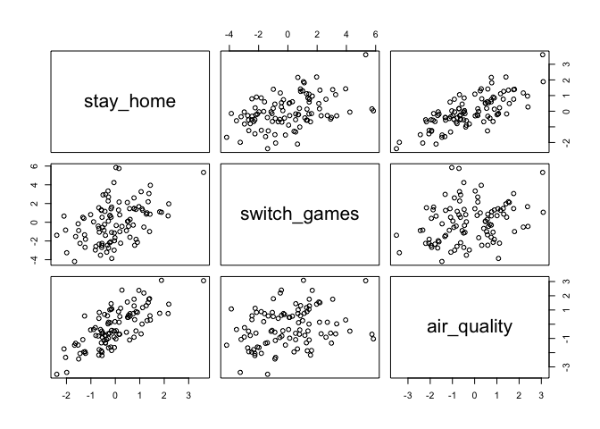

Chapter 5 Exercise Questions
================
Usman Khaliq
2020-05-03

``` r
# Libraries
library(tidyverse)
library(rethinking) 
library(rvest)

#Parameters

#url for numbers for LDS membership in all US States
url <- "https://en.wikipedia.org/wiki/The_Church_of_Jesus_Christ_of_Latter-day_Saints_membership_statistics_(United_States)"
css_selector <- "table.wikitable:nth-child(11)"
```

5E1. Which of the linear models below are multiple linear regressions?

1)  μi = α + βxi

2)  μi = βxxi + βzzi

3)  μi = α + β(xi − zi)

4)  μi = α + βxxi + βzzi

Answer: 2, 3, 4.

5E2. Write down a multiple regression to evaluate the claim: Animal
diversity is linearly related to latitude, but only after controlling
for plant diversity. You just need to write down the model definition.

Answer μi = α + βlxl + βpxp,

where l is latitude and p is plant diversity, and the outcome variable
is animal diversity.

5E3. Write down a multiple regression to evaluate the claim: Neither
amount of funding nor size of laboratory is by itself a good predictor
of time to PhD degree; but together these variables are both positively
associated with time to degree. Write down the model definition and
indicate which side of zero each slope parameter should be on.

Answer μi = α + βfxf + βsxs,

where f is funding and s is size of laboratory. Each slope parameter
should be positive.

5E4. Suppose you have a single categorical predictor with 4 levels
(unique values), labeled A, B, C and D. Let Ai be an indicator variable
that is 1 where case i is in category A. Also suppose Bi, Ci, and Di for
the other categories. Now which of the following linear models are
inferentially equivalent ways to include the categorical variable in a
regression? Models are inferentially equivalent when it’s possible to
compute one posterior distribution from the posterior distribution of
another model.

1)  μi = α + βAAi + βBBi + βDDi

2)  μi = α + βAAi + βBBi + βCCi + βDDi

3)  μi = α + βBBi + βCCi + βDDi

4)  μi = αAAi + αBBi + αCCi + αDDi

5)  μi = αA(1 − Bi − Ci − Di) + αBBi + αCCi + αDDi

The first model includes an intercept for label C and slopes for labels
A, B and D. The second model is non-identifiable because it includes a
slope for all possible categories. The third model includes an incercept
for label A and slopes for labels B, C and D. The fourth model includes
intercepts for all four labels by using the unique index approach. The
fifth model multiples the intercept of A by 1 for category A and with 0
for all other categories.

5M1. Invent your own example of a spurious correlation. An outcome
variable should be correlated with both predictor variables. But when
both predictors are entered in the same model, the correlation between
the outcome and one of the predictors should mostly vanish (or at least
be greatly reduced).

An example of a spurios relationship can be relationship between ice
cream consumption and drowning. Both of these are in fact caused by
higher weather in summers and the fact that more people end up going to
swimming in the ocean, which increases their probability of drowning.

5M2. Invent your own example of a masked relationship. An outcome
variable should be correlated with both predictor variables, but in
opposite directions. And the two predictor variables should be
correlated with one another.

An example of a spurious relationship is the correlation between playing
more Nintendo Switch games and an improvement in air quality in
California. This correlation vanishes when the number of people who are
staying at home due to COVID-19 shelter-in-place orders is included in
the model.

Lets simulate the data for this example:

``` r
N <- 100
stay_home <- rnorm(n = N, mean = 0, sd = 1)
switch_games <- rnorm(n = N, mean = stay_home, sd = 2)
air_quality <- rnorm(n = N, mean = stay_home, sd = 1)
d <- data.frame(stay_home, switch_games, air_quality)
pairs(d)
```

<!-- -->

Now, lets demonstrate that theres a spurious relationship between the
number of Switch games played and air quality

``` r
m <- rethinking::map(
  alist(
    air_quality ~ dnorm(mu, sigma),
    mu <- a + bo * switch_games,
    a ~ dnorm(0, 5),
    bo ~ dnorm(0, 5),
    sigma ~ dunif(0, 5)
  ),
  data = d
) 

precis(m)
```

    ##             mean         sd        5.5%       94.5%
    ## a     -0.2220030 0.12913400 -0.42838408 -0.01562192
    ## bo     0.1722243 0.06082379  0.07501618  0.26943250
    ## sigma  1.2915883 0.09132908  1.14562678  1.43754981

Now, lets demonstrate that the relationship disappears when we add the
number of people staying at home in the model

``` r
m <- rethinking::map(
  alist(
    air_quality ~ dnorm(mu, sigma),
    mu <- a + bo * switch_games + b1 * stay_home,
    a ~ dnorm(0, 5),
    bo ~ dnorm(0, 5),
    b1 ~ dnorm(0, 5),
    sigma ~ dunif(0, 5)
  ),
  data = d
) 

precis(m)
```

    ##              mean         sd       5.5%       94.5%
    ## a     -0.19517998 0.08971235 -0.3385576 -0.05180232
    ## bo    -0.03379919 0.04667664 -0.1083975  0.04079909
    ## b1     1.00570995 0.09704866  0.8506074  1.16081246
    ## sigma  0.89676648 0.06341550  0.7954163  0.99811671

From the above, we can see that the relatioship between switch games and
air quality is spurious. The number of people at home better predicts
air quality when the number of switch games being played by people is
already known, but the opposite isnt really the case.

5M2. Invent your own example of a masked relationship. An outcome
variable should be correlated with both predictor variables, but in
opposite directions. And the two predictor variables should be
correlated with one another.

My example of a masked relationship would be as follows. Obesity would
be an outcome variable, and staying at home due to COVID-19 and the
amount of junk food consumed are the predictor variables . The former
would cause obesity to increase, while the latter causes it to reduce.

Lets simulate the data for this example now.

``` r
N <- 100
#correlation between staying at home due to COVID19 and amount of junk food consumed
rho <- 0.7
junk_food <- rnorm(n = N, mean = 0, sd = 1)
stay_at_home <- rnorm(n = N, mean = rho * junk_food, sd = sqrt(1 - rho^2))
obesity <- rnorm(n = N, mean = junk_food - stay_at_home, sd = 1)
d <- data.frame(obesity, junk_food, stay_at_home)
pairs(d)
```

<!-- -->

Lets plot the bivariate relationship between each predictor variable and
the outcome.

``` r
m <- rethinking::map(
  alist(
    obesity ~ dnorm(mu, sigma),
    mu <- a + bo * junk_food,
    a ~ dnorm(0, 5),
    bo ~ dnorm(0, 5),
    sigma ~ dunif(0, 5)
  ),
  data = d
)
precis(m)
```

    ##              mean         sd        5.5%     94.5%
    ## a     -0.00138754 0.11649589 -0.18757048 0.1847954
    ## bo     0.14348273 0.11472162 -0.03986458 0.3268300
    ## sigma  1.16510259 0.08238877  1.03342942 1.2967758

``` r
m <- rethinking::map(
  alist(
    obesity ~ dnorm(mu, sigma),
    mu <- a + b1 * stay_at_home,
    a ~ dnorm(0, 5),
    b1 ~ dnorm(0, 5),
    sigma ~ dunif(0, 5)
  ),
  data = d
)
precis(m)
```

    ##              mean         sd       5.5%      94.5%
    ## a     -0.02296042 0.11073790 -0.1999410  0.1540201
    ## b1    -0.37104112 0.10378397 -0.5369079 -0.2051743
    ## sigma  1.10559299 0.07817702  0.9806510  1.2305350

Now, lets plot both the predictor variables together to see how the
slopes of the parameters increases.

``` r
m <- rethinking::map(
  alist(
    obesity ~ dnorm(mu, sigma),
    mu <- a + b0 * junk_food + b1 * stay_at_home,
    a ~ dnorm(0, 5),
    b0 ~ dnorm(0, 5),
    b1 ~ dnorm(0, 5),
    sigma ~ dunif(0, 5)
  ),
  data = d
)
precis(m)
```

    ##              mean         sd       5.5%       94.5%
    ## a     -0.07551068 0.09279061 -0.2238080  0.07278665
    ## b0     0.85302500 0.12941832  0.6461895  1.05986047
    ## b1    -0.95003850 0.12337737 -1.1472194 -0.75285764
    ## sigma  0.92291560 0.06525968  0.8186180  1.02721317

5M3. It is sometimes observed that the best predictor of fire risk is
the presence of firefighters—States and localities with many
firefighters also have more fires. Presumably firefighters do not cause
fires. Nevertheless, this is not a spurious correlation. Instead fires
cause firefighters. Consider the same reversal of causal inference in
the context of the divorce and marriage data. How might a high divorce
rate cause a higher marriage rate? Can you think of a way to evaluate
this relationship, using multiple regression?

Answer: We can hypothesis that a higher divorce rate can result in more
people being willing to remarry, which can in turn increase the marriage
rate. We can determine this relationship by having a multivariate
regression model where we use the divorce rate and the remarraige rates
to regress on the marriage rate.

5M4. In the divorce data, States with high numbers of Mormons (members
of The Church of Jesus Christ of Latter-day Saints, LDS) have much lower
divorce rates than the regression models expected. Find a list of LDS
population by State and use those numbers as a predictor variable,
predicting divorce rate using marriage rate, median age at marriage, and
percent LDS population (possibly standardized). You may want to consider
transformations of the raw percent LDS variable.

``` r
data("WaffleDivorce")
d <- WaffleDivorce 

lds_membership <-
  url %>% 
  read_html() %>% 
  html_node(css = css_selector) %>% 
  html_table() %>% 
  as_tibble() %>% 
  select(
    State,
    LDS
  ) %>% 
  filter(State != "Nevada") 

dataset <- 
  d %>% 
  left_join(lds_membership, by = c("Location" = "State")) %>% 
  mutate(
    LDS = str_replace(LDS, "%", ""),
    LDS = as.numeric(LDS)
  ) 
```

    ## Warning: Column `Location`/`State` joining factor and character vector, coercing
    ## into character vector

``` r
dataset <-
dataset %>% 
  mutate(
    log_lds = log(LDS),
    standardized_lds = (log_lds - mean(log_lds)) / sd(log_lds)
  ) 
```

``` r
m <- rethinking::map(
  alist(
    Divorce ~ dnorm(mu, sigma),
    mu <- a + br * Marriage + ba * MedianAgeMarriage + bl * standardized_lds,
    a ~ dnorm(10, 20),
    br ~ dnorm(0, 10),
    ba ~ dnorm(0, 10),
    bl ~ dnorm(0, 10),
    sigma ~ dunif(0, 5)
  ),
  data = dataset
) 

precis(m)
```

    ##             mean         sd        5.5%      94.5%
    ## a     35.4659013 6.77071406 24.64499249 46.2868100
    ## br     0.0547246 0.08268283 -0.07741853  0.1868677
    ## ba    -1.0317436 0.22462663 -1.39074037 -0.6727469
    ## bl    -0.6159121 0.29135374 -1.08155161 -0.1502725
    ## sigma  1.3775504 0.13827187  1.15656526  1.5985356

From the above, we can see that marriage rate is does not have a strong
correlation with the divorce rate, whereas the age of getting married is
very strongly negatively correlated with divorce rates(older folks
getting married are less likely to get a divorce). We can also see that
states that had a higher proportion of Mormons had a lower divorce rate.

5M5. One way to reason through multiple causation hypotheses is to
imagine detailed mechanisms through which predictor variables may
influence outcomes. For example, it is sometimes argued that the price
of gasoline (predictor variable) is positively associated with lower
obesity rates (outcome variable). However, there are at least two
important mechanisms by which the price of gas could reduce obesity.
First, it could lead to less driving and therefore more exercise.
Second, it could lead to less driving, which leads to less eating out,
which leads to less consumption of huge restaurant meals. Can you
outline one or more multiple regressions that address these two
mechanisms? Assume you can have any predictor data you need.

We could create a multiple regression model through which we can include
metrics that measure the consumption of gasoline ( as a proxy for less
driving), the amount of money spent by individuals on food at
restaurants( as a proxy for eating out), and physical movement data from
fitbits/apple watches(as a proxy for measuring exercises performed by an
individual).

Hard. All three exercises below use the same data, data(foxes) (partof
rethinking).81 Theurban fox (Vulpes vulpes) is a successful exploiter of
human habitat. Since urban foxes move in packs and defend territories,
data on habitat quality and population density is also included. The
data frame has five columns:

1)  group: Number of the social group the individual fox belongs to

2)  avgfood: The average amount of food available in the territory

3)  groupsize: The number of foxes in the social group

4)  area: Size of the territory

5)  weight: Body weight of the individual fox

<!-- end list -->

``` r
data("foxes")
d <- foxes
glimpse(d)
```

    ## Rows: 116
    ## Columns: 5
    ## $ group     <int> 1, 1, 2, 2, 3, 3, 4, 4, 5, 5, 5, 6, 6, 6, 7, 7, 7, 8, 8, 8,…
    ## $ avgfood   <dbl> 0.37, 0.37, 0.53, 0.53, 0.49, 0.49, 0.45, 0.45, 0.74, 0.74,…
    ## $ groupsize <int> 2, 2, 2, 2, 2, 2, 2, 2, 3, 3, 3, 3, 3, 3, 3, 3, 3, 3, 3, 3,…
    ## $ area      <dbl> 1.09, 1.09, 2.05, 2.05, 2.12, 2.12, 1.29, 1.29, 3.78, 3.78,…
    ## $ weight    <dbl> 5.02, 2.84, 5.33, 6.07, 5.85, 3.25, 4.53, 4.09, 6.13, 5.59,…

5H1. Fit two bivariate Gaussian regressions, using map: (1) body weight
as a linear function of territory size (area), and (2) body weight as a
linear function of groupsize. Plot the results of these regressions,
displaying the MAP regression line and the 95% interval of the mean. Is
either variable important for predicting fox body weight?

Answer:

Lets plot body weight as a linear function of territory size

``` r
m <- rethinking::map(
  alist(
    weight ~ dnorm(mu, sigma),
    mu <- a + bo * area,
    a ~ dnorm(5, 5),
    bo ~ dnorm(0, 5),
    sigma ~ dunif(0, 5)
  ),
  data = d
)

precis(m)
```

    ##             mean         sd       5.5%    94.5%
    ## a     4.45430959 0.38955870  3.8317196 5.076900
    ## bo    0.02386029 0.11803125 -0.1647764 0.212497
    ## sigma 1.17868864 0.07738489  1.0550126 1.302365

``` r
#compute percentile interval of mean
area.seq <- seq(from = min(d$area), to = max(d$area), length.out = 30)
mu <- link(m, data = data.frame(area = area.seq))
mu.PI <- apply(mu, 2, PI)

#plot it all
plot(weight ~ area, data = d, col = rangi2)
abline(m)
```

    ## Warning in abline(m): only using the first two of 3 regression coefficients

``` r
shade(mu.PI, area.seq)
```

<!-- -->

Now, lets plot body weight as a linear function of group size

``` r
m <- rethinking::map(
  alist(
    weight ~ dnorm(mu, sigma),
    mu <- a + bo * groupsize,
    a ~ dnorm(5, 5),
    bo ~ dnorm(0, 5),
    sigma ~ dunif(0, 5)
  ),
  data = d
)

precis(m)
```

    ##             mean         sd       5.5%       94.5%
    ## a      5.0675830 0.32418283  4.5494763  5.58568982
    ## bo    -0.1238161 0.07038361 -0.2363027 -0.01132946
    ## sigma  1.1635303 0.07638933  1.0414455  1.28561525

``` r
#compute percentile interval of mean
groupsize.seq <- seq(from = min(d$groupsize), to = max(d$groupsize), length.out = 30)
mu <- link(m, data = data.frame(groupsize = groupsize.seq))
mu.PI <- apply(mu, 2, PI)

#plot it all
plot(weight ~ groupsize, data = d, col = rangi2)
abline(m)
```

    ## Warning in abline(m): only using the first two of 3 regression coefficients

``` r
shade(mu.PI, groupsize.seq)
```

<!-- -->

It seems like groupsize might have a slightly stronger negative
correlation with the body weight, but both of the variables are not too
important.

5H2. Now fit a multiple linear regression with weight as the outcome and
both area and groupsize as predictor variables. Plot the predictions of
the model for each predictor, holding the other predictor constant at
its mean. What does this model say about the importance of each
variable? Why do you get different results than you got in the exercise
just above?

Answer:

Lets fit the model first.

``` r
m <- rethinking::map(
  alist(
    weight ~ dnorm(mu, sigma),
    mu <- a + bo * area + b1 * groupsize,
    a ~ dnorm(5, 5),
    bo ~ dnorm(0, 5),
    b1 ~ dnorm(0, 5),
    sigma ~ dunif(0, 5)
  ),
  data = d
)

precis(m)
```

    ##             mean        sd       5.5%      94.5%
    ## a      4.4541725 0.3697715  3.8632062  5.0451388
    ## bo     0.6159488 0.1997836  0.2966560  0.9352415
    ## b1    -0.4318491 0.1206667 -0.6246978 -0.2390003
    ## sigma  1.1184513 0.0734298  1.0010963  1.2358063

Now, lets plot the counterfactual plot for area.

``` r
groupsize.avg <- mean(d$groupsize)
area.seq <- seq(from = min(d$area), to = max(d$area), length.out = 30)
pred.data <- data.frame(
  area = area.seq,
  groupsize = groupsize.avg
) 

#compute counterfactual mean weight
mu <- link(m, data = pred.data)
mu.mean <- apply(mu, 2, mean)
mu.PI <- apply(mu, 2, PI)

#simulate counterfactual weight outcomes
weight.sim <- sim(m, data = pred.data, n = 1e4)

weight.PI <- apply(weight.sim, 2, PI)

#display predictions, hiding raw data with type = "n"
plot(weight ~ area, data = d, type = "n")
mtext("Groupsize = 0")
lines(area.seq, mu.mean)
shade(mu.PI, area.seq)
shade(weight.PI, area.seq)
```

<!-- -->

Now, lets plot the counterfactual plot for group size

``` r
area.avg <- mean(d$area)
groupsize.seq <- 
  seq(from = min(d$groupsize), to = max(d$groupsize), length.out = 30)
pred.data <- data.frame(
  area = area.avg,
  groupsize = groupsize.seq
) 

#compute counterfactual mean weight
mu <- link(m, data = pred.data)
mu.mean <- apply(mu, 2, mean)
mu.PI <- apply(mu, 2, PI)

#simulate counterfactual weight outcomes
weight.sim <- sim(m, data = pred.data, n = 1e4)

weight.PI <- apply(weight.sim, 2, PI)

#display predictions, hiding raw data with type = "n"
plot(weight ~ groupsize, data = d, type = "n")
mtext("Area = 0")
lines(groupsize.seq, mu.mean)
shade(mu.PI, groupsize.seq)
shade(weight.PI, groupsize.seq)
```

<!-- -->

The bivariate models tell us that territory area is positively related
to body weight, and groupsize is negatively related to body weight.
These relatioships are different from the bivariate Gaussean
relatioships plotted previously because this is an example of a masked
relationship. Territory area and groupsize are positively related while
they have opposite effects on body weight, hence these effects get
cancelled out in the bivariate model.

5H3. Finally, consider the avgfood variable. Fit two more multiple
regressions: (1) body weight as an additive function of avgfood and
groupsize, and (2) body weight as an additive function of all three
variables, avgfood and groupsize and area. Compare the results of these
models to the previous models you’ve fit, in the first two exercises.
(a) Is avgfood or area abetter predictor of body weight? If you had to
choose one or the other to include in a model, which would it be?
Support your assessment with any tables or plots you choose. (b) When
both avgfood or area are in the same model, their effects are reduced
(closer to zero) and their standard errors are larger than when they are
included in separate models. Can you explain this result?

Lets fit a multiple regression model of predicting body weight from
avgfood and groupsize

``` r
m <- rethinking::map(
  alist(
    weight ~ dnorm(mu, sigma),
    mu <- a + bo * avgfood + b1 * groupsize,
    a ~ dnorm(5, 5),
    bo ~ dnorm(0, 5),
    b1 ~ dnorm(0, 5),
    sigma ~ dunif(0, 5)
  ),
  data = d
)

precis(m)
```

    ##            mean         sd       5.5%      94.5%
    ## a      4.182176 0.42505773  3.5028520  4.8615007
    ## bo     3.599509 1.17696691  1.7184888  5.4805297
    ## b1    -0.542716 0.15272817 -0.7868051 -0.2986269
    ## sigma  1.116777 0.07334136  0.9995633  1.2339907

The model above shows that average food has a high and positive
relationship with body weight, while groupsize has a lower negative
relationship with body weight. It is quite possible that average food
and group size are positively correlated with each other and there is
some masking effect that is happening here.

Lets fit a multiple regression model of predicting body weight from
avgfood, groupsize and area.

``` r
m <- rethinking::map(
  alist(
    weight ~ dnorm(mu, sigma),
    mu <- a + bo * avgfood + b1 * groupsize + b2 * area,
    a ~ dnorm(5, 5),
    bo ~ dnorm(0, 5),
    b1 ~ dnorm(0, 5),
    b2 ~ dnorm(0, 5),
    sigma ~ dunif(0, 5)
  ),
  data = d
)

precis(m)
```

    ##             mean         sd        5.5%      94.5%
    ## a      4.1010960 0.42308591  3.42492298  4.7772690
    ## bo     2.3025987 1.39359243  0.07536883  4.5298286
    ## b1    -0.5926746 0.15385414 -0.83856327 -0.3467860
    ## b2     0.4017152 0.23609470  0.02439023  0.7790401
    ## sigma  1.1044465 0.07252214  0.98854210  1.2203509

From the above, it seems that average food and area both have a positive
relationship with weight. However, there might be some multicollinearity
occuring that might be reducing the effect of adding both of these
predictors in a model. We can therefore choose the variable that has a
greater standardized slope estimate.

``` r
d$avgfood.standardized <- (d$avgfood - mean(d$avgfood)) / sd(d$avgfood)
m <- rethinking::map(
  alist(
    weight ~ dnorm(mu, sigma),
    mu <- a + bo * avgfood.standardized + b1 * groupsize,
    a ~ dnorm(5, 5),
    bo ~ dnorm(0, 5),
    b1 ~ dnorm(0, 5),
    sigma ~ dunif(0, 5)
  ),
  data = d
)

precis(m)
```

    ##             mean         sd       5.5%     94.5%
    ## a      6.9570511 0.67998582  5.8703024  8.043800
    ## bo     0.7451697 0.23845211  0.3640771  1.126262
    ## b1    -0.5588813 0.15474182 -0.8061886 -0.311574
    ## sigma  1.1166705 0.07332019  0.9994907  1.233850

``` r
d$area.standardized <- (d$area - mean(d$area)) / sd(d$area)
m <- rethinking::map(
  alist(
    weight ~ dnorm(mu, sigma),
    mu <- a + bo * area.standardized + b1 * groupsize,
    a ~ dnorm(5, 5),
    bo ~ dnorm(0, 5),
    b1 ~ dnorm(0, 5),
    sigma ~ dunif(0, 5)
  ),
  data = d
)

precis(m)
```

    ##             mean        sd       5.5%      94.5%
    ## a      6.3903619 0.5314807  5.5409531  7.2397708
    ## bo     0.5682749 0.1849481  0.2726921  0.8638577
    ## b1    -0.4283960 0.1200199 -0.6202109 -0.2365810
    ## sigma  1.1184570 0.0734309  1.0011002  1.2358138

From the above, average food has a greater standardized slope estimate,
and I would therefore choose it in my model for predicting weight.

The phenomena described in (b) occurs due to multicollinearity, since
average food and area are very strongly correlated.

References: I used [this](https://www.rpubs.com/jmgirard/sr5) notebook
as reference while understanding the questions and formulating my
responses.
