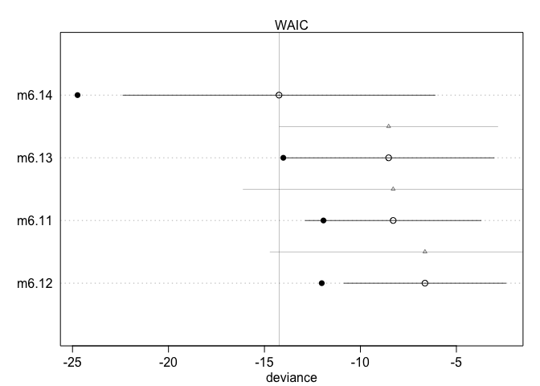
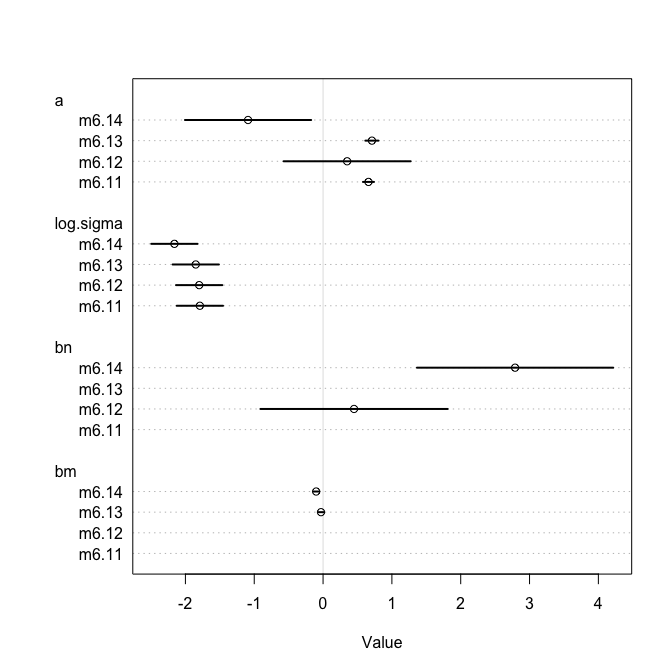
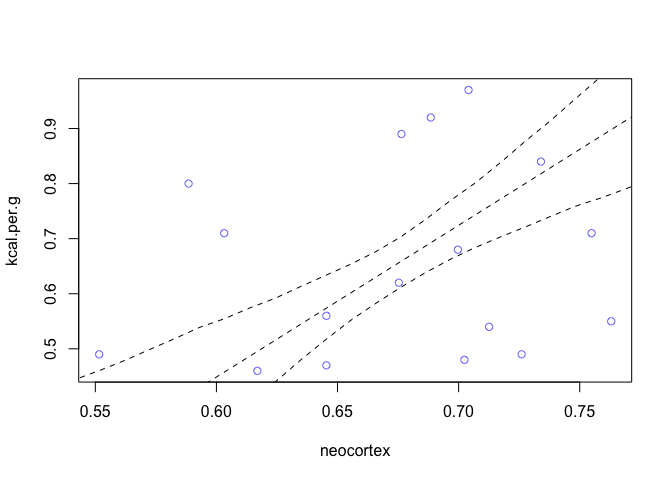
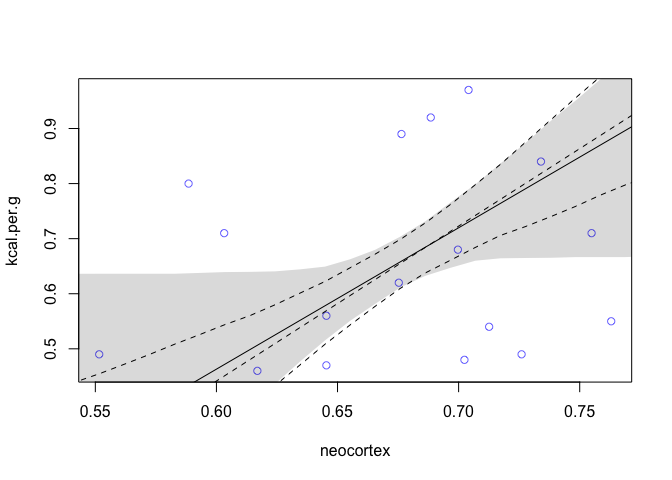

Chapter 6
================
Usman Khaliq
2020-05-05

``` r
# Libraries
library(tidyverse)
library(rethinking)
# Parameters

#===============================================================================

# Code
```

R Code 6.1

Lets simulate data for 7 hominin species, of their average brain volumes
and body mass

``` r
sppnames <- c(
  "afarensis", 
  "africanus",
  "habilis",
  "boisei",
  "rudolfensis",
  "ergaster",
  "sapiens"
  ) 

brainvolcc <- c(438, 452, 612, 521, 752, 871, 1350)

masskg <- c(37.0, 35.5, 34.5, 41.5, 55.5, 61.0, 53.5)

d <- data.frame(species = sppnames, brain = brainvolcc, mass = masskg)
```

Lets fit this data with increasingly complex models.

First, lets fit it in a linear model that assumes tha the average brain
volume of a species is a linear function of its body mass.

R Code 6.2

``` r
m6.1 <- lm(brain ~ mass, data = d)
```

Now, lets compute the R2 of this model.

R Code 6.3

``` r
1 - var(resid(m6.1)) / var(d$brain)
```

    ## [1] 0.490158

``` r
summary(m6.1)
```

    ## 
    ## Call:
    ## lm(formula = brain ~ mass, data = d)
    ## 
    ## Residuals:
    ##       1       2       3       4       5       6       7 
    ##  -99.86  -54.83  125.86 -109.96 -168.60 -163.39  470.77 
    ## 
    ## Coefficients:
    ##             Estimate Std. Error t value Pr(>|t|)  
    ## (Intercept) -227.629    439.794  -0.518   0.6268  
    ## mass          20.689      9.436   2.192   0.0798 .
    ## ---
    ## Signif. codes:  0 '***' 0.001 '**' 0.01 '*' 0.05 '.' 0.1 ' ' 1
    ## 
    ## Residual standard error: 252.1 on 5 degrees of freedom
    ## Multiple R-squared:  0.4902, Adjusted R-squared:  0.3882 
    ## F-statistic: 4.807 on 1 and 5 DF,  p-value: 0.07985

R Code 6.4

Now, lets use a more complex model that uses a second degree polynomial.

``` r
m6.2 <- lm(brain ~ mass + I(mass^2), data = d)
m6.3 <- lm(brain ~ mass + I(mass^2) + I(mass^3), data = d)
m6.4 <- lm(brain ~ mass + I(mass^2) + I(mass^3) + I(mass^4), data = d)
m6.5 <- lm(brain ~ mass + I(mass^2) + I(mass^3) + I(mass^4) + I(mass^5), data = d)
m6.6 <- 
  lm(
    brain ~ mass +
      I(mass^2) +
      I(mass^3) +
      I(mass^4) +
      I(mass^5) +
      I(mass^6),
    data = d
  )
```

R Code 6.9

``` r
p <- c(0.3, 0.7)
-sum(p * log(p))
```

    ## [1] 0.6108643

R Code 6.10

Lets use `logLik` to compute deviance

``` r
#fit model with lm
m6.1 <- lm(brain ~ mass, d)

#compute deviance by cheating
(-2) * logLik(m6.1)
```

    ## 'log Lik.' 94.92499 (df=3)

R Code 6.21

Lets demonstrate how to conduct model comparison.

``` r
data(milk)
d <- 
  milk %>% 
  drop_na() 

d$neocortex <- d$neocortex.perc / 100
glimpse(d)
```

    ## Rows: 17
    ## Columns: 9
    ## $ clade          <fct> Strepsirrhine, New World Monkey, New World Monkey, New…
    ## $ species        <fct> Eulemur fulvus, Alouatta seniculus, A palliata, Cebus …
    ## $ kcal.per.g     <dbl> 0.49, 0.47, 0.56, 0.89, 0.92, 0.80, 0.46, 0.71, 0.68, …
    ## $ perc.fat       <dbl> 16.60, 21.22, 29.66, 53.41, 50.58, 41.35, 3.93, 38.38,…
    ## $ perc.protein   <dbl> 15.42, 23.58, 23.46, 15.80, 22.33, 20.85, 25.30, 20.09…
    ## $ perc.lactose   <dbl> 67.98, 55.20, 46.88, 30.79, 27.09, 37.80, 70.77, 41.53…
    ## $ mass           <dbl> 1.95, 5.25, 5.37, 2.51, 0.68, 0.12, 0.47, 0.32, 1.55, …
    ## $ neocortex.perc <dbl> 55.16, 64.54, 64.54, 67.64, 68.85, 58.85, 61.69, 60.32…
    ## $ neocortex      <dbl> 0.5516, 0.6454, 0.6454, 0.6764, 0.6885, 0.5885, 0.6169…

R Code 6.22

Now, lets plot four different models that predict kilograms per grams of
milk by neocortex and the logarithm of mass. We would also be
constraining the standard deviation of the outcome to be positive by
estimating the logarithm of sigma and then exponentiating it.

``` r
a.start <- mean(d$kcal.per.g)
sigma.start <- log(sd(d$kcal.per.g))

m6.11 <- rethinking::map(
  alist(
    kcal.per.g ~ dnorm(a, exp(log.sigma))
  ),
  data = d,
  start = list(a = a.start, log.sigma = sigma.start)
) 

m6.12 <- rethinking::map(
  alist(
    kcal.per.g ~ dnorm(mu, exp(log.sigma)),
    mu <- a + bn * neocortex
  ),
  data = d,
  start = list(a = a.start, bn = 0, log.sigma = sigma.start)
)  

m6.13 <- rethinking::map(
  alist(
    kcal.per.g ~ dnorm(mu, exp(log.sigma)),
    mu <- a + bm * log(mass)
  ),
  data = d,
  start = list(a = a.start, bm = 0, log.sigma = sigma.start)
)  

m6.14 <- rethinking::map(
  alist(
    kcal.per.g ~ dnorm(mu, exp(log.sigma)),
    mu <- a + bm * log(mass) + bn * neocortex
  ),
  data = d,
  start = list(a = a.start, bm = 0, bn = 0, log.sigma = sigma.start)
)  
```

We will now be comparing these four models on the basis of their WAIC
values and how the models overfit the data, and on the basis of their
parameter estimates.

R Code 6.24

lets compare the models by WAIC, ranking the models from lowest WAIC to
highest WAIC

``` r
milk_models <- rethinking::compare(
  m6.11,
  m6.12,
  m6.13,
  m6.14
) 

milk_models
```

    ##             WAIC       SE    dWAIC      dSE    pWAIC     weight
    ## m6.14 -14.240917 8.132341 0.000000       NA 5.248254 0.88418357
    ## m6.13  -8.530152 5.497212 5.710764 5.692294 2.743564 0.05087046
    ## m6.11  -8.294111 4.578541 5.946805 7.820528 1.815810 0.04520745
    ## m6.12  -6.636730 4.216047 7.604186 8.073145 2.688826 0.01973851

The parameters described in the model above are as follows:

  - WAIC is the WAIC for each model. The models are ranked from lowest
    to highest WAIC values
  - SE is the standard error of the WAIC estimate
  - dWAIC is the difference between each WAIC and the lowest WAIC
  - dSE is the standard error of the difference in WAIC between each
    model and the top-ranked model.
  - pWAIC is the estimated effective number of parameters. This gives a
    hint on how flexible the model is in fitting the sample.
  - weight is the Akaine weight of each model.

R Code 6.25

Lets plot the WAIC estimates of the models.

``` r
plot(milk_models, SE = TRUE, dSE = TRUE)
```

<!-- -->

In the above plot, \* The closed circle is each model’s in-sample
deviance \* The open circle is WAIC of each model \* The dark segment
that passes through the open circle is each model’s standard error of
each WAIC \* The triangle above each model, and the light line is the
difference between the WAIC of the model and the top model, and the
standard error in the difference between models.

R Code 6.27

Now, lets compare the models by the estimates

``` r
plot(coeftab(m6.11, m6.12, m6.13, m6.14))
```

<!-- -->

R Code 6.29

To compute model averaging, lets plot counterfactual predictions for the
minimum WAIC model, m6.14 across the range of `neocrotex` values.

``` r
#compute counterfactual predictions
#neocortex from 0.5 to 0.8
nc.seq <- seq(from = 0.5, to = 0.8, length.out = 30)
d.predict <- list(
  #empty outcome
  kcal.per.g = rep(0, 30),
  #sequence of neocortex
  neocortex = nc.seq,
  #average mass
  mass = rep(4.5, 30)
) 

pred.m6.14 <- link(m6.14, data = d.predict)
mu <- apply(pred.m6.14, 2, mean)
mu.PI <- apply(pred.m6.14, 2, PI)

#plot it all
plot(kcal.per.g ~ neocortex, d, col = rangi2)
lines(nc.seq, mu, lty = 2)
lines(nc.seq, mu.PI[1, ], lty = 2)
lines(nc.seq, mu.PI[2, ], lty = 2)
```

<!-- -->

R Code 6.30 Model Averaging

Now, add the averaged posterior predictions by following these steps:

1)  Compute WAIC for each model
2)  Compute weight of each model
3)  Compute linear model and simulated outcome for each model
4)  Combine these values into an ensemble of predictions, using the
    model weights as parameters

<!-- end list -->

``` r
#compute counterfactual predictions
#neocortex from 0.5 to 0.8
nc.seq <- seq(from = 0.5, to = 0.8, length.out = 30)
d.predict <- list(
  #empty outcome
  kcal.per.g = rep(0, 30),
  #sequence of neocortex
  neocortex = nc.seq,
  #average mass
  mass = rep(4.5, 30)
) 

pred.m6.14 <- link(m6.14, data = d.predict)
mu <- apply(pred.m6.14, 2, mean)
mu.PI <- apply(pred.m6.14, 2, PI)

#plot it all
plot(kcal.per.g ~ neocortex, d, col = rangi2)
lines(nc.seq, mu, lty = 2)
lines(nc.seq, mu.PI[1, ], lty = 2)
lines(nc.seq, mu.PI[2, ], lty = 2)

milk.ensemble <- ensemble(m6.11, m6.12, m6.13, m6.14, data = d.predict)
mu <- apply(milk.ensemble$link, 2, mean)
mu.PI <- apply(milk.ensemble$link, 2, PI)
lines(nc.seq, mu)
shade(mu.PI, nc.seq)
```

<!-- -->
