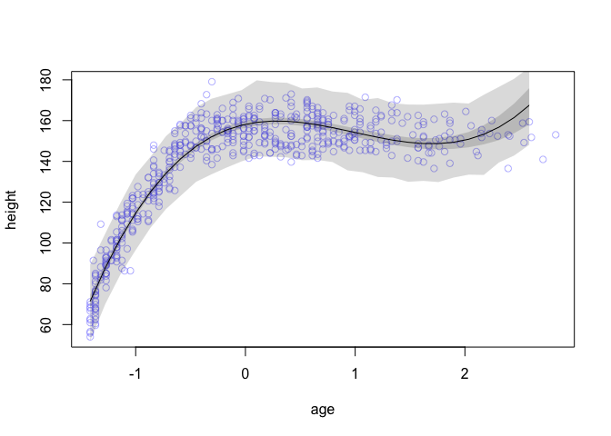

Chapter 6 Exercises
================
Usman Khaliq
2020-05-10

``` r
# Libraries
library(tidyverse)
library(rethinking)
```

6E1. State the three motivating criteria that define information
entropy. Try to express each in your own words.

The following are the three motivating criteria that define information
entropy:

1)  The measure of uncertainty should be continuous, so that a small
    change in the probabilities does not result in a massive change in
    the uncertainty

2)  The measure of uncertainty should increase as the number of events
    increase

3)  The measure of uncertainty should be additive.

6E2. Suppose a coin is weighted such that, when it is tossed and lands
on a table, it comes up heads 70% of the time. What is the entropy of
this coin?

Answer:

``` r
p <- c(0.7, 0.3)
-sum(p * log(p))
```

    ## [1] 0.6108643

6E3. Suppose a four-sided die is loaded such that, when tossed onto a
table, it shows “1” 20%, “2” 25%, ”3” 25%, and ”4” 30% of the time. What
is the entropy of this die?

``` r
p <- c(0.20, 0.25, 0.25, 0.3)
-sum(p * log(p))
```

    ## [1] 1.376227

6E4. Suppose another four-sided die is loaded such that it never shows
“4”. The other three sides show equally often. What is the entropy of
this die?

``` r
p <- c(1/3 , 1/3, 1/3)
-sum(p * log(p))
```

    ## [1] 1.098612

6M1. Write down and compare the definitions of AIC, DIC, and WAIC. Which
of these criteria is most general? Which assumptions are required to
transform a more general criterion into a less general one?

AIC: AIC provides a measure of predictive accuracy, as measured by the
out-of-sample deviance of a model. AIC relies on the following criteria:

1)  The priors are either flat or are overwhelmed by the likelihood
    function.
2)  The posterior distribution is approximately multivariate Gaussean
3)  The same size, N is much larger than the number of parameters.

DIC: The DIC also assumes a multivariate Gaussean distribution like AIC,
but it does not assume that the priors are flat.

WAIC: The WAIC does not make any assumptions about the distribution of
the posterior. It is also different from AIC and DIC because WAIC
considers the uncertainty in prediction on a case-by-case basis, instead
of averaging it out over the data.

WAIC is the most general. If we assume that the posterior distribution
is Gaussean, then WAIC can be converted to DIC. Furthermore, if we
assume that the priors are flat, then DIC can be converted to AIC.

6M2. Explain the difference between model selection and model averaging.
What information is lost under model selection? What information is lost
under model averaging?

Answer:

Model selection is the process of choosing a model with the lowest
AIC/DIC/WAIC values and then discarding the other models. Under model
selection, we lose information about the relative predictive accuracy of
different models, and by discarding this information, we lose
information on how confident we should be in our final model choice,
since it is possible that the relative difference between the predictice
accuracy of different models is either large or small.

Model averaging is the process of using the DIC/WAIC values of different
models to construct a posterior predictive distribution that helps us to
use information about the relative accuracy of the different models.
This helps us against overconfidence in the model structure. However,
under model averaging, we might end up diminishing the predictive power
of individual models.

6M3. When comparing models with an information criterion, why must all
models be fit to exactly the same observations? What would happen to the
information criterion values, if the models were fit to different
numbers of observations? Perform some experiments, if you are not sure.

Answer:

All models must be fit to exactly the same observations so that we can
get a better sense of their out-of-sample deviance estimate. If the
models were fit to different number of observations, then the model that
fits in with the lesser amount of data would have better AIC/DIC/WAIC
values as compared to the other model.

6M4. What happens to the effective number of parameters, as measured by
DIC or WAIC, as a prior becomes more concentrated? Why? Perform some
experiments, if you are not sure.

Answer:

As the priors become more concentrated, the effective number of
parameters reduce, since the skeptical priors prevent overfitting.

6M5. Provide an informal explanation of why informative priors reduce
overfitting.

Answer:

Informative priors reduce overfitting because they require more data for
the values to be moved from their initial values, which prevents the
model from learning too much from the training data.

6M6. Provide an information explanation of why overly informative priors
result in underfitting.

Overly informative priors make it very difficult for the model to be
adaptive and to learn from more data, which ends up with the model not
learning enough from the data available, leading to underfitting.

R Code 6.31

``` r
data("Howell1")
d <- Howell1

d$age <- (d$age - mean(d$age)) / sd(d$age)
set.seed(1000)
i <- sample(1:nrow(d), size = nrow(d) / 2)
d1 <- d[i, ]
d2 <- d[-i, ]
```

You now have two randomly formed data frames, each with 272 rows. The
notion here is to use the cases in d1 to fit models and the cases in d2
to evaluate them. The set.seed command just ensures that everyone works
with the same randomly shuffled data.

Now let hi and xi be the height and centered age values, respectively,
on row i. Fit the following models to the data in d1:

ℳ1:hi\~Normal(μi,σ) μi=α+β1xi ℳ2:hi\~Normal(μi,σ) μi=α+β1xi+β2x2i
ℳ3:hi\~Normal(μi,σ) μi=α+β1xi+β2x2i+β3x3i
ℳ4:hi\~Normal(μi,σ)μi=α+β1xi+β2x2i+β3x3i+β4x4i
ℳ5:hi\~Normal(μi,σ) μi=α+β1xi+β2x2i+β3x3i+β4x4i+β5x5i
ℳ6:hi\~Normal(μi,σ) μi=α+β1xi+β2x2i+β3x3i+β4x4i+β5x5i+β6x6i

Use map to fit these. Use weakly regularizing priors for all parameters.

Note that fitting all of these polynomials to the height-by-age
relationship is not a good way to derive insight. It would be better to
have a simpler approach that would allow for more insight, like perhaps
a piecewise linear model. But the set of polynomial families above will
serve to help you practice and understand model comparison and
averaging.

``` r
d1$age.s2 <- d1$age^2
d1$age.s3 <- d1$age^3
d1$age.s4 <- d1$age^4
d1$age.s5 <- d1$age^5
d1$age.s6 <- d1$age^6


f1 <- alist(
    height ~ dnorm(mean = mu, sd = sigma),
    mu <- alpha + beta.1*age,
    c(alpha, beta.1) ~ dnorm(mean = 0, sd = 100),
    sigma ~ dunif(min = 0, max = 50)
)

f2 <- alist(
  height ~ dnorm(mean = mu, sd = sigma),
  mu <- alpha + beta.1*age + beta.2*age.s2,
  c(alpha, beta.1, beta.2) ~ dnorm(mean = 0, sd = 100),
  sigma ~ dunif(min = 0, max = 50)
)

f3 <- alist(
  height ~ dnorm(mean = mu, sd = sigma),
  mu <- alpha + beta.1*age + beta.2*age.s2 + beta.3*age.s3,
  c(alpha, beta.1, beta.2, beta.3) ~ dnorm(mean = 0, sd = 100),
  sigma ~ dunif(min = 0, max = 50)
)

f4 <- alist(
  height ~ dnorm(mean = mu, sd = sigma),
  mu <- alpha + beta.1*age + beta.2*age.s2 + beta.3*age.s3 + beta.4*age.s4,
  c(alpha, beta.1, beta.2, beta.3, beta.4) ~ dnorm(mean = 0, sd = 100),
  sigma ~ dunif(min = 0, max = 50)
)

f5 <- alist(
  height ~ dnorm(mean = mu, sd = sigma),
  mu <- alpha + beta.1*age + beta.2*age.s2 + beta.3*age.s3 + beta.4*age.s4 + beta.5*age.s5,
  c(alpha, beta.1, beta.2, beta.3, beta.4, beta.5) ~ dnorm(mean = 0, sd = 100),
  sigma ~ dunif(min = 0, max = 50)
)

f6 <- alist(
  height ~ dnorm(mean = mu, sd = sigma),
  mu <- alpha + beta.1*age + beta.2*age.s2 + beta.3*age.s3 + beta.4*age.s4 + beta.5*age.s5 + beta.6*age.s6,
  c(alpha, beta.1, beta.2, beta.3, beta.4, beta.5, beta.6) ~ dnorm(mean = 0, sd = 100),
  sigma ~ dunif(min = 0, max = 50)
) 

alpha.start <- mean(d$height)
sigma.start <- sd(d$height)

m1 <- rethinking::map(
  flist = f1,
  data = d1,
  start = list(alpha = alpha.start, sigma = sigma.start, beta.1 = 0)
)

m2 <- rethinking::map(
  flist = f2,
  data = d1,
  start = 
    list(
      alpha = alpha.start,
      sigma = sigma.start,
      beta.1 = 0,
      beta.2 = 0
    )
) 

m3 <- rethinking::map(
  flist = f3,
  data = d1,
  start = 
    list(
      alpha = alpha.start,
      sigma = sigma.start,
      beta.1 = 0,
      beta.2 = 0,
      beta.3 = 0
    )
)

m4 <- rethinking::map(
  flist = f4,
  data = d1,
  start = 
    list(
      alpha = alpha.start,
      sigma = sigma.start,
      beta.1 = 0,
      beta.2 = 0,
      beta.3 = 0,
      beta.4 = 0
    )
)

m5 <- rethinking::map(
  flist = f5,
  data = d1,
  start = 
    list(
      alpha = alpha.start,
      sigma = sigma.start,
      beta.1 = 0,
      beta.2 = 0,
      beta.3 = 0,
      beta.4 = 0,
      beta.5 = 0
    )
)

m6 <- rethinking::map(
  flist = f6,
  data = d1,
  start = 
    list(
      alpha = alpha.start,
      sigma = sigma.start,
      beta.1 = 0,
      beta.2 = 0,
      beta.3 = 0,
      beta.4 = 0,
      beta.5 = 0,
      beta.6 = 0
    )
)
```

6H1. Compare the models above, using WAIC. Compare the model rankings,
as well as the WAIC weights.

``` r
height.models <- 
  rethinking::compare(
    m1,
    m2,
    m3,
    m4,
    m5,
    m6
  ) 

height.models
```

    ##        WAIC       SE       dWAIC       dSE    pWAIC        weight
    ## m6 1907.931 26.65992   0.0000000        NA 7.777385  4.349297e-01
    ## m4 1908.056 26.87063   0.1243414  3.662775 6.032766  4.087132e-01
    ## m5 1909.977 27.38173   2.0460925  3.730509 7.083093  1.563564e-01
    ## m3 1934.516 24.67041  26.5850971 11.477954 5.393104  7.337338e-07
    ## m2 2122.571 25.76553 214.6400554 28.498195 6.001333  1.071330e-47
    ## m1 2393.066 21.71368 485.1350540 30.795128 3.305926 1.961917e-106

6H2. For each model, produce a plot with model averaged mean and 97%
confidence interval of the mean, superimposed on the raw data. How do
predictions differ across models?

``` r
#define sequence of ages to compute predictions for
age.seq <- seq(from = min(d1$age), to = max(d1$age), length.out = 30)
pred_data <- list(age = age.seq)
mu <- link(m1, data = pred_data)
mu.mean <- apply(mu, 2, mean)
mu.PI <- apply(mu, 2, PI, prob = 0.97)
sim.height <- sim(m1, data = pred_data)
height.PI <- apply(sim.height, 2, PI, prob = 0.97)

plot(height ~ age, d, col = col.alpha(rangi2, 0.5))
lines(age.seq, mu.mean)
shade(mu.PI, age.seq)
shade(height.PI, age.seq)
```

<!-- -->

``` r
#
```

``` r
#define sequence of ages to compute predictions for
age.seq <- seq(from = min(d1$age), to = max(d1$age), length.out = 30)
pred_data <- list(age = age.seq, age.s2 = age.seq^2)
mu <- link(m2, data = pred_data)
mu.mean <- apply(mu, 2, mean)
mu.PI <- apply(mu, 2, PI, prob = 0.97)
sim.height <- sim(m2, data = pred_data)
height.PI <- apply(sim.height, 2, PI, prob = 0.97)

plot(height ~ age, d, col = col.alpha(rangi2, 0.5))
lines(age.seq, mu.mean)
shade(mu.PI, age.seq)
shade(height.PI, age.seq)
```

<!-- -->

``` r
#define sequence of ages to compute predictions for
age.seq <- seq(from = min(d1$age), to = max(d1$age), length.out = 30)
pred_data <- list(age = age.seq, age.s2 = age.seq^2, age.s3 = age.seq^3)
mu <- link(m3, data = pred_data)
mu.mean <- apply(mu, 2, mean)
mu.PI <- apply(mu, 2, PI, prob = 0.97)
sim.height <- sim(m3, data = pred_data)
height.PI <- apply(sim.height, 2, PI, prob = 0.97)

plot(height ~ age, d, col = col.alpha(rangi2, 0.5))
lines(age.seq, mu.mean)
shade(mu.PI, age.seq)
shade(height.PI, age.seq)
```

<!-- -->

``` r
#define sequence of ages to compute predictions for
age.seq <- seq(from = min(d1$age), to = max(d1$age), length.out = 30)
pred_data <- 
  list(
    age = age.seq,
    age.s2 = age.seq^2,
    age.s3 = age.seq^3,
    age.s4 = age.seq^4
  )
mu <- link(m4, data = pred_data)
mu.mean <- apply(mu, 2, mean)
mu.PI <- apply(mu, 2, PI, prob = 0.97)
sim.height <- sim(m4, data = pred_data)
height.PI <- apply(sim.height, 2, PI, prob = 0.97)

plot(height ~ age, d, col = col.alpha(rangi2, 0.5))
lines(age.seq, mu.mean)
shade(mu.PI, age.seq)
shade(height.PI, age.seq)
```

<!-- -->

``` r
#define sequence of ages to compute predictions for
age.seq <- seq(from = min(d1$age), to = max(d1$age), length.out = 30)
pred_data <- 
  list(
    age = age.seq,
    age.s2 = age.seq^2,
    age.s3 = age.seq^3,
    age.s4 = age.seq^4,
    age.s5 = age.seq^5
  )
mu <- link(m5, data = pred_data)
mu.mean <- apply(mu, 2, mean)
mu.PI <- apply(mu, 2, PI, prob = 0.97)
sim.height <- sim(m5, data = pred_data)
height.PI <- apply(sim.height, 2, PI, prob = 0.97)

plot(height ~ age, d, col = col.alpha(rangi2, 0.5))
lines(age.seq, mu.mean)
shade(mu.PI, age.seq)
shade(height.PI, age.seq)
```

<!-- -->

``` r
#define sequence of ages to compute predictions for
age.seq <- seq(from = min(d1$age), to = max(d1$age), length.out = 30)
pred_data <- 
  list(
    age = age.seq,
    age.s2 = age.seq^2,
    age.s3 = age.seq^3,
    age.s4 = age.seq^4,
    age.s5 = age.seq^5,
    age.s6 = age.seq^6
  )
mu <- link(m6, data = pred_data)
mu.mean <- apply(mu, 2, mean)
mu.PI <- apply(mu, 2, PI, prob = 0.97)
sim.height <- sim(m6, data = pred_data)
height.PI <- apply(sim.height, 2, PI, prob = 0.97)

plot(height ~ age, d, col = col.alpha(rangi2, 0.5))
lines(age.seq, mu.mean)
shade(mu.PI, age.seq)
shade(height.PI, age.seq)
```

<!-- -->

6H3. Now also plot the model averaged predictions, across all models. In
what ways do the averaged predictions differ from the predictions of the
model with the lowest WAIC value?

Answer: First, lets plot the counterfactual predictions for the
minimum-WAIC model, m6.

``` r
#define sequence of ages to compute predictions for
age.seq <- seq(from = min(d1$age), to = max(d1$age), length.out = 30)
pred_data <- 
  list(
    age = age.seq,
    age.s2 = age.seq^2,
    age.s3 = age.seq^3,
    age.s4 = age.seq^4,
    age.s5 = age.seq^5,
    age.s6 = age.seq^6,
    height = rep(0, 30)
  )
mu <- link(m6, data = pred_data)
mu.mean <- apply(mu, 2, mean)
mu.PI <- apply(mu, 2, PI, prob = 0.97)

#plot it all
plot(height ~ age, d, col = col.alpha(rangi2, 0.5))
lines(age.seq, mu.mean, lty = 2)
lines(age.seq, mu.PI[1,], lty = 2)
lines(age.seq, mu.PI[2,], lty = 2)
```

<!-- -->

The dashed lines above give the dashed average mean prediction and the
89% confidence interval for the prediction.

Now, lets compute and add model averaged posterior predictions to the
above visualization.

``` r
model.ensemble <- ensemble(m1, m2, m3, m4, m5, m6, data = pred_data)
mu_ensemble <- apply(model.ensemble$link, 2, mean)
mu_ensemble_PI <- apply(model.ensemble$link, 2, PI)

plot(height ~ age, d, col = col.alpha(rangi2, 0.5))
lines(age.seq, mu.mean, lty = 2)
lines(age.seq, mu.PI[1,], lty = 2)
lines(age.seq, mu.PI[2,], lty = 2)
lines(age.seq, mu_ensemble)
shade(mu_ensemble_PI, age.seq)
```

<!-- -->

6H4. Compute the test-sample deviance for each model. This means
calculating deviance, but using the data in d2 now. You can compute the
log-likelihood of the height data with:

``` r
sum(dnorm(d2$height, mu, sigma, log = TRUE))
```

``` r
coef_m1 <- coef(m1)
mu_m1 <- coef_m1["alpha"] + coef_m1["beta"] * d1$age
log_likelihood_m1 <- 
  sum(
    dnorm(d2$height),
    mean = mu_m1,
    sd = coef_m1["sigma"],
    log = TRUE
  ) 

deviance_m1 <- -2 * log_likelihood_m1 

coef_m2 <- coef(m2)
mu_m2 <- 
  coef_m2["alpha"] + coef_m2["beta.1"] * d1$age + coef_m2["beta.2"] * d1$age^2
log_likelihood_m2 <- 
  sum(
    dnorm(d2$height),
    mean = mu_m2,
    sd = coef_m2["sigma"],
    log = TRUE
  ) 

deviance_m2 <- -2 * log_likelihood_m2 

coef_m2 <- coef(m2)
mu_m2 <- 
  coef_m2["alpha"] + coef_m2["beta.1"] * d1$age + coef_m2["beta.2"] * d1$age^2
log_likelihood_m2 <- 
  sum(
    dnorm(d2$height),
    mean = mu_m2,
    sd = coef_m2["sigma"],
    log = TRUE
  ) 

deviance_m2 <- -2 * log_likelihood_m2 

coef_m3 <- coef(m3)
mu_m3 <- 
  coef_m3["alpha"] + 
  coef_m3["beta.1"] * d1$age + 
  coef_m3["beta.2"] * d1$age^2 + 
  coef_m3["beta.3"] * d1$age^3
log_likelihood_m3 <- 
  sum(
    dnorm(d2$height),
    mean = mu_m3,
    sd = coef_m3["sigma"],
    log = TRUE
  ) 

deviance_m3 <- -2 * log_likelihood_m3 

coef_m4 <- coef(m4)
mu_m4 <- 
  coef_m4["alpha"] + 
  coef_m4["beta.1"] * d1$age + 
  coef_m4["beta.2"] * d1$age^2 + 
  coef_m4["beta.3"] * d1$age^3 +
  coef_m4["beta.4"] * d1$age^4
log_likelihood_m4 <- 
  sum(
    dnorm(d2$height),
    mean = mu_m4,
    sd = coef_m4["sigma"],
    log = TRUE
  ) 

deviance_m4 <- -2 * log_likelihood_m4  

coef_m5 <- coef(m5)
mu_m5 <- 
  coef_m5["alpha"] + 
  coef_m5["beta.1"] * d1$age + 
  coef_m5["beta.2"] * d1$age^2 + 
  coef_m5["beta.3"] * d1$age^3 +
  coef_m5["beta.4"] * d1$age^4 +
  coef_m5["beta.5"] * d1$age^5
log_likelihood_m5 <- 
  sum(
    dnorm(d2$height),
    mean = mu_m5,
    sd = coef_m5["sigma"],
    log = TRUE
  ) 

deviance_m5 <- -2 * log_likelihood_m5 

coef_m6 <- coef(m6)
mu_m6 <- 
  coef_m6["alpha"] + 
  coef_m6["beta.1"] * d1$age + 
  coef_m6["beta.2"] * d1$age^2 + 
  coef_m6["beta.3"] * d1$age^3 +
  coef_m6["beta.4"] * d1$age^4 +
  coef_m6["beta.5"] * d1$age^5 +
  coef_m6["beta.6"] * d1$age^6

log_likelihood_m6 <- 
  sum(
    dnorm(d2$height),
    mean = mu_m6,
    sd = coef_m6["sigma"],
    log = TRUE
  ) 

deviance_m6 <- -2 * log_likelihood_m6

deviance_m1
```

    ## [1] NA

``` r
deviance_m2
```

    ## [1] -74660.53

``` r
deviance_m3
```

    ## [1] -74655.76

``` r
deviance_m4
```

    ## [1] -74655.11

``` r
deviance_m5
```

    ## [1] -74655.1

``` r
deviance_m6
```

    ## [1] -74655.06
