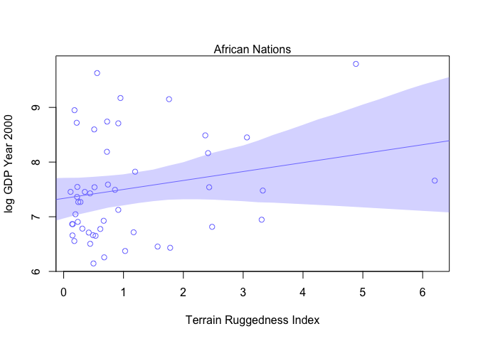

Chapter 7 - Interactions
================
Usman Khaliq
2020-05-11

``` r
# Libraries
library(tidyverse)
library(rethinking)
# Parameters

#===============================================================================

# Code
```

R 7.1 Lets explore regressions of terrain ruggedness against economic
performance in Africa and outside of Africa

``` r
data("rugged")
d <- rugged
#transform outcome to log scale
d$log_gdp <- log(d$rgdppc_2000)

#remove countries which do not have GDP data
dd <- 
  d %>%
  drop_na(rgdppc_2000)

#split countries on whether they are in africa or not in africa
d.A1 <- 
  dd  %>% 
  filter(cont_africa == 1)

d.A0 <- 
  dd %>% 
  filter(cont_africa == 0)
```

R Code 7.2

Fit regression models to the data above.

``` r
#African nations
m7.1 <- rethinking::map(
  alist(
    log_gdp ~ dnorm(mu, sigma),
    mu <- a + bR * rugged,
    a ~ dnorm(8, 100),
    bR ~ dnorm(0, 1),
    sigma ~ dunif(0, 10)
  ),
  data = d.A1
) 

#non-African nations
m7.2 <- rethinking::map(
  alist(
    log_gdp ~ dnorm(mu, sigma),
    mu <- a + bR * rugged,
    a ~ dnorm(8, 100),
    bR ~ dnorm(0, 1),
    sigma ~ dunif(0, 10)
  ),
  data = d.A0
) 
```

``` r
#define sequence of rugged terrain values to make predictions on
rugged_seq_africa <- 
  seq(from = min(d.A1$rugged), to = max(d.A1$rugged), length.out = 30) 

mu_africa <- link(m7.1, data = data.frame(rugged = rugged_seq_africa))
mu.mean <- apply(mu_africa, 2, mean)
mu.PI <- apply(mu_africa, 2, HPDI, prob = 0.89) 


plot(log_gdp ~ rugged, data = d.A1, col = col.alpha(rangi2, 0.5))
mtext("Africa")
#draw MAP line
lines(rugged_seq_africa, mu.mean)

#draw HPDI region for line
shade(mu.PI, rugged_seq_africa)
```

<!-- -->

``` r
#define sequence of rugged terrain values to make predictions on
rugged_seq_not_africa <- 
  seq(from = min(d.A0$rugged), to = max(d.A0$rugged), length.out = 30) 

mu_not_africa <- link(m7.2, data = data.frame(rugged = rugged_seq_not_africa))
mu.mean <- apply(mu_not_africa, 2, mean)
mu.PI <- apply(mu_not_africa, 2, HPDI, prob = 0.89) 


plot(log_gdp ~ rugged, data = d.A0, col = col.alpha(rangi2, 0.5))
mtext("not Africa")
#draw MAP line
lines(rugged_seq_not_africa, mu.mean)

#draw HPDI region for line
shade(mu.PI, rugged_seq_not_africa)
```

<!-- -->

Its not a good idea to split data, like we split the data above. The
following are the reasons for it:

1)  Some parameters, such as sigma, were assumed to not depend on a
    country’s Africa identity. By splitting the data, we are hurting the
    accuracy of such estimates because we are now making two less
    accurate estimates instead of pooling all data into making one solid
    estimate.

2)  In order to make probability estimates about the `cont_africa`
    variable, we need to include it in the data that the model works on.
    Unless our model analyses all the data, it canot make a solid
    estimate of the uncertainty in the probability that `cont_africa`
    has on the outcome variable.

3)  We might need to use information criteria to compare how different
    models treat different continents. In order for the estimate to be
    as accurate as possible, the models should read all the data.

4)  In multilevel models, we can in fact learn across different
    categories. Therefore, it makes sense to not split data before
    inputting it into the model.

Lets see if adding the categorical variable(dummy variable)
`cont_africa` will reveal the reverse slope in the model.

R Code 7.3

The following is a simple linear regression model for `log_gdp` on
ruggedness over the entire dataset

``` r
m7.3 <- rethinking::map(
  alist(
    log_gdp ~ dnorm(mu, sigma),
    mu <- a + bR * rugged,
    a ~ dnorm(8, 100),
    bR ~ dnorm(0, 1),
    sigma ~ dunif(0, 10)
  ),
  data = dd
)
```

The second is a model that includes a dummy variable for African
countries.

R Code 7.4

``` r
m7.4 <- rethinking::map(
  alist(
    log_gdp ~ dnorm(mu, sigma),
    mu <- a + bR * rugged + bA * cont_africa,
    a ~ dnorm(8, 100),
    bR ~ dnorm(0, 1),
    bA ~ dnorm(0, 1),
    sigma ~ dunif(0, 10)
  ),
  data = dd
)
```

Now, lets compare the WAIC values of these models

R Code 7.5

``` r
compare(m7.3, m7.4)
```

    ##          WAIC       SE    dWAIC      dSE    pWAIC      weight
    ## m7.4 476.4312 15.35923  0.00000       NA 4.435232 1.00000e+00
    ## m7.3 539.9227 13.34768 63.49147 15.15474 2.870943 1.63306e-14

From the above, we can see that all weight is assigned to model m7.4.
The standard error in the difference of WAIC between the two models is
15, but the difference in WAIC values is 63, which implies a 95%
confidence interval difference of 63 +- 30. Thus, we can gauge from
these numbers that the dummy variable is picking up some important
information since m7.4 is superior to the simple model.

Now, lets plot the posterior prediction of m7.4 to see whether it
achieves different slopes within and outside of Africa.

R Code 7.6

``` r
rugged.seq <- seq(from = -1, to = 8, by = 0.25)

#compute mu over samples, fixing cont_africa = 0
mu.NotAfrica <- 
  link(m7.4, data = data.frame(cont_africa = 0, rugged = rugged.seq))

#compute mu over samples, fixing cont_africa = 1
mu.Africa <- 
  link(m7.4, data = data.frame(cont_africa = 1, rugged = rugged.seq))

#summarise to means and intervals 
mu.NotAfrica.mean <- apply(mu.NotAfrica, 2, mean)
mu.NotAfrica.PI <- apply(mu.NotAfrica, 2, PI, prob = 0.97)
mu.Africa.mean <- apply(mu.Africa, 2, mean)
mu.Africa.PI <- apply(mu.Africa, 2, PI, prob = 0.97)
```

``` r
plot(log_gdp ~ rugged, data = dd) 

#plot the regression lines
lines(rugged.seq, mu.NotAfrica.mean)
lines(rugged.seq, mu.Africa.mean, col = col.alpha(rangi2, 0.5))

#draw HPDI region for lines
shade(mu.NotAfrica.PI, rugged.seq)
shade(mu.Africa.PI, rugged.seq, col = col.alpha(rangi2, 0.5))
mtext("Africa is in Blue, Other Countries in Black")
```

<!-- -->

From the above, we can see that by just adding a dummy variable to the
model, the model still predicted a poor relationship between ruggedness
and a country’s GDP. What the model only did was that it predicted a
lower average GDP values for African countries, which can be shown from
the fact that the regression line for Africa is lower.

Now, instead, lets add a linear model that models the linear interaction
effect between ruggedness and African nations. In short, the
relationship between GDP and ruggedness will be conditional on whether a
country is in Africa or not.

Yi \~ Normal(µi, σ) \[likelihood\] µi = α + γiRi + βAAi \[linear model
of µ\] γi = βR + βARAi \[linear model of slope\]

The third line above is the linear interaction effect between ruggedness
and whether a country is in Africa or not.

Lets model the above linear interaction.

R Code 7.7

``` r
m7.5 <- rethinking::map(
  alist(
    log_gdp ~ dnorm(mu, sigma),
    mu <- a + gamma * rugged + bA * cont_africa,
    gamma <- bR + bAR * cont_africa,
    a ~ dnorm(8, 100),
    bA ~ dnorm(0, 1),
    bR ~ dnorm(0, 1),
    bAR ~ dnorm(0, 1),
    sigma ~ dunif(0, 10)
  ),
  data = dd
)
```

Now, lets compare this model using WAIC values with the previous models.

``` r
compare(m7.3, m7.4, m7.5)
```

    ##          WAIC       SE     dWAIC       dSE    pWAIC       weight
    ## m7.5 469.6433 15.11418  0.000000        NA 5.286206 9.679679e-01
    ## m7.4 476.4602 15.29862  6.816919  6.164413 4.433733 3.203213e-02
    ## m7.3 539.5304 13.32193 69.887082 15.175004 2.672001 6.457640e-16

Model 7.5 has a weight of 0.97. However, the weight of 0.03 that is
given to model m7.4 shows that there is slight overfitting happening in
m7.5. Also, the difference in the standard errors between the top two
models is almost the same. This phenonema might also be there because
there are only a limited number of African countries, and hence there is
some sparsity in the data.

R Code 7.10 First, lets calculate the posterior mean line and intervals
for both plots.

``` r
rugged.seq <- seq(from = -1, to = 8, by = 0.25)

mu.Africa <- link(m7.5, data = data.frame(cont_africa = 1, rugged = rugged.seq))
mu.Africa.mean <- apply(mu.Africa$mu, 2, mean)
mu.Africa.PI <- apply(mu.Africa$mu, 2, PI, prob = 0.97)

mu.NotAfrica <- 
  link(m7.5, data = data.frame(cont_africa = 0, rugged = rugged.seq))
mu.NotAfrica.mean <- apply(mu.NotAfrica$mu, 2, mean)
mu.NotAfrica.PI <- apply(mu.NotAfrica$mu, 2, PI, prob = 0.97)
```

now, lets plot the plots

R Code 7.11

``` r
#plot African nations with regression
plot(
  log(rgdppc_2000) ~ rugged,
  data = d.A1,
  col = rangi2,
  ylab = "log GDP Year 2000",
  xlab = "Terrain Ruggedness Index"
  ) 
mtext("African Nations", 3)
lines(rugged.seq, mu.Africa.mean, col = rangi2)
shade(mu.Africa.PI, rugged.seq, col = col.alpha(rangi2, 0.3))
```

<!-- -->

``` r
#plot non-African nations with regression
plot(
  log(rgdppc_2000) ~ rugged,
  data = d.A0,
  col = "black",
  ylab = "log GDP Year 2000",
  xlab = "Terrain Ruggedness Index"
  ) 
mtext("Non-African Nations", 3)
lines(rugged.seq, mu.NotAfrica.mean)
shade(mu.NotAfrica.PI, rugged.seq)
```

<!-- -->

Now above, we can see that the slopes reverse direction inside and
outside of Africa.

Interpreting interaction estimates is tricky. The following are two
reasons for being wary about directly interpreting tables of posterior
means and standard deviations.

1)  When we add interactions to a model, it changes the meaning of
    parameters. A “main effect” coefficient in the interaction model
    does not mean the same thing as a coefficient of the same name in a
    model without an interaction. In a simple linear regression, with no
    interactions, each coefficient tells us how much the average outcome
    changes when the predictor changes by one unit. However, in case of
    an interaction, this does not hold true anymore, since the
    coefficient is now dependent on other predictor variables. We can no
    longer read these values directly from tables.

For instance, in the above example, the parameter estimates are as
follows:

``` r
precis(m7.5)
```

    ##             mean         sd       5.5%       94.5%
    ## a      9.1835953 0.13641582  8.9655765  9.40161416
    ## bA    -1.8461141 0.21848085 -2.1952887 -1.49693955
    ## bR    -0.1843541 0.07568752 -0.3053173 -0.06339078
    ## bAR    0.3483231 0.12749937  0.1445545  0.55209174
    ## sigma  0.9332506 0.05067074  0.8522689  1.01423219

In the above table, we do not see values for gamma, since it wasn’t
estimated. However, we would have to estimate it ourselves for both
within Africa and outside of Africa.

Within Africa, gamma is as follows

``` r
-0.18 + 0.35
```

    ## [1] 0.17

Outside of Africa, gamma is as follows:

``` r
-0.18 + 0.35 * 0
```

    ## [1] -0.18

2)  It is difficult to incorporate uncertainty just by looking at tables
    of numbers. Since gamma depends on parameters,and those parameters
    have posterior distributions, gamma also has a posterior
    distribution.

We can compute the posterior distribution of gamma as follows:

``` r
post <- extract.samples(m7.5)
gamma.Africa <- post$bR + post$bAR * 1
gamma.notAfrica <- post$bR + post$bAR * 0
```

The means of these posterior distributions for gamma values is as
follows:

``` r
mean(gamma.Africa)
```

    ## [1] 0.1645059

``` r
mean(gamma.notAfrica)
```

    ## [1] -0.1848995

These means are very close to the MAP values of mean calculated above.

Now, lets plot the distributions of gamma values within and outside of
Africa to see where they overlap.

``` r
dens(
  gamma.Africa, 
  xlim = c(-0.5, 0.6),
  ylim = c(0, 5.5),
  xlab = "gamma",
  col = rangi2
  )
dens(gamma.notAfrica, add = TRUE)
```

<!-- -->
