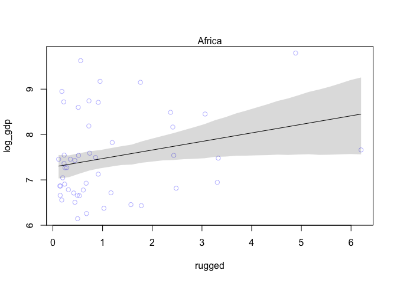
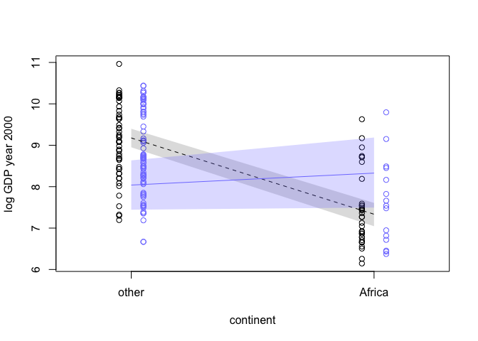

Chapter 7 - Interactions
================
Usman Khaliq
2020-05-17

  - [Continuous Interactions](#continuous-interactions)
      - [Benefits of Centering Prediction
        Variables.](#benefits-of-centering-prediction-variables.)
      - [R Code 7.18](#r-code-7.18)
      - [The Un-centered model.](#the-un-centered-model.)
      - [R Code 7.19](#r-code-7.19)
      - [Centering and Re-estimating](#centering-and-re-estimating)
      - [Plotting Implied Predictions.](#plotting-implied-predictions.)

``` r
# Libraries
library(tidyverse)
library(rethinking)
# Parameters

#===============================================================================

# Code
```

R 7.1 Lets explore regressions of terrain ruggedness against economic
performance in Africa and outside of Africa

``` r
data("rugged")
d <- rugged
#transform outcome to log scale
d$log_gdp <- log(d$rgdppc_2000)

#remove countries which do not have GDP data
dd <- 
  d %>%
  drop_na(rgdppc_2000)

#split countries on whether they are in africa or not in africa
d.A1 <- 
  dd  %>% 
  filter(cont_africa == 1)

d.A0 <- 
  dd %>% 
  filter(cont_africa == 0)
```

R Code 7.2

Fit regression models to the data above.

``` r
#African nations
m7.1 <- rethinking::map(
  alist(
    log_gdp ~ dnorm(mu, sigma),
    mu <- a + bR * rugged,
    a ~ dnorm(8, 100),
    bR ~ dnorm(0, 1),
    sigma ~ dunif(0, 10)
  ),
  data = d.A1
) 

#non-African nations
m7.2 <- rethinking::map(
  alist(
    log_gdp ~ dnorm(mu, sigma),
    mu <- a + bR * rugged,
    a ~ dnorm(8, 100),
    bR ~ dnorm(0, 1),
    sigma ~ dunif(0, 10)
  ),
  data = d.A0
) 
```

``` r
#define sequence of rugged terrain values to make predictions on
rugged_seq_africa <- 
  seq(from = min(d.A1$rugged), to = max(d.A1$rugged), length.out = 30) 

mu_africa <- link(m7.1, data = data.frame(rugged = rugged_seq_africa))
mu.mean <- apply(mu_africa, 2, mean)
mu.PI <- apply(mu_africa, 2, HPDI, prob = 0.89) 


plot(log_gdp ~ rugged, data = d.A1, col = col.alpha(rangi2, 0.5))
mtext("Africa")
#draw MAP line
lines(rugged_seq_africa, mu.mean)

#draw HPDI region for line
shade(mu.PI, rugged_seq_africa)
```

<!-- -->

``` r
#define sequence of rugged terrain values to make predictions on
rugged_seq_not_africa <- 
  seq(from = min(d.A0$rugged), to = max(d.A0$rugged), length.out = 30) 

mu_not_africa <- link(m7.2, data = data.frame(rugged = rugged_seq_not_africa))
mu.mean <- apply(mu_not_africa, 2, mean)
mu.PI <- apply(mu_not_africa, 2, HPDI, prob = 0.89) 


plot(log_gdp ~ rugged, data = d.A0, col = col.alpha(rangi2, 0.5))
mtext("not Africa")
#draw MAP line
lines(rugged_seq_not_africa, mu.mean)

#draw HPDI region for line
shade(mu.PI, rugged_seq_not_africa)
```

<!-- -->

Its not a good idea to split data, like we split the data above. The
following are the reasons for it:

1)  Some parameters, such as sigma, were assumed to not depend on a
    country’s Africa identity. By splitting the data, we are hurting the
    accuracy of such estimates because we are now making two less
    accurate estimates instead of pooling all data into making one solid
    estimate.

2)  In order to make probability estimates about the `cont_africa`
    variable, we need to include it in the data that the model works on.
    Unless our model analyses all the data, it canot make a solid
    estimate of the uncertainty in the probability that `cont_africa`
    has on the outcome variable.

3)  We might need to use information criteria to compare how different
    models treat different continents. In order for the estimate to be
    as accurate as possible, the models should read all the data.

4)  In multilevel models, we can in fact learn across different
    categories. Therefore, it makes sense to not split data before
    inputting it into the model.

Lets see if adding the categorical variable(dummy variable)
`cont_africa` will reveal the reverse slope in the model.

R Code 7.3

The following is a simple linear regression model for `log_gdp` on
ruggedness over the entire dataset

``` r
m7.3 <- rethinking::map(
  alist(
    log_gdp ~ dnorm(mu, sigma),
    mu <- a + bR * rugged,
    a ~ dnorm(8, 100),
    bR ~ dnorm(0, 1),
    sigma ~ dunif(0, 10)
  ),
  data = dd
)
```

The second is a model that includes a dummy variable for African
countries.

R Code 7.4

``` r
m7.4 <- rethinking::map(
  alist(
    log_gdp ~ dnorm(mu, sigma),
    mu <- a + bR * rugged + bA * cont_africa,
    a ~ dnorm(8, 100),
    bR ~ dnorm(0, 1),
    bA ~ dnorm(0, 1),
    sigma ~ dunif(0, 10)
  ),
  data = dd
)
```

Now, lets compare the WAIC values of these models

R Code 7.5

``` r
compare(m7.3, m7.4)
```

    ##          WAIC       SE    dWAIC      dSE    pWAIC       weight
    ## m7.4 476.5891 15.41035  0.00000       NA 4.546904 1.000000e+00
    ## m7.3 539.6292 13.35775 63.04018 15.18857 2.726874 2.046441e-14

From the above, we can see that all weight is assigned to model m7.4.
The standard error in the difference of WAIC between the two models is
15, but the difference in WAIC values is 63, which implies a 95%
confidence interval difference of 63 +- 30. Thus, we can gauge from
these numbers that the dummy variable is picking up some important
information since m7.4 is superior to the simple model.

Now, lets plot the posterior prediction of m7.4 to see whether it
achieves different slopes within and outside of Africa.

R Code 7.6

``` r
rugged.seq <- seq(from = -1, to = 8, by = 0.25)

#compute mu over samples, fixing cont_africa = 0
mu.NotAfrica <- 
  link(m7.4, data = data.frame(cont_africa = 0, rugged = rugged.seq))

#compute mu over samples, fixing cont_africa = 1
mu.Africa <- 
  link(m7.4, data = data.frame(cont_africa = 1, rugged = rugged.seq))

#summarise to means and intervals 
mu.NotAfrica.mean <- apply(mu.NotAfrica, 2, mean)
mu.NotAfrica.PI <- apply(mu.NotAfrica, 2, PI, prob = 0.97)
mu.Africa.mean <- apply(mu.Africa, 2, mean)
mu.Africa.PI <- apply(mu.Africa, 2, PI, prob = 0.97)
```

``` r
plot(log_gdp ~ rugged, data = dd) 

#plot the regression lines
lines(rugged.seq, mu.NotAfrica.mean)
lines(rugged.seq, mu.Africa.mean, col = col.alpha(rangi2, 0.5))

#draw HPDI region for lines
shade(mu.NotAfrica.PI, rugged.seq)
shade(mu.Africa.PI, rugged.seq, col = col.alpha(rangi2, 0.5))
mtext("Africa is in Blue, Other Countries in Black")
```

<!-- -->

From the above, we can see that by just adding a dummy variable to the
model, the model still predicted a poor relationship between ruggedness
and a country’s GDP. What the model only did was that it predicted a
lower average GDP values for African countries, which can be shown from
the fact that the regression line for Africa is lower.

Now, instead, lets add a linear model that models the linear interaction
effect between ruggedness and African nations. In short, the
relationship between GDP and ruggedness will be conditional on whether a
country is in Africa or not.

Yi \~ Normal(µi, σ) \[likelihood\] µi = α + γiRi + βAAi \[linear model
of µ\] γi = βR + βARAi \[linear model of slope\]

The third line above is the linear interaction effect between ruggedness
and whether a country is in Africa or not.

Lets model the above linear interaction.

R Code 7.7

``` r
m7.5 <- rethinking::map(
  alist(
    log_gdp ~ dnorm(mu, sigma),
    mu <- a + gamma * rugged + bA * cont_africa,
    gamma <- bR + bAR * cont_africa,
    a ~ dnorm(8, 100),
    bA ~ dnorm(0, 1),
    bR ~ dnorm(0, 1),
    bAR ~ dnorm(0, 1),
    sigma ~ dunif(0, 10)
  ),
  data = dd
)
```

Now, lets compare this model using WAIC values with the previous models.

``` r
compare(m7.3, m7.4, m7.5)
```

    ##          WAIC       SE     dWAIC       dSE    pWAIC       weight
    ## m7.5 469.8784 15.09131  0.000000        NA 5.424972 9.671164e-01
    ## m7.4 476.6411 15.39861  6.762691  6.296706 4.573945 3.288358e-02
    ## m7.3 539.6809 13.28699 69.802487 15.168490 2.747998 6.730717e-16

Model 7.5 has a weight of 0.97. However, the weight of 0.03 that is
given to model m7.4 shows that there is slight overfitting happening in
m7.5. Also, the difference in the standard errors between the top two
models is almost the same. This phenonema might also be there because
there are only a limited number of African countries, and hence there is
some sparsity in the data.

R Code 7.10 First, lets calculate the posterior mean line and intervals
for both plots.

``` r
rugged.seq <- seq(from = -1, to = 8, by = 0.25)

mu.Africa <- link(m7.5, data = data.frame(cont_africa = 1, rugged = rugged.seq))
mu.Africa.mean <- apply(mu.Africa$mu, 2, mean)
mu.Africa.PI <- apply(mu.Africa$mu, 2, PI, prob = 0.97)

mu.NotAfrica <- 
  link(m7.5, data = data.frame(cont_africa = 0, rugged = rugged.seq))
mu.NotAfrica.mean <- apply(mu.NotAfrica$mu, 2, mean)
mu.NotAfrica.PI <- apply(mu.NotAfrica$mu, 2, PI, prob = 0.97)
```

now, lets plot the plots

R Code 7.11

``` r
#plot African nations with regression
plot(
  log(rgdppc_2000) ~ rugged,
  data = d.A1,
  col = rangi2,
  ylab = "log GDP Year 2000",
  xlab = "Terrain Ruggedness Index"
  ) 
mtext("African Nations", 3)
lines(rugged.seq, mu.Africa.mean, col = rangi2)
shade(mu.Africa.PI, rugged.seq, col = col.alpha(rangi2, 0.3))
```

<!-- -->

``` r
#plot non-African nations with regression
plot(
  log(rgdppc_2000) ~ rugged,
  data = d.A0,
  col = "black",
  ylab = "log GDP Year 2000",
  xlab = "Terrain Ruggedness Index"
  ) 
mtext("Non-African Nations", 3)
lines(rugged.seq, mu.NotAfrica.mean)
shade(mu.NotAfrica.PI, rugged.seq)
```

<!-- -->

Now above, we can see that the slopes reverse direction inside and
outside of Africa.

Interpreting interaction estimates is tricky. The following are two
reasons for being wary about directly interpreting tables of posterior
means and standard deviations.

1)  When we add interactions to a model, it changes the meaning of
    parameters. A “main effect” coefficient in the interaction model
    does not mean the same thing as a coefficient of the same name in a
    model without an interaction. In a simple linear regression, with no
    interactions, each coefficient tells us how much the average outcome
    changes when the predictor changes by one unit. However, in case of
    an interaction, this does not hold true anymore, since the
    coefficient is now dependent on other predictor variables. We can no
    longer read these values directly from tables.

For instance, in the above example, the parameter estimates are as
follows:

``` r
precis(m7.5)
```

    ##             mean        sd       5.5%       94.5%
    ## a      9.1835833 0.1364156  8.9655648  9.40160183
    ## bA    -1.8461058 0.2184805 -2.1952799 -1.49693179
    ## bR    -0.1843453 0.0756874 -0.3053084 -0.06338222
    ## bAR    0.3483126 0.1274992  0.1445443  0.55208090
    ## sigma  0.9332488 0.0506705  0.8522675  1.01423003

In the above table, we do not see values for gamma, since it wasn’t
estimated. However, we would have to estimate it ourselves for both
within Africa and outside of Africa.

Within Africa, gamma is as follows

``` r
-0.18 + 0.35
```

    ## [1] 0.17

Outside of Africa, gamma is as follows:

``` r
-0.18 + 0.35 * 0
```

    ## [1] -0.18

2)  It is difficult to incorporate uncertainty just by looking at tables
    of numbers. Since gamma depends on parameters,and those parameters
    have posterior distributions, gamma also has a posterior
    distribution.

We can compute the posterior distribution of gamma as follows:

``` r
post <- extract.samples(m7.5)
gamma.Africa <- post$bR + post$bAR * 1
gamma.notAfrica <- post$bR + post$bAR * 0
```

The means of these posterior distributions for gamma values is as
follows:

``` r
mean(gamma.Africa)
```

    ## [1] 0.1624946

``` r
mean(gamma.notAfrica)
```

    ## [1] -0.1839338

These means are very close to the MAP values of mean calculated above.

Now, lets plot the distributions of gamma values within and outside of
Africa to see where they overlap.

``` r
dens(
  gamma.Africa, 
  xlim = c(-0.5, 0.6),
  ylim = c(0, 5.5),
  xlab = "gamma",
  col = rangi2
  )
dens(gamma.notAfrica, add = TRUE)
```

<!-- -->

Linear interactions are symmetrical, and our golum cannot tell the
difference between one symmetrical interaction and the other. Consider
the following:

Yi \~ Normal (µi σ) \[likelihood\] µi = α + γiRi + βAAi \[linear model
of µ\] γi = βR + βARAi \[linear model of slope\]

Lets now expand γi into the expression for µi

μi=α+(βR+βARAi)Ri+βAAi=α+βRRi+βARAiRi+βAAi

Now factor together the terms with Ai in them:

μi=α+βRRi+(βA+βARRi)Ai

From the above mathematical notations,we can see that for our linear
interaction model, the following two phrasings are equally valid.

1)  How much does the influence of ruggedness on GDP depend upon whether
    the nation is in Africa?

2)  How much does the influence of being in Africa on GDP depend upon
    ruggedness?

Lets plot the second interpretation below.

R Code 7.17

``` r
#get minimum and maximum rugged values
q.rugged <- range(dd$rugged)

#compute lines and confidence intervals
mu.ruggedlo <- 
  link(m7.5, data = data.frame(rugged = q.rugged[1], cont_africa = 0:1)) 

mu.ruggedlo.mean <- apply(mu.ruggedlo$mu, 2, mean)
mu.ruggedlo.PI <- apply(mu.ruggedlo$mu, 2, PI) 

mu.ruggedhi <- 
  link(m7.5, data = data.frame(rugged = q.rugged[2], cont_africa = 0:1)) 

mu.ruggedhi.mean <- apply(mu.ruggedhi$mu, 2, mean)
mu.ruggedhi.PI <- apply(mu.ruggedhi$mu, 2, PI) 

#plot it all, splitting points at  median
med.r <- median(dd$rugged)
ox <- ifelse(dd$rugged > med.r, 0.05, -0.05)
plot(
  dd$cont_africa + ox,
  log(dd$rgdppc_2000),
  col = ifelse(dd$rugged > med.r, rangi2, "black"),
  xlim = c(-0.25, 1.25),
  xaxt = "n",
  ylab = "log GDP year 2000",
  xlab = "continent"
  ) 
axis(1, at = c(0, 1), labels = c("other", "Africa"))
lines(0:1, mu.ruggedlo.mean, lty = 2, col = "black")
shade(mu.ruggedlo.PI, 0:1)
lines(0:1, mu.ruggedhi.mean, col = rangi2)
shade(mu.ruggedhi.PI, 0:1, col = col.alpha(rangi2, 0.25))
```

<!-- -->

In the above, blue points are countries with terrain ruggedness above
the median. Black points are countries with terrain ruggedness below the
median. We can see from the plot that countries in Africa on avearge
have lower GDP(due to colonization). The black line and black shaded
region tell us the expected reduction in log GDP when we take a nation
with minimum terrain ruggedness and change its continent.

The blue line and blue shaded region show the change in GDP for a nation
which has maximum terrain ruggedness between. We can see from this line
that changing the continent has a very negligible effect on the GDP
value. However, given the large area of the shaded region, this estimate
is not very accurate. Thus, for a nation with veyr high rugged terrain,
there is negligible effect on GDP by being in Africa.

## Continuous Interactions

Another reason to be wary about using tables of numbers to interpret
interactions is that interactions among continuous variables are
especially opaque and difficult to interpret.

Below, we will use the method of triptych to plot a panel of three
complementary figures to show two way interaction between two variables.

### Benefits of Centering Prediction Variables.

The following are the two reasons why centering is useful:

1)  It makes it easier to compare the coefficients in understanding a
    model, especially when we want to compare the estimates from models
    with and without interactions.

2)  Centering the data can help us achieve a better and faster set of
    estimates.

### R Code 7.18

The data used in this example is the sizes of blooms from beds of tulips
grown in greenhouses under different soil and light conditions.

``` r
data("tulips")
d <- tulips
str(d)
```

    ## 'data.frame':    27 obs. of  4 variables:
    ##  $ bed   : Factor w/ 3 levels "a","b","c": 1 1 1 1 1 1 1 1 1 2 ...
    ##  $ water : int  1 1 1 2 2 2 3 3 3 1 ...
    ##  $ shade : int  1 2 3 1 2 3 1 2 3 1 ...
    ##  $ blooms: num  0 0 111 183.5 59.2 ...

`water` and `shade` will be the predictor variables. `blooms` is the
outcome variable. `water` has three levels, from low(1) to high(3).
`shade` has three levels of light exposure, from high(1) to low(3).
`bed` indicates a cluster of plants from the same section of the
greenhouse.

We will also be plotting the interaction effect between `water` and
`light` by using a linear two way interaction model that is built up
from using knowledge about the plant’s physiology to predict
relationship between these two variables.

### The Un-centered model.

Lets plot the first model, which contains `water` and `shade` but no
interaction between them, and then the model that contains interaction
between these two predictor variables.

Mathematically, the first model is as follows:

Bi\~Normal(μi,σ)

μi=α+βWWi+βSSi

Mathematically, the second model is as follows:

Bi\~Normal(μi,σ)

μi=α+βWWi+βSSi+βWSWiSi,

where Bi is the value of bloom on row i, Wi is the value of water, and
Si is the value of shade.

### R Code 7.19

``` r
m7.6 <-
  rethinking::map(
    alist(
      blooms ~ dnorm(mu, sigma),
      mu <- a + bW * water + bS * shade,
      a ~ dnorm(0, 100),
      bW ~ dnorm(0, 100),
      bS ~ dnorm(0, 100),
      sigma ~ dunif(0, 100)
    ),
    data = d,
    method = "Nelder-Mead",
    control = list(maxit = 1e4)
  ) 

m7.7 <-
  rethinking::map(
    alist(
      blooms ~ dnorm(mu, sigma),
      mu <- a + bW * water + bS * shade + bWS * water * shade,
      a ~ dnorm(0, 100),
      bW ~ dnorm(0, 100),
      bS ~ dnorm(0, 100),
      bWS ~ dnorm(0, 100),
      sigma ~ dunif(0, 100)
    ),
    data = d,
    method = "Nelder-Mead",
    control = list(maxit = 1e4)
  ) 
```

Lets examine the coefficients from these two models.

``` r
coeftab(m7.6, m7.7)
```

    ##       m7.6    m7.7   
    ## a       53.47  -84.34
    ## bW      76.37  151.05
    ## bS     -38.94   35.03
    ## sigma   57.38   46.27
    ## bWS        NA  -39.54
    ## nobs       27      27

Lets investigate how difficult it is to just interpret coefficients from
the table of numbers. From above, we can see that the values of `a` in
both models vary from 53 to -118. Since `a` is the intercept in the
model and is the predicted bloom value when the predictor values are 0,
it is difficult to interpre this value in this un-centered dataset
because in the original dataset, neither of the predictor variables ever
take a value of 0.

If we consider the slope values for `bW` and `bS` in `m7.6`, we can see
that the MAP main effect for water is positive and the effect for shade
is negative. Lets look at the standard derivatives and intervals in
`m7.6`.

``` r
precis(m7.6)
```

    ##            mean        sd       5.5%     94.5%
    ## a      53.46832 36.759653  -5.280702 112.21735
    ## bW     76.36942 12.978797  55.626797  97.11205
    ## bS    -38.93762 12.994871 -59.705935 -18.16931
    ## sigma  57.37584  7.817268  44.882337  69.86935

From the above, we can see that `bW` lies on the right side of 0 and
`bS` lies on the left side of 0. Therefore, we can infer that the
posterior distribution for `m7.6` suggests that water increases bloom
while shade decreases bloom.

However, if we look at the values of the slopes and intercepts for
`m7.7`, we can see that both `bW` and `bS` are positive. Lets compare
both of these models to see which one has a better WAIC value.

``` r
compare(m7.6, m7.7)
```

    ##          WAIC       SE    dWAIC      dSE    pWAIC      weight
    ## m7.7 296.5457 9.966881  0.00000       NA 6.300282 0.993385824
    ## m7.6 306.5695 9.256864 10.02381 6.361924 5.654253 0.006614176

From the above, we can see that the model assigns all weight to `m7.7`.
However, it is very difficult to interpret these tables of values
especially in interactions without sampling from the posterior and
plotting the model’s predictions.

### Centering and Re-estimating

Lets centre the predictor variables. This will fix the problem of
maximum iterations with the BFGS optimization method, and it will also
make the estimates easiers to interpret

``` r
d$shade.c <- d$shade - mean(d$shade)
d$water.c <- d$water - mean(d$water)
```

``` r
m7.8 <- rethinking::map(
  alist(
    blooms ~ dnorm(mu, sigma),
    mu <- a + bW * water.c + bS * shade.c,
    a ~ dnorm(130, 100),
    bW ~ dnorm(0, 100),
    bS ~ dnorm(0, 100),
    sigma ~ dunif(0, 100)
  ),
  data = d,
  start = list(a = mean(d$blooms), bW = 0, bS = 0, sigma = sd(d$blooms))
) 

m7.9 <- rethinking::map(
  alist(
    blooms ~ dnorm(mu, sigma),
    mu <- a + bW * water.c + bS * shade.c + bWS * water.c * shade.c,
    a ~ dnorm(130, 100),
    bW ~ dnorm(0, 100),
    bS ~ dnorm(0, 100),
    bWs ~ dnorm(0, 100),
    sigma ~ dunif(0, 100)
  ),
  data = d,
  start = list(a = mean(d$blooms), bW = 0, bS = 0, bWS = 0, sigma = sd(d$blooms))
)
```

    ## Caution, model may not have converged.

    ## Code 1: Maximum iterations reached.

``` r
coeftab(m7.8, m7.9)
```

    ## Caution, model may not have converged.

    ## Code 1: Maximum iterations reached.

    ## Caution, model may not have converged.

    ## Code 1: Maximum iterations reached.

    ##       m7.8    m7.9   
    ## a         129     129
    ## bW      74.22   75.06
    ## bS     -40.74  -41.20
    ## sigma   57.35   45.23
    ## bWS        NA  -52.92
    ## bWs        NA   23.74
    ## nobs       27      27

Now, we can see that in the two models, the directions for the
associations of `shade` are the same. We can also see that more water
leads to more blooms, whereas an increase in shade has the opposite
effect.

With centered predictor variables, estimation worked better because
there was less distance for the MAP values to travel to determine the
optimum values for the model.

Also, with centered predictor variables, estimates changed less across
models.

``` r
precis(m7.9)
```

    ##            mean        sd       5.5%     94.5%
    ## a     129.00029  8.671504  115.14155 142.85903
    ## bW     75.05992 10.602347   58.11532  92.00452
    ## bS    -41.19568 10.601038  -58.13819 -24.25317
    ## bWS   -52.92216 13.056447  -73.78888 -32.05544
    ## sigma  45.22883  6.153896   35.39371  55.06394
    ## bWs    23.74403 99.999108 -136.07386 183.56192

From the above model:

  - The estimate a, is the expected value of blooms at the average
    values of water and shade, which in this case are 0 since the data
    has been centered.
  - The estimate, bW, is the expected change in blooms when water is
    increased by 1 unit and shade is at its average value of 0.
  - The estimate, bSs, is the expected change in blooms when shade is
    increased by 1 unit and water is at its average value of 0.
  - The estimate, bWS, is the interaction effect. It tells us the
    influence of water on blooms when shade is increased by 1 unit, and
    it is also the influence of shade on blooms when water is increased
    by 1 unit.

### Plotting Implied Predictions.

In a model which has interactions, the effect of changing a predictor
depends upon the values of the other predictors. We can use a triptych
plot to show the impact of interactions on the predictions of the model.

``` r
#make a plot window with three panels in a single row
par(mfrow = c(1, 3)) # 1 row, 3 columns

#loop over values of water.c and plot predictions 
shade.seq <- -1:1
for (w in -1:1) {
  dt <- d[d$water.c == w,]
  plot(
    blooms ~ shade.c, 
    data = dt,
    col = rangi2,
    main = paste("water.c = ", w),
    xaxp = c(-1, 1, 2),
    ylim = c(0, 362),
    xlab = "shade (centered)"
  ) 
  
  mu <- link(m7.9, data = data.frame(water.c = w, shade.c = shade.seq))
  mu.mean <- apply(mu, 2, mean)
  mu.PI <- apply(mu, 2, PI, prob = 0.97)
  lines(shade.seq, mu.mean)
  lines(shade.seq, mu.PI[1, ], lty = 2)
  lines(shade.seq, mu.PI[2, ], lty = 2)
}
```

<!-- -->

``` r
#make a plot window with three panels in a single row
par(mfrow = c(1, 3)) # 1 row, 3 columns

#loop over values of water.c and plot predictions 
shade.seq <- -1:1
for (w in -1:1) {
  dt <- d[d$water.c == w,]
  plot(
    blooms ~ shade.c, 
    data = dt,
    col = rangi2,
    main = paste("water.c = ", w),
    xaxp = c(-1, 1, 2),
    ylim = c(0, 362),
    xlab = "shade (centered)"
  ) 
  
  mu <- link(m7.8, data = data.frame(water.c = w, shade.c = shade.seq))
  mu.mean <- apply(mu, 2, mean)
  mu.PI <- apply(mu, 2, PI, prob = 0.97)
  lines(shade.seq, mu.mean)
  lines(shade.seq, mu.PI[1, ], lty = 2)
  lines(shade.seq, mu.PI[2, ], lty = 2)
}
```

<!-- -->

From the above triptych, we can deduce the following:

  - At low levels of water, shade has a very slight positive effect on
    blooms, but with a lot of uncertainty.
  - At average water levels, increasing shade reduces the blooms.
  - At very high water levels, water is no longer limiting the size of
    blooms, and therefore shade can have a much more pronounced effect
    on the blooms.
