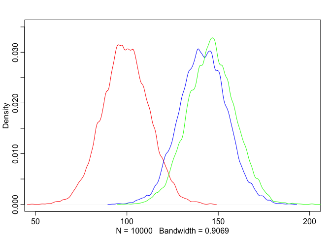
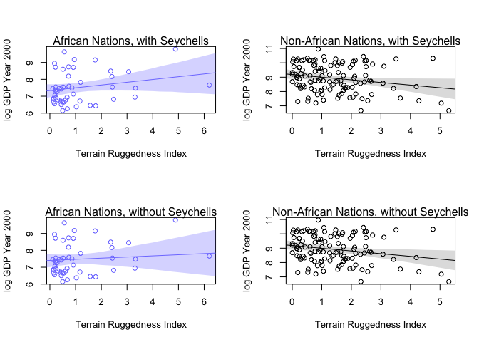
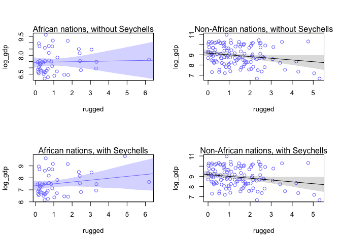
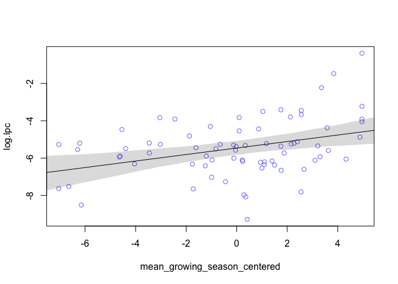
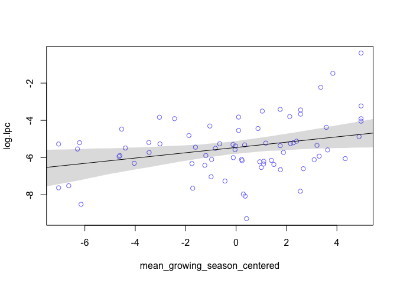
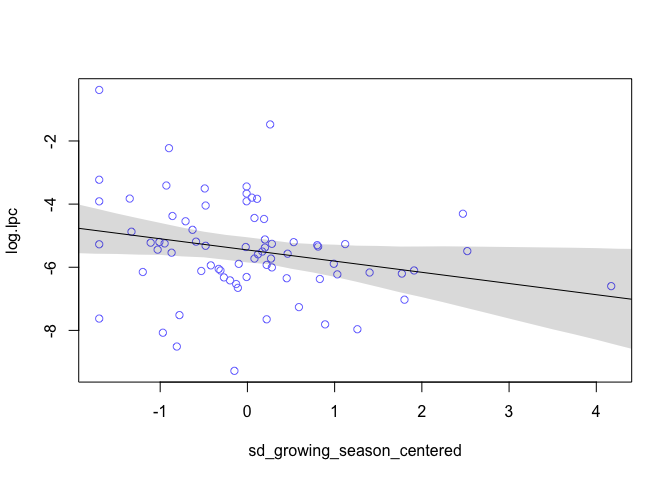
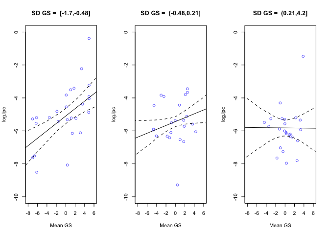
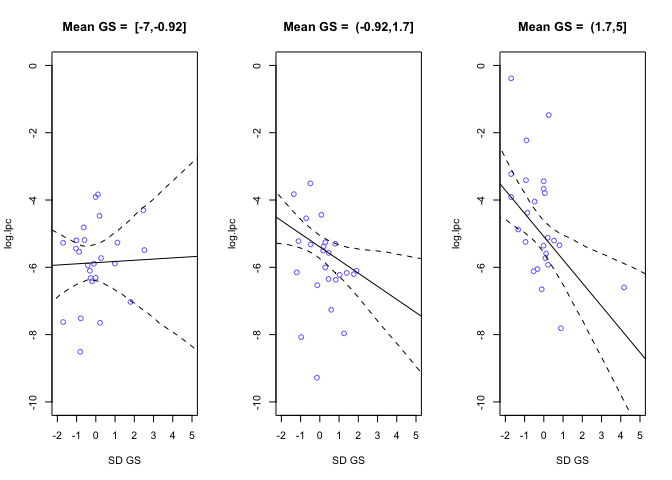

Chapter 7 Exercises
================
Usman Khaliq
2020-05-18

  - [Reference](#reference)
  - [Easy Questions](#easy-questions)
  - [Medium Questions](#medium-questions)
  - [Hard Questions](#hard-questions)

``` r
# Libraries
library(tidyverse)
library(rethinking)
# Parameters

#===============================================================================

# Code
```

### Reference

For this exercise, I referenced this excellent explanation of these
exercises by Jeffrey Girard
[here](https://jmgirard.com/statistical-rethinking-ch7/)

### Easy Questions

7E1. For each of the causal relationships below, name a hypothetical
third variable that would lead to an interaction effect.

1)  Bread dough rises because of yeast

Answer: Temperature

2)  Education leads to higher income.

Answer: The student’s ethnicity

3)  Gasoline makes a car go.

Answer: The status of a car’s engine and whether it needs a lot of
repairs.

7E2. Which of the following explanations invokes an interaction?

1)  Caramelizing onions requires cooking over low heat and making sure
    the onions do not dry out.

2)  A car will go faster when it has more cylinders or when it has a
    better fuel injector.

3)  Most people acquire their political beliefs from their parents,
    unless they get them instead from their friends.

4)  Intelligent animal species tend to be either highly social or have
    manipulative appendages (hands, tentacles, etc.).

Explanation 1 invokes an interaction because it seems to imply that the
heat and dryness of onions determine the caramelization of onions.

Explanation 2 does not imply an interaction, since it implies that the
number of cylinders and the quality of the fuel injector are independent
variables that determine a car’s speed.

Explanation 3 implies that there is an interaction between whether a
person gets their political believes from their friends or their
parents, and it seems to imply a linear relationship in which the
combined political believes acquired by a person are a combination of
the beliefs acquired by their parents and friends.

Explanation 4 implies that intelligent specieis tend to either be highly
social or have high manipulative appendages, and there is interaction
between these two variables in determining the intelligence of an animal
specie.

This, explanations 1, 3 and 4 imply an interaction.

7E3. For each of the explanations in 7E2, write a linear model that
expresses the stated relationship

Answer:

1)  : 𝜇𝑖=𝛽𝐻𝐻𝑖+𝛽𝐷𝐷𝑖+𝛽𝐻𝐷𝐻𝑖𝐷𝑖
2)  : 𝜇𝑖=𝛽𝐶𝐶𝑖+𝛽𝑄𝑄𝑖 (3): 𝜇𝑖=𝛽𝑇𝑃𝑇𝑖𝑃𝑖+𝛽𝑇𝐹𝑇𝑖𝐹𝑖
3)  : 𝜇𝑖=𝛽𝑆𝑆𝑖+𝛽𝐴𝐴𝑖+𝛽𝑆𝐴𝑆𝑖𝐴

### Medium Questions

7M1. Recall the tulips example from the chapter. Suppose another set of
treatments adjusted the temperature in the greenhouse over two levels:
cold and hot. The data in the chapter were collected at the cold
temperature. You find none of the plants grown under the hot temperature
developed any blooms at all, regardless of the water and shade levels.
Can you explain this result in terms of interactions between water,
shade, and temperature?

Answer: In terms of interactions, we can explain this phenomena as
follows. The three varaiables that have an interaction amongst
themselves now are the temperature, the level of water and the shade
level. In our new model, there will now be a single 3 way interaction
(between water, temperature and shade) and three two-way interactions
(between water and temperature, water and shade, and temperature and
shade).

7M2. Can you invent a regression equation that would make the bloom size
zero, whenever the temperature is hot?

7M3. In parts of North America, ravens depend upon wolves for their
food. This is because ravens are carnivorous but cannot usually kill or
open carcasses of prey. Wolves however can and do kill and tear open
animals, and they tolerate ravens co-feeding at their kills. This
species relationship is generally described as a “species interaction.”
Can you invent a hypothetical set of data on raven population size in
which this relationship would manifest as a statistical interaction? Do
you think the biological interaction could be linear? Why or why not?

Answer:

The posterior distribution of the populations of ravens can be given by
the following equation:

ui = Bw \* Wi + Bp \* Pi + Bwp \* Pi \* Wi,

The population of ravens would be high in areas which also have high
populations of wolves and preys. Lets simulate some data to show this
relationship.

``` r
#number of observations to simulate
N <- 1000

#correlation between prey and wolves
corr_wolves_prey <- 0.7 

#regression coefficient for wolves
bW <- 0.1 

#regression coefficient for preys
bP <- 0.3 

#regression coefficinet for interaction between wolves and preys
bWP <- 0.5 


#simulate data
prey <- rnorm(n = N, mean = 0, sd = 1)

#simulate wolf data
wolf <- rnorm(
  n = N,
  mean = corr_wolves_prey * prey,
  sd = sqrt(1 - corr_wolves_prey^2)
) 

#simulate raven data
raven <- rnorm(
  n = N,
  mean = bP * prey + bW * wolf + bWP * prey * wolf,
  sd = 1
) 

data <- data.frame(raven, prey, wolf) 

glimpse(data)
```

    ## Rows: 1,000
    ## Columns: 3
    ## $ raven <dbl> 1.21970125, 1.12114044, -0.61258849, 0.46995830, 0.99539144, -0…
    ## $ prey  <dbl> -0.2794935, -0.4416682, -0.7714847, -0.1870868, 0.3833673, 0.46…
    ## $ wolf  <dbl> 0.78969313, 0.36922297, -1.07531272, -0.29951966, 0.78995859, 0…

Now, lets see if the linear interaction relationship was correct by
observing whether from the linear interaction model we get data that is
similar to the simulated data above.

``` r
model <- rethinking::map(
  alist(
    raven ~ dnorm(mu, sigma),
    mu <- a + bP * prey + bW * wolf + bWP * prey * wolf,
    a ~ dnorm(0, 1),
    bW ~ dnorm(0, 1),
    bP ~ dnorm(0, 1),
    bWP ~ dnorm(0, 1),
    sigma ~ dunif(0, 5)
  ),
  data = data,
  start = list(a = 0, bP = 0, bW = 0, bPW = 0, sigma = 1)
)
```

    ## Error in solve.default(fit$hessian) : 
    ##   Lapack routine dgesv: system is exactly singular: U[4,4] = 0

    ## Warning in rethinking::map(alist(raven ~ dnorm(mu, sigma), mu <- a + bP * :
    ## Error when computing variance-covariance matrix (Hessian). Fit may not be
    ## reliable.

``` r
precis(model)
```

    ##              mean sd 5.5% 94.5%
    ## a     -0.01058614 NA   NA    NA
    ## bP     0.27943752 NA   NA    NA
    ## bW     0.04214137 NA   NA    NA
    ## bPW    0.00000000 NA   NA    NA
    ## sigma  1.00500123 NA   NA    NA
    ## bWP    0.50347280 NA   NA    NA

### Hard Questions

7H1. Return to the data(tulips) example in the chapter. Now include the
bed variable as a predictor in the interaction model. Don’t interact bed
with the other predictors; just include it as a main effect. Note that
bed is categorical. So to use it properly, you will need to either
construct dummy variables or rather an index variable, as explained in
Chapter 6.

``` r
data(tulips)
d <- tulips
glimpse(d)
```

    ## Rows: 27
    ## Columns: 4
    ## $ bed    <fct> a, a, a, a, a, a, a, a, a, b, b, b, b, b, b, b, b, b, c, c, c,…
    ## $ water  <int> 1, 1, 1, 2, 2, 2, 3, 3, 3, 1, 1, 1, 2, 2, 2, 3, 3, 3, 1, 1, 1,…
    ## $ shade  <int> 1, 2, 3, 1, 2, 3, 1, 2, 3, 1, 2, 3, 1, 2, 3, 1, 2, 3, 1, 2, 3,…
    ## $ blooms <dbl> 0.00, 0.00, 111.04, 183.47, 59.16, 76.75, 224.97, 83.77, 134.9…

``` r
d$shade.c <- d$shade - mean(d$shade)
d$water.c <- d$water - mean(d$water)

#create dummy variables for bed
d$bedb <- d$bed == "b"
d$bedc <- d$bed == "c"
```

``` r
model_with_bed <- rethinking::map(
  alist(
    blooms ~ dnorm(mu, sigma),
    mu <- 
      a + bW * water.c + bS * shade.c + bWS * water.c * shade.c + bBb * bedb + bBc * bedc,
    a ~ dnorm(130, 100),
    bW ~ dnorm(0, 100),
    bS ~ dnorm(0, 100),
    bWS ~ dnorm(0, 100),
    bBb ~ dnorm(0, 100),
    bBc ~ dnorm(0, 100),
    sigma ~ dunif(0, 100)
  ),
  data = d,
  start = list(
    a = mean(d$blooms), 
    bW = 0,
    bS = 0,
    bWS = 0,
    bBb = 0,
    bBc = 0,
    sigma = sd(d$blooms)
  )
)
```

``` r
precis(model_with_bed)
```

    ##            mean        sd      5.5%     94.5%
    ## a      99.36131 12.757521  78.97233 119.75029
    ## bW     75.12433  9.199747  60.42136  89.82730
    ## bS    -41.23103  9.198481 -55.93198 -26.53008
    ## bWS   -52.15060 11.242951 -70.11901 -34.18219
    ## bBb    42.41139 18.039255  13.58118  71.24160
    ## bBc    47.03141 18.040136  18.19979  75.86303
    ## sigma  39.18964  5.337920  30.65862  47.72067

7H2. Use WAIC to compare the model from 7H1 to a model that omits bed.
What do you infer from this comparison? Can you reconcile the WAIC
results with the posterior distribution of the bed coefficients?

Lets create the model without the `bed` variable.

``` r
model_without_bed <- rethinking::map(
  alist(
    blooms ~ dnorm(mu, sigma),
    mu <- 
      a + bW * water.c + bS * shade.c + bWS * water.c * shade.c,
    a ~ dnorm(130, 100),
    bW ~ dnorm(0, 100),
    bS ~ dnorm(0, 100),
    bWS ~ dnorm(0, 100),
    sigma ~ dunif(0, 100)
  ),
  data = d,
  start = list(
    a = mean(d$blooms), 
    bW = 0,
    bS = 0,
    bWS = 0,
    sigma = sd(d$blooms)
  )
)
```

``` r
compare(model_with_bed, model_without_bed)
```

    ##                       WAIC        SE    dWAIC    dSE    pWAIC    weight
    ## model_with_bed    294.0698  9.572922 0.000000     NA 9.372640 0.8055947
    ## model_without_bed 296.9131 10.555135 2.843272 7.7704 7.011579 0.1944053

From the WAIC models, we can see that the model with the bed variables
is assigned more Akaine weight. Lets plot the posterior distributions of
the bed coefficients to see whether there was any uncertainty in the
calculations of these coefficients.

``` r
post <- extract.samples(model_with_bed)

post.a <- post$a
post.b <- post$a + post$bBb
post.c <- post$a + post$bBc
dens(post.a, xlim = c(50, 200), ylim = c(0, 0.035), col = "red")
dens(post.b, col = "blue", add = TRUE)
dens(post.c, col = "green", add = TRUE)
```

<!-- -->

From the above, we can see that bed type a had fewer tulips than beds b
and c.

7H3. Consider again the data(rugged) data on economic development and
terrain ruggedness, examined in this chapter. One of the African
countries in that example, Seychelles, is far outside the cloud of other
nations, being a rare country with both relatively high GDP and high
ruggedness. Seychelles is also unusual, in that it is a group of islands
far from the coast of mainland Africa, and its main economic activity is
tourism.

One might suspect that this one nation is exerting a strong influence on
the conclusions. In this problem, I want you to drop Seychelles from the
data and re-evaluate the hypothesis that the relationship of African
economies with ruggedness is different from that on other continents.

1)  Begin by using map to fit just the interaction model:

yi\~Normal(μi,σ)μi=α+βAAi+βRRi+βARAiRi

where y is log GDP per capita in the year 2000 (log of rgdppc\_2000); A
is cont\_africa, the dummy variable for being an African nation; and R
is the variable rugged. Choose your own priors. Compare the inference
from this model fit to the data without Seychelles to the same model fit
to the full data. Does it still seem like the effect of ruggedness
depends upon continent? How much has the expected relationship changed?

Answer:

``` r
data(rugged)
d <- rugged  

d <- 
  d %>%
  drop_na(rgdppc_2000)
  

data_without_seychelles <- 
  d %>% 
  filter(country != "Seychelles")

#make log version of outcome
d$log_gdp <- log(d$rgdppc_2000)
data_without_seychelles$log_gdp <- log(data_without_seychelles$rgdppc_2000)
```

``` r
model_without_seychelles <- rethinking::map(
  alist(
    log_gdp ~ dnorm(mu, sigma),
    mu <- a + bA * cont_africa + bR * rugged + bAR * cont_africa * rugged,
    a ~ dnorm(8, 100),
    bA ~ dnorm(0, 1),
    bR ~ dnorm(0, 1),
    bAR ~ dnorm(0, 1),
    sigma ~ dunif(0, 10)
  ),
  data = data_without_seychelles
)
```

``` r
model_with_seychelles <- rethinking::map(
  alist(
    log_gdp ~ dnorm(mu, sigma),
    mu <- a + bA * cont_africa + bR * rugged + bAR * cont_africa * rugged,
    a ~ dnorm(8, 100),
    bA ~ dnorm(0, 1),
    bR ~ dnorm(0, 1),
    bAR ~ dnorm(0, 1),
    sigma ~ dunif(0, 10)
  ),
  data = d
)
```

``` r
coeftab(model_without_seychelles, model_with_seychelles)
```

    ##       model_without_seychelles model_with_seychelles
    ## a        9.19                     9.18              
    ## bA      -1.78                    -1.85              
    ## bR      -0.19                    -0.18              
    ## bAR      0.25                     0.35              
    ## sigma    0.93                     0.93              
    ## nobs      169                      170

From the above, we can see that the value of bAR drops from 0.35 to 0.25
when Seychelles is removed from the model. With such a substantial drop
in bAR values due to just one country, it seems slightly uncertain that
ruggedness varies due to the continent, but lets explore this further.

2)  Now plot the predictions of the interaction model, with and without
    Seychelles. Does it still seem like the effect of ruggedness depends
    upon continent? How much has the expected relationship changed?

Answer:

First, lets plot the predictions of the interaction model without
Seychells in the dataset.

``` r
par(mfrow = c(2, 2))

#Plot predictions for model with Seychelles
rugged.seq <- seq(from = -1, to = 8, by = 0.25)

mu.Africa <- 
  link(
    model_with_seychelles,
    data = data.frame(cont_africa = 1, rugged = rugged.seq)
  )
mu.Africa.mean <- apply(mu.Africa, 2, mean)
mu.Africa.PI <- apply(mu.Africa, 2, PI, prob = 0.97)

mu.NotAfrica <- 
  link(
    model_with_seychelles, 
    data = data.frame(cont_africa = 0, rugged = rugged.seq)
  )
mu.NotAfrica.mean <- apply(mu.NotAfrica, 2, mean)
mu.NotAfrica.PI <- apply(mu.NotAfrica, 2, PI, prob = 0.97) 

#plot African nations with regression. 
d.A1 <- d[d$cont_africa == 1,]
plot(
  log(rgdppc_2000) ~ rugged,
  data = d.A1,
  col = rangi2,
  ylab = "log GDP Year 2000",
  xlab = "Terrain Ruggedness Index"
  ) 
mtext("African Nations, with Seychells", 3)
lines(rugged.seq, mu.Africa.mean, col = rangi2)
shade(mu.Africa.PI, rugged.seq, col = col.alpha(rangi2, 0.3))

#plot non-african nations with regression 
d.A0 <- d[d$cont_africa == 0,]
plot(
  log(rgdppc_2000) ~ rugged,
  data = d.A0,
  col = "black",
  ylab = "log GDP Year 2000",
  xlab = "Terrain Ruggedness Index"
  ) 
mtext("Non-African Nations, with Seychells", 3)
lines(rugged.seq, mu.NotAfrica.mean)
shade(mu.NotAfrica.PI, rugged.seq)


#Plot predictions for model without Seychelles
rugged.seq <- seq(from = -1, to = 8, by = 0.25)

mu.Africa <- 
  link(
    model_without_seychelles,
    data = data.frame(cont_africa = 1, rugged = rugged.seq)
  )
mu.Africa.mean <- apply(mu.Africa, 2, mean)
mu.Africa.PI <- apply(mu.Africa, 2, PI, prob = 0.97)

mu.NotAfrica <- 
  link(
    model_without_seychelles, 
    data = data.frame(cont_africa = 0, rugged = rugged.seq)
  )
mu.NotAfrica.mean <- apply(mu.NotAfrica, 2, mean)
mu.NotAfrica.PI <- apply(mu.NotAfrica, 2, PI, prob = 0.97) 

#plot African nations with regression. 
d.A1 <- d[d$cont_africa == 1,]
plot(
  log(rgdppc_2000) ~ rugged,
  data = d.A1,
  col = rangi2,
  ylab = "log GDP Year 2000",
  xlab = "Terrain Ruggedness Index"
  ) 
mtext("African Nations, without Seychells", 3)
lines(rugged.seq, mu.Africa.mean, col = rangi2)
shade(mu.Africa.PI, rugged.seq, col = col.alpha(rangi2, 0.3))

#plot non-african nations with regression 
d.A0 <- d[d$cont_africa == 0,]
plot(
  log(rgdppc_2000) ~ rugged,
  data = d.A0,
  col = "black",
  ylab = "log GDP Year 2000",
  xlab = "Terrain Ruggedness Index"
  ) 
mtext("Non-African Nations, without Seychells", 3)
lines(rugged.seq, mu.NotAfrica.mean)
shade(mu.NotAfrica.PI, rugged.seq)
```

<!-- -->

From the above, we can now see that without Seychells, it seems that
ruggedness has a weak interaction with the continent.

3)  Finally, conduct a model comparison analysis, using WAIC. Fit three
    models to the data without Seychelles:

Model1:yi\~Normal(μi,σ)μi=α+βRRi

Model2:yi\~Normal(μi,σ)μi=α+βAAi+βRRi

Model3:yi\~Normal(μi,σ)μi=α+βAAi+βRRi+βARAiRi

Use whatever priors you think are sensible. Plot the model-averaged
predictions of this model set. Do your inferences differ from those in
(b)? Why or why not?

Answer:

``` r
model_1 <- rethinking::map(
  alist(
    log_gdp ~ dnorm(mu, sigma),
    mu <- a + bR * rugged,
    a ~ dnorm(8, 100),
    bR ~ dnorm(0, 1),
    sigma ~ dunif(0, 10)
  ),
  data = data_without_seychelles
)
```

``` r
model_2 <- rethinking::map(
  alist(
    log_gdp ~ dnorm(mu, sigma),
    mu <- a + bR * rugged + bA * cont_africa,
    a ~ dnorm(8, 100),
    bR ~ dnorm(0, 1),
    bA ~ dnorm(0, 1),
    sigma ~ dunif(0, 10)
  ),
  data = data_without_seychelles
)
```

``` r
model_3 <- rethinking::map(
  alist(
    log_gdp ~ dnorm(mu, sigma),
    mu <- a + bR * rugged + bA * cont_africa + bAR * cont_africa * rugged,
    a ~ dnorm(8, 100),
    bR ~ dnorm(0, 1),
    bA ~ dnorm(0, 1),
    bAR ~ dnorm(0, 1),
    sigma ~ dunif(0, 10)
  ),
  data = data_without_seychelles
)
```

``` r
compare(model_1, model_2, model_3)
```

    ##             WAIC       SE     dWAIC       dSE    pWAIC       weight
    ## model_3 463.3878 14.99731  0.000000        NA 4.601270 7.954594e-01
    ## model_2 466.1042 14.18905  2.716307  3.332013 3.924004 2.045406e-01
    ## model_1 536.0151 13.31368 72.627221 15.202929 2.609917 1.348395e-16

From the above WAIC comparisons, we can see that although an Akaine
weight of 0.75 has been assigned to the third model, a weight of 0.25 is
also assigned to the second model. This hints at the fact that
Seychelles might be causing the interaction to be stronger than what it
might be.

Lets also create the WAIC comparisons for data that contains
Seychelles(this will be helpful in making comparisons for model-averaged
predictions.)

``` r
model_1_with_seychelles <- rethinking::map(
  alist(
    log_gdp ~ dnorm(mu, sigma),
    mu <- a + bR * rugged,
    a ~ dnorm(8, 100),
    bR ~ dnorm(0, 1),
    sigma ~ dunif(0, 10)
  ),
  data = d
)
```

``` r
model_2_with_seychelles <- rethinking::map(
  alist(
    log_gdp ~ dnorm(mu, sigma),
    mu <- a + bR * rugged + bA * cont_africa,
    a ~ dnorm(8, 100),
    bR ~ dnorm(0, 1),
    bA ~ dnorm(0, 1),
    sigma ~ dunif(0, 10)
  ),
  data = d
)
```

``` r
model_3_with_seychelles <- rethinking::map(
  alist(
    log_gdp ~ dnorm(mu, sigma),
    mu <- a + bR * rugged + bA * cont_africa + bAR * cont_africa * rugged,
    a ~ dnorm(8, 100),
    bR ~ dnorm(0, 1),
    bA ~ dnorm(0, 1),
    bAR ~ dnorm(0, 1),
    sigma ~ dunif(0, 10)
  ),
  data = d
)
```

Now, lets plot the model-averaged predictions.

``` r
par(mfrow = c(2, 2))

#the ensemble plots on data that does not contain Seychelles
rugged.seq <- seq(from = -1, to = 8, by = 0.25)

#predictions on countries within Africa
dA.predict <- list(
  log_gdp = rep(0, 37),
  rugged = rugged.seq,
  cont_africa = rep(1, 37)
) 

#predictions on countries out of Africa
dN.predict <- list(
  log_gdp = rep(0, 37),
  rugged = rugged.seq,
  cont_africa = rep(0, 37)
) 

africa_ensemble <- 
  ensemble(
    model_1,
    model_2,
    model_3,
    data = dA.predict,
    refresh = 0
  )

not_africa_ensemble <- 
  ensemble(
    model_1,
    model_2,
    model_3,
    data = dN.predict,
    refresh = 0
  )

muA <- apply(africa_ensemble$link, 2, mean)
muA.PI <- apply(africa_ensemble$link, 2, PI, prob = 0.97) 

muNA <- apply(not_africa_ensemble$link, 2, mean)
muNA.PI <- apply(not_africa_ensemble$link, 2, PI, prob = 0.97)

dA <- data_without_seychelles[data_without_seychelles$cont_africa == 1,]

plot(log_gdp ~ rugged, data = dA, col = rangi2)
lines(rugged.seq, muA, col = rangi2)
shade(muA.PI, rugged.seq, col = col.alpha(rangi2, 0.3))
mtext("African nations, without Seychells")

dN <- data_without_seychelles[data_without_seychelles$cont_africa == 0,]

plot(log_gdp ~ rugged, data = dN, col = rangi2)
lines(rugged.seq, muNA)
shade(muNA.PI, rugged.seq)
mtext("Non-African nations, without Seychells")


#the ensemble plots of data that contains Seychelles

africa_ensemble_full_data <- 
  ensemble(
    model_1_with_seychelles,
    model_2_with_seychelles,
    model_3_with_seychelles,
    data = dA.predict,
    refresh = 0
  )

not_africa_ensemble_full_data <- 
  ensemble(
    model_1_with_seychelles,
    model_2_with_seychelles,
    model_3_with_seychelles,
    data = dN.predict,
    refresh = 0
  )

muA <- apply(africa_ensemble_full_data$link, 2, mean)
muA.PI <- apply(africa_ensemble_full_data$link, 2, PI, prob = 0.97) 

muNA <- apply(not_africa_ensemble_full_data$link, 2, mean)
muNA.PI <- apply(not_africa_ensemble_full_data$link, 2, PI, prob = 0.97)

dA <- d[d$cont_africa == 1,]

plot(log_gdp ~ rugged, data = dA, col = rangi2)
lines(rugged.seq, muA, col = rangi2)
shade(muA.PI, rugged.seq, col = col.alpha(rangi2, 0.3))
mtext("African nations, with Seychells")

dN <- d[d$cont_africa == 0,]

plot(log_gdp ~ rugged, data = dN, col = rangi2)
lines(rugged.seq, muNA)
shade(muNA.PI, rugged.seq)
mtext("Non-African nations, with Seychells")
```

<!-- -->

From the above, we can see that with no Seychelles, the interaction
between ruggedness and GDP is weaker.

7H4. The values in data(nettle) are data on language diversity in 74
nations. The meaning of each column is given below.

1)  country: Name of the country

2)  num.lang: Number of recognized languages spoken

3)  area: Area in square kilometers

4)  k.pop: Population, in thousands

5)  num.stations: Number of weather stations that provided data for the
    next two columns

6)  mean.growing.season: Average length of growing season, in months

7)  sd. growing.season: Standard deviation of length of growing season,
    in months

Use these data to evaluate the hypothesis that language diversity is
partly a product of food security. The notion is that, in productive
ecologies, people don’t need large social networks to buffer them
against risk of food shortfalls. This means ethnic groups can be smaller
and more self-sufficient, leading to more languages per capita. In
contrast, in a poor ecology, there is more subsistence risk, and so
human societies have adapted by building larger networks of mutual
obligation to provide food insurance. This in turn creates social forces
that help prevent languages from diversifying. Specifically, you will
try to model the number of languages per capita as the outcome variable:

`d$lang.per.cap <- d$num.lang / d$k.pop` Use the logarithm of this new
variable as your regression outcome.

This problem is open ended, allowing you to decide how you address the
hypotheses and the uncertain advice the modeling provides. If you think
you need to use WAIC anyplace, please do. If you think you need certain
priors, argue for them. If you think you need to plot predictions in a
certain way, please do. Just try to honestly evaluate the main effects
of both mean.growing.season and sd.growing.season, as well as their
two-way interaction, as outlined in parts (a), (b), and (c) below. If
you are not sure which approach to use, try several.

1)  Evaluate the hypothesis that language diversity, as measured by
    log(lang.per.cap), is positively associated with the average length
    of the growing season, mean.growing.season. Consider log(area) in
    your regression(s) as a covariate (not an interaction). Interpret
    your results.

Answer:

First, lets model the language diversity on the growing season. This
model will form the base model for our comparison with other models.

``` r
data(nettle)
d <- nettle
d$lang.per.cap <- d$num.lang / d$k.pop
d$log.lpc <- log(d$lang.per.cap)
d$log.area <- log(d$area)
d$log.area_c <- d$log.area - mean(d$log.area)
d$mean_growing_season_centered <- 
  d$mean.growing.season - mean(d$mean.growing.season)
d$sd_growing_season_centered <- 
  d$sd.growing.season - mean(d$sd.growing.season)
```

``` r
model_base <- rethinking::map(
  alist(
    log.lpc ~ dnorm(mu, sigma),
    mu <- a + bM * mean_growing_season_centered,
    a ~ dnorm(-5, 5),
    bM ~ dnorm(0, 5),
    sigma ~ dunif(0, 10)
  ),
  data = d
)
```

``` r
precis(model_base)
```

    ##             mean         sd        5.5%     94.5%
    ## a     -5.4561163 0.16374888 -5.71781859 -5.194414
    ## bM     0.1739447 0.05246633  0.09009336  0.257796
    ## sigma  1.4093770 0.11584991  1.22422642  1.594527

Lets also plot the posterior distribution of the base model.

``` r
mean_growing_season_seq <- seq(from = -10, to = 10, by = 0.25)
mu <- 
  link(
    model_base, 
    data = data.frame(mean_growing_season_centered = mean_growing_season_seq),
    refresh = 0
  ) 
mu.mean <- apply(mu, 2, mean)
mu.PI <- apply(mu, 2, PI, prob = 0.97)
plot(log.lpc ~ mean_growing_season_centered, data = d, col = rangi2)
lines(mean_growing_season_seq, mu.mean)
shade(mu.PI, mean_growing_season_seq)
```

<!-- -->

From the above posterior distribution, we can see that it seems like the
mean growing season has a positive relationship with language diversity.

Now, lets add `log(area)` in our model as a coefficient .

``` r
model_1 <- rethinking::map(
  alist(
    log.lpc ~ dnorm(mu, sigma),
    mu <- a + bM * mean_growing_season_centered + bA * log.area_c,
    a ~ dnorm(-5, 5),
    bM ~ dnorm(0, 5),
    bA ~ dnorm(0, 5),
    sigma ~ dunif(0, 10)
  ),
  data = d
)
```

``` r
precis(model_1)
```

    ##             mean         sd        5.5%       94.5%
    ## a     -5.4561302 0.16141962 -5.71410998 -5.19815051
    ## bM     0.1438164 0.05564793  0.05488029  0.23275256
    ## bA    -0.2016228 0.13743942 -0.42127752  0.01803194
    ## sigma  1.3893081 0.11420025  1.20679408  1.57182219

Now, lets plot the posterior distribution of this model.

``` r
mean_growing_season_seq <- seq(from = -10, to = 10, by = 0.25)
mu <- 
  link(
    model_1, 
    data = 
      data.frame(
        mean_growing_season_centered = mean_growing_season_seq,
        log.area_c = 0
      ),
    refresh = 0
  ) 
mu.mean <- apply(mu, 2, mean)
mu.PI <- apply(mu, 2, PI, prob = 0.97)
plot(log.lpc ~ mean_growing_season_centered, data = d, col = rangi2)
lines(mean_growing_season_seq, mu.mean)
shade(mu.PI, mean_growing_season_seq)
```

<!-- -->

``` r
compare(model_base, model_1)
```

    ##                WAIC       SE     dWAIC     dSE    pWAIC    weight
    ## model_base 268.3097 15.35552 0.0000000      NA 3.894837 0.5252481
    ## model_1    268.5118 15.76257 0.2021564 3.52158 5.126615 0.4747519

The Akaine weights assigned slightly prefer the base model over the
second model. It seems like languade diversity is positively associated
with the average length of the growing season. We can interpret this by
saying that a longer growing season results in more food security, which
leads to more language diversity.

2)  Now evaluate the hypothesis that language diversity is negatively
    associated with the standard deviation of length of growing season,
    sd.growing.season. This hypothesis follows from uncertainty in
    harvest favoring social insurance through larger social networks and
    therefore fewer languages. Again, consider log(area) as a covariate
    (not an interaction). Interpret your results.

First, lets model the association between language diversity and the
standard deviation of length of growing season.

``` r
model_base_2 <- rethinking::map(
  alist(
    log.lpc ~ dnorm(mu, sigma),
    mu <- a + bS * sd_growing_season_centered,
    a ~ dnorm(-5, 5),
    bS ~ dnorm(0, 5),
    sigma ~ dunif(0, 10)
  ),
  data = d
)
```

``` r
precis(model_base_2)
```

    ##             mean        sd       5.5%      94.5%
    ## a     -5.4560793 0.1697566 -5.7273831 -5.1847755
    ## bS    -0.3610847 0.1603312 -0.6173249 -0.1048445
    ## sigma  1.4611436 0.1201052  1.2691922  1.6530950

Now, lets plot the posterior distribution of this model.

``` r
sd_growing_season_seq <- seq(from = -10, to = 10, by = 0.25)
mu <- 
  link(
    model_base_2, 
    data = data.frame(sd_growing_season_centered = sd_growing_season_seq),
    refresh = 0
  ) 
mu.mean <- apply(mu, 2, mean)
mu.PI <- apply(mu, 2, PI, prob = 0.97)
plot(log.lpc ~ sd_growing_season_centered, data = d, col = rangi2)
lines(sd_growing_season_seq, mu.mean)
shade(mu.PI, sd_growing_season_seq)
```

<!-- -->

From the above posterior distribution, it seems like there is a negative
correlation between the standard deviation of the growing season and the
language diversity. Now, lets add `log(area)` as a covariate to the
model.

``` r
model_2 <- rethinking::map(
  alist(
    log.lpc ~ dnorm(mu, sigma),
    mu <- a + bS * sd_growing_season_centered + bA * log.area_c,
    a ~ dnorm(-5, 5),
    bS ~ dnorm(0, 5),
    bA ~ dnorm(0, 5),
    sigma ~ dunif(0, 10)
  ),
  data = d
)
```

``` r
precis(model_2)
```

    ##             mean        sd       5.5%        94.5%
    ## a     -5.4560934 0.1671186 -5.7231812 -5.189005540
    ## bS    -0.2090484 0.1863462 -0.5068656  0.088768715
    ## bA    -0.2395545 0.1561330 -0.4890852  0.009976248
    ## sigma  1.4384123 0.1182317  1.2494551  1.627369463

Now, lets plot the posterior distribution of this model.

``` r
sd_growing_season_seq <- seq(from = -10, to = 10, by = 0.25)
mu <- 
  link(
    model_base_2, 
    data = 
      data.frame(
        sd_growing_season_centered = sd_growing_season_seq,
        log.area_c = 0
      ),
    refresh = 0
  ) 
mu.mean <- apply(mu, 2, mean)
mu.PI <- apply(mu, 2, PI, prob = 0.97)
plot(log.lpc ~ sd_growing_season_centered, data = d, col = rangi2)
lines(sd_growing_season_seq, mu.mean)
shade(mu.PI, sd_growing_season_seq)
```

<!-- -->

``` r
coeftab(model_base_2, model_2)
```

    ##       model_base_2 model_2
    ## a       -5.46        -5.46
    ## bS      -0.36        -0.21
    ## sigma    1.46         1.44
    ## bA         NA        -0.24
    ## nobs       74           74

``` r
compare(model_base_2, model_2)
```

    ##                  WAIC       SE    dWAIC      dSE    pWAIC    weight
    ## model_base_2 273.9169 17.23679 0.000000       NA 4.133603 0.5407214
    ## model_2      274.2434 17.08666 0.326494 3.826788 5.601074 0.4592786

From the above, we can see that there seems to be a negative correlation
between language diversity and the standard deviation of the growing
season.

3)  Finally, evaluate the hypothesis that mean.growing.season and
    sd.growing.season interact to synergistically reduce language
    diversity. The idea is that, in nations with longer average growing
    seasons, high variance makes storage and redistribution even more
    important than it would be otherwise. That way, people can cooperate
    to preserve and protect windfalls to be used during the droughts.
    These forces in turn may lead to greater social integration and
    fewer languages.

<!-- end list -->

``` r
model_3 <- rethinking::map(
  alist(
    log.lpc ~ dnorm(mu, sigma),
    mu <- 
      a + bM * mean_growing_season_centered + bS * sd_growing_season_centered + bMS * mean_growing_season_centered * sd_growing_season_centered,
    a ~ dnorm(-5, 5),
    bM ~ dnorm(0, 5),
    bS ~ dnorm(0, 5),
    bMS ~ dnorm(0, 5),
    sigma ~ dunif(0, 10)
  ),
  data = d
)
```

``` r
precis(model_3)
```

    ##             mean         sd        5.5%       94.5%
    ## a     -5.4486165 0.15186205 -5.69132134 -5.20591158
    ## bM     0.1146773 0.05554409  0.02590709  0.20344745
    ## bS    -0.3440358 0.14394555 -0.57408862 -0.11398304
    ## bMS   -0.1088453 0.04706566 -0.18406534 -0.03362529
    ## sigma  1.3066567 0.10740652  1.13500033  1.47831305

Lets plot a triptych plot to demonstrate the interaction between the
predictor variables. You will also need to discretise the predictor
variables.

``` r
par(mfrow = c(1, 3)) 

# Discretize variables into groups
d$mgsc.group <- cut(
  d$mean_growing_season_centered, 
  breaks = quantile(d$mean_growing_season_centered, probs = c(0, 1/3, 2/3, 1)),
  include.lowest = TRUE, 
  dig.lab = 2
)
d$sgsc.group <- cut(
  d$sd_growing_season_centered, 
  breaks = quantile(d$sd_growing_season_centered, probs = c(0, 1/3, 2/3, 1)),
  include.lowest = TRUE, 
  dig.lab = 2
)
# Plot first row as mean against SD
mgsc.seq <- seq(from = -10, to = 10, length.out = 50)
for (group in levels(d$sgsc.group)) {
  dt <- d[d$sgsc.group == group, ]
  plot(
    log.lpc ~ mean_growing_season_centered,
    data = dt,
    col = rangi2,
    xlim = c(-8, 6),
    ylim = c(-10, 0),
    main = paste("SD GS = ", group),
    xlab = "Mean GS"
  )
  mu <- 
    link(model_3, data = data.frame(mean_growing_season_centered = mgsc.seq, sd_growing_season_centered = mean(dt$sd_growing_season_centered)),
    refresh = 0)
  mu.mean <- apply(mu, 2, mean)
  mu.PI <- apply(mu, 2, PI, prob = 0.97)
  lines(mgsc.seq, mu.mean)
  lines(mgsc.seq, mu.PI[1, ], lty = 2)
  lines(mgsc.seq, mu.PI[2, ], lty = 2)
}
```

<!-- -->

``` r
# Plot second row as SD against mean
sgsc.seq <- seq(from = -5, to = 10, length.out = 50)
for (group in levels(d$mgsc.group)) {
  dt <- d[d$mgsc.group == group, ]
  plot(
    log.lpc ~ sd_growing_season_centered,
    data = dt,
    col = rangi2,
    xlim = c(-2, 5),
    ylim = c(-10, 0),
    main = paste("Mean GS = ", group),
    xlab = "SD GS"
  )
  mu <- link(model_3, data = data.frame(sd_growing_season_centered = sgsc.seq, mean_growing_season_centered = mean(dt$mean_growing_season_centered)),
    refresh = 0)
  mu.mean <- apply(mu, 2, mean)
  mu.PI <- apply(mu, 2, PI, prob = 0.97)
  lines(sgsc.seq, mu.mean)
  lines(sgsc.seq, mu.PI[1, ], lty = 2)
  lines(sgsc.seq, mu.PI[2, ], lty = 2)
}
```

<!-- -->

The above plots show that at higher standard deviation of growing season
values, the effect on diversity due to increased mean growth season
duration is smaller, whereas the effect is more pronounced and positive
at lower standard deviation values of growing season length.

Similarly, at higher values of mean growing season length, the standard
deviation of growing season has a negative correlation with the
diversity in languages, and this effect disappears at lower levels of
mean growing season lengths.
