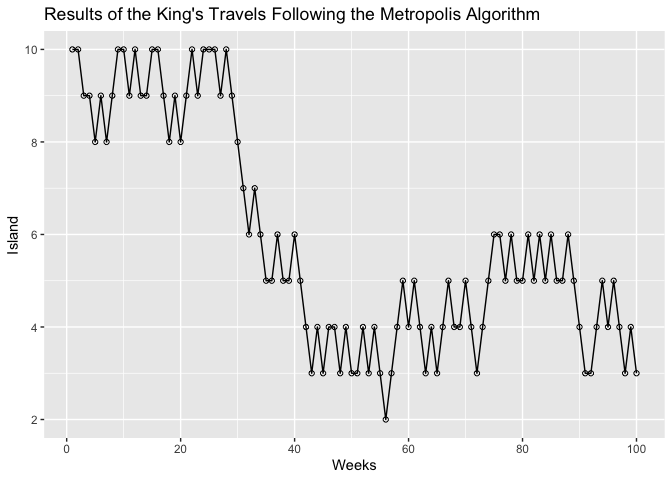
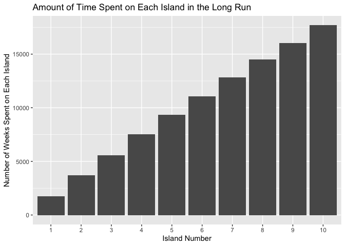

Chapter 8 - Markov Chain Monte Carlo
================
Usman Khaliq
2020-05-27

  - [Reference](#reference)
  - [Introduction](#introduction)
      - [Good King Markov and his Island
        Kingdom](#good-king-markov-and-his-island-kingdom)
  - [R Code 8.1](#r-code-8.1)
  - [Markov Chain Monte Carlo](#markov-chain-monte-carlo)
  - [Gibbs Sampling](#gibbs-sampling)
  - [Hamiltonian Monte Carlo](#hamiltonian-monte-carlo)
  - [Easy HMC: map2stan](#easy-hmc-map2stan)
  - [R Code 8.2](#r-code-8.2)
  - [R Code 8.3](#r-code-8.3)
  - [R Code 8.4](#r-code-8.4)
  - [R Code 8.5](#r-code-8.5)
  - [Sampling in Parallel](#sampling-in-parallel)
  - [Visualizing the samples.](#visualizing-the-samples.)
  - [Using the samples.](#using-the-samples.)
  - [Checking the chain](#checking-the-chain)

``` r
# Libraries
library(tidyverse)
library(rethinking)
library(rstan)
# Parameters

#===============================================================================

# Code
```

## Reference

I used these excellent notes from [Jose Roberto Ayala
Solares](https://jroberayalas.netlify.app/post/notes-on-statistical-rethinking-chapter-8-mcmc/)
while making these notes for this chapter.

## Introduction

Markov Chain Monte Carlo(MCMC) is a stochastic process for estimating
the posterior probability distribution by producing samples from the
joint posterior distribution without maximising anything. We would not
be assuming that the posterior is Gaussean, and would not be using a
quadratic or other approximation methods.

The downside of using MCMC is that it requires more time to process and
there is more work involved in specifying the model.

### Good King Markov and his Island Kingdom

KIng Markov was the king of a circular archipelago with 10 islands.

  - The islands were of different sizes. The second island had twice the
    population on the first island, the third had three times the
    population on the first island, and so no, until the tenth island
    had 10 times the population on the first island.

  - The people in all islands wanted the king to visit them, but the
    king also wanted to spend time on each island proportional to the
    number of people on each island.

  - The king was not a fan of planning out a schedule way in advance,
    and he also did not want to spend a lot of time on the sea
    travelling between different islands, so he decided on the following
    algorithm:

<!-- end list -->

1.  Each week, the king decided between moving to an adjacent island or
    staying in the same island. He did this by tossing a coin.

2.  If the coin turned up head, the king considered moving to the
    adjacent island clockwise around the archipalego. If the coin turned
    up tails, then he considered moving to the adjacent island
    counterclockwise.

3.  To decide whether to move to the adjacent island or to remain in the
    current island, the king counted out a number of seashells
    proportional to the relative population of the island. He also
    counted out a number of stones equal to the relative population of
    the current island.

4.  If the number of seashells is more than the number of stones, the
    King would always move to the adjacent island. However, if the
    number of stones is more than the number of seashells, then, the
    king would discard a number of stones equal to the number of
    seashells and place the remaining seashells and stones in a bag. He
    would then pull out one object from the bag, and if he pulled out a
    seashell, then he would go to the adjacent island, and if he pulled
    out a stone, then he would remain on the current island.

Thus, the probability that the king moves is equal to the number of
seashells divided by the original number of stones.

Lets simulate this algorithm below.

## R Code 8.1

``` r
num_weeks <- 1e5

positions <- rep(0, num_weeks)

current <- 10

for (i in 1:num_weeks) {
  #record current position
  positions[i] <- current
  
  #flip coin to generate proposal
  proposal <- current + sample(c(-1, 1), size = 1)
  #now make sure he loops around the archipalego
  if (proposal < 1) proposal <- 10
  if (proposal > 10) proposal <- 1
  
  #move?
  prob_move <- proposal / current
  current <- ifelse(runif(1) < prob_move, proposal, current)
}
```

``` r
tibble(
  week = 1:1e5,
  island = positions
) %>% 
  filter(week < 101) %>% 
  ggplot(aes(week, island)) +
  geom_point(shape = 1) +
  geom_line() +
  scale_x_continuous(breaks = seq(from = 0, to = 100, by = 20)) +
  scale_y_continuous(breaks = seq(from = 0, to = 10, by = 2)) +
  labs(
    title = "Results of the King's Travels Following the Metropolis Algorithm",
    x = "Weeks",
    y = "Island"
  )
```

<!-- -->

``` r
tibble(
  week = 1:1e5,
  island = positions
) %>% 
  mutate(island = factor(island)) %>% 
  ggplot(aes(island)) +
  geom_bar() +
  labs(
    title = "Amount of Time Spent on Each Island in the Long Run",
    x = "Island Number",
    y = "Number of Weeks Spent on Each Island"
  )
```

<!-- -->

Thus, from the above, we can see that over the long-term, the algorithm
performs really well and the amount of time spent by the king on each
island is proportional to the island’s population.

The algorithm would also work on any size archipalego, even if the king
didnt know how many islands there were in total. All that he needs to
know is the current population of the island and the population of the
island that he wants to go next to.

## Markov Chain Monte Carlo

The example above is an example of using the Metropolis Algorithm. It is
used to draw samples from an unknown and usually complex target
distribution. \* The “islands” in our objective are parameter values.
They can either be discrete or continuous.

  - The “population size” is the posterior probability at each parameter
    value.

  - The “weeks” are samples taken from the joint posterior of the
    parameters in the model.

Two other contemporary algorithms that are used in MCMC are Gibbs
sampling and the Hamiltonian Monte Carlo.

## Gibbs Sampling

The Metropolis algorithm works well in symmetric distributions. However,
we might need to use asymmetric distributions because not only do they
do a better job of handling parameters that have standard deviations
around 0, but they might also help us to get an equally good image of
the posterior distribution in lesser number of steps.

Gibbs sampling is a variant of the Metropolis-Hastings algorithm(that
allows for asymmetric proposals). Gibbs sampling uses particular
combinations of prior distributions and likelihoods that are called
**conjugate pairs**. These conjugate pairs allow Gibbs sampling to make
smart jumps around sampling for different parameter values.

Gibbs sampling is used in the following popular Bayesian model fits:

  - BUGS - Bayesian Inference Using Gibbs Sampling
  - JAGS - Just Another Gibbs Sampler

However, Gibbs sampling has some limitations:

  - Some conjugate pairs might not make sense, and from a scientific
    point of view it doesnt make sense to just choose conjugate pairs
    that fit a model well.

  - In very complex models that contain thousands of parameters, Gibbs
    sampling becomes very inefficient.

## Hamiltonian Monte Carlo

Gibbs and Metropolis sampling are highly random processes. However,
Gibbs sampling gains efficiency by reducing the number of jumps and
exploiting knowledge of the target distribution.

HMC is much more computationally intensive compared to Gibbs and
Metropolis algorithms.

Lets assume that King Markov has a cousin, Monty, who has a kingdom on
the mainland. Like King Markov, he also needs to spend time with his
people. His advisor tells him that they can travel back and forth across
the kingdom’s length, with their carriage slowing down in places which
have more population density and speeding up in areas which have lower
population density.

The example above is analogous to how Hamiltonian Monte Carlo works in
statistical applications. The vector of parameters is the “royal
vehicle”, while the log-posteriors provide the “surface” for the
vehicle to glind on. When the log posterior is flat, the particle can
float for a long time before the slope forces it to change.

The following are some limitations of HMC:

  - It requires continuous parameters
  - It needs to be tuned to a particular model and its data.
  - Tuning all of the parameters by hand can be a pain.

## Easy HMC: map2stan

`map2stan` is a function in the `rethinking` package that provides an
interface for converting `map` estimates into Stan HMC code. To use
`map2stan`, we first need to do the following:

1)  We need to preprocess any variable transformations
2)  Wwe need to construct a clean data frame that only contains the
    variables that we want to use.

## R Code 8.2

Lets explore the terrain ruggedness example.

``` r
data(rugged)
d <- rugged 

d$log_gdp <- log(d$rgdppc_2000) 

dd <- d[complete.cases(d$rgdppc_2000), ]
```

## R Code 8.3

Lets fit an interaction model that predicts log-GDP from terrain
ruggedness, continent and the interaction of these two variables.

``` r
m8.1 <- rethinking::map(
  alist(
    log_gdp ~ dnorm(mu, sigma),
    mu <- a + bR * rugged + bA * cont_africa + bAR * rugged * cont_africa,
    a ~ dnorm(0, 100),
    bR ~ dnorm(0, 10),
    bA ~ dnorm(0, 10),
    bAR ~ dnorm(0, 10),
    sigma ~ dunif(0, 10)
  ),
  data = dd
)
```

``` r
precis(m8.1)
```

    ##             mean         sd       5.5%       94.5%
    ## a      9.2227865 0.13798151  9.0022654  9.44330756
    ## bR    -0.2026512 0.07646906 -0.3248636 -0.08043888
    ## bA    -1.9469483 0.22450059 -2.3057436 -1.58815295
    ## bAR    0.3929050 0.13004789  0.1850633  0.60074661
    ## sigma  0.9326797 0.05058141  0.8518409  1.01351859

Now, lets create a new data frame that only contains the predictor and
outcome variables that we need.

## R Code 8.4

``` r
dd.trim <-
  dd %>% 
  select(
    log_gdp,
    rugged,
    cont_africa
  )

glimpse(dd.trim)
```

    ## Rows: 170
    ## Columns: 3
    ## $ log_gdp     <dbl> 7.492609, 8.216929, 9.933263, 9.407032, 7.792343, 9.21254…
    ## $ rugged      <dbl> 0.858, 3.427, 0.769, 0.775, 2.688, 0.006, 0.143, 3.513, 1…
    ## $ cont_africa <int> 1, 0, 0, 0, 0, 0, 0, 0, 0, 1, 0, 1, 1, 0, 0, 0, 0, 0, 0, …

## R Code 8.5

Now, lets get samples from the posterior distribution of the STAN model.

``` r
m8.1stan <- map2stan(
  alist(
    log_gdp ~ dnorm(mu, sigma),
    mu <- a + bR * rugged + bA * cont_africa + bAR * rugged * cont_africa,
    a ~ dnorm(0, 100),
    bR ~ dnorm(0, 10),
    bA ~ dnorm(0, 10),
    bAR ~ dnorm(0, 10),
    sigma ~ dcauchy(0, 2)
  ),
  data = dd.trim
)
```

    ## Trying to compile a simple C file

    ## Running /Library/Frameworks/R.framework/Resources/bin/R CMD SHLIB foo.c
    ## clang -I"/Library/Frameworks/R.framework/Resources/include" -DNDEBUG   -I"/Library/Frameworks/R.framework/Versions/3.6/Resources/library/Rcpp/include/"  -I"/Library/Frameworks/R.framework/Versions/3.6/Resources/library/RcppEigen/include/"  -I"/Library/Frameworks/R.framework/Versions/3.6/Resources/library/RcppEigen/include/unsupported"  -I"/Library/Frameworks/R.framework/Versions/3.6/Resources/library/BH/include" -I"/Library/Frameworks/R.framework/Versions/3.6/Resources/library/StanHeaders/include/src/"  -I"/Library/Frameworks/R.framework/Versions/3.6/Resources/library/StanHeaders/include/"  -I"/Library/Frameworks/R.framework/Versions/3.6/Resources/library/rstan/include" -DEIGEN_NO_DEBUG  -D_REENTRANT  -DBOOST_DISABLE_ASSERTS -DBOOST_PENDING_INTEGER_LOG2_HPP -include stan/math/prim/mat/fun/Eigen.hpp   -isysroot /Library/Developer/CommandLineTools/SDKs/MacOSX.sdk -I/usr/local/include  -fPIC  -isysroot /Library/Developer/CommandLineTools/SDKs/MacOSX.sdk -c foo.c -o foo.o
    ## In file included from <built-in>:1:
    ## In file included from /Library/Frameworks/R.framework/Versions/3.6/Resources/library/StanHeaders/include/stan/math/prim/mat/fun/Eigen.hpp:13:
    ## In file included from /Library/Frameworks/R.framework/Versions/3.6/Resources/library/RcppEigen/include/Eigen/Dense:1:
    ## In file included from /Library/Frameworks/R.framework/Versions/3.6/Resources/library/RcppEigen/include/Eigen/Core:88:
    ## /Library/Frameworks/R.framework/Versions/3.6/Resources/library/RcppEigen/include/Eigen/src/Core/util/Macros.h:613:1: error: unknown type name 'namespace'
    ## namespace Eigen {
    ## ^
    ## /Library/Frameworks/R.framework/Versions/3.6/Resources/library/RcppEigen/include/Eigen/src/Core/util/Macros.h:613:16: error: expected ';' after top level declarator
    ## namespace Eigen {
    ##                ^
    ##                ;
    ## In file included from <built-in>:1:
    ## In file included from /Library/Frameworks/R.framework/Versions/3.6/Resources/library/StanHeaders/include/stan/math/prim/mat/fun/Eigen.hpp:13:
    ## In file included from /Library/Frameworks/R.framework/Versions/3.6/Resources/library/RcppEigen/include/Eigen/Dense:1:
    ## /Library/Frameworks/R.framework/Versions/3.6/Resources/library/RcppEigen/include/Eigen/Core:96:10: fatal error: 'complex' file not found
    ## #include <complex>
    ##          ^~~~~~~~~
    ## 3 errors generated.
    ## make: *** [foo.o] Error 1
    ## 
    ## SAMPLING FOR MODEL '5259bdc76214e0fabf6a51d89ad59b6b' NOW (CHAIN 1).
    ## Chain 1: 
    ## Chain 1: Gradient evaluation took 6.7e-05 seconds
    ## Chain 1: 1000 transitions using 10 leapfrog steps per transition would take 0.67 seconds.
    ## Chain 1: Adjust your expectations accordingly!
    ## Chain 1: 
    ## Chain 1: 
    ## Chain 1: Iteration:    1 / 2000 [  0%]  (Warmup)
    ## Chain 1: Iteration:  200 / 2000 [ 10%]  (Warmup)
    ## Chain 1: Iteration:  400 / 2000 [ 20%]  (Warmup)
    ## Chain 1: Iteration:  600 / 2000 [ 30%]  (Warmup)
    ## Chain 1: Iteration:  800 / 2000 [ 40%]  (Warmup)
    ## Chain 1: Iteration: 1000 / 2000 [ 50%]  (Warmup)
    ## Chain 1: Iteration: 1001 / 2000 [ 50%]  (Sampling)
    ## Chain 1: Iteration: 1200 / 2000 [ 60%]  (Sampling)
    ## Chain 1: Iteration: 1400 / 2000 [ 70%]  (Sampling)
    ## Chain 1: Iteration: 1600 / 2000 [ 80%]  (Sampling)
    ## Chain 1: Iteration: 1800 / 2000 [ 90%]  (Sampling)
    ## Chain 1: Iteration: 2000 / 2000 [100%]  (Sampling)
    ## Chain 1: 
    ## Chain 1:  Elapsed Time: 0.229043 seconds (Warm-up)
    ## Chain 1:                0.22297 seconds (Sampling)
    ## Chain 1:                0.452013 seconds (Total)
    ## Chain 1:

    ## Computing WAIC

``` r
precis(m8.1stan)
```

    ##             mean        sd       5.5%       94.5%    n_eff     Rhat4
    ## a      9.2138227 0.1433634  8.9794438  9.44827087 436.7574 0.9990520
    ## bR    -0.1966894 0.0805746 -0.3234971 -0.06370298 450.4315 0.9997181
    ## bA    -1.9336708 0.2337026 -2.3162436 -1.56645745 431.9847 0.9995067
    ## bAR    0.3775893 0.1298495  0.1760554  0.58883818 426.9379 0.9999225
    ## sigma  0.9510099 0.0535969  0.8725629  1.04270602 573.3429 0.9999630

A few things about the table above:

  - The interval boundaries are for highest posterior density intervals
    (HPDI), not the usual percentile intervals (PI).
  - `n_eff` is a crude estimate on the number of samples that we got
  - `Rhat4` is a complicated estimate of the convergence of the Markov
    chains to the target distribution.

## Sampling in Parallel

Once the initial Stan model has been compiled, we can draw more samples
from it at any time, and can also run as many independent Markov chains
as we like. Below, we will be running four independent Markov chains for
the model.

``` r
m8.1stan_4chains <- map2stan(
  m8.1stan, 
  chains = 4,
  cores = 4
)
```

    ## Computing WAIC

``` r
precis(m8.1stan_4chains)
```

    ##             mean         sd       5.5%       94.5%    n_eff     Rhat4
    ## a      9.2275287 0.14314408  8.9968079  9.45744116 1728.179 1.0025339
    ## bR    -0.2057553 0.07818383 -0.3292992 -0.08206252 1769.500 1.0014392
    ## bA    -1.9617826 0.23149749 -2.3381843 -1.59275977 1801.019 1.0017313
    ## bAR    0.4032421 0.13505308  0.1858774  0.61337176 1762.892 1.0003982
    ## sigma  0.9503591 0.05429190  0.8679701  1.03866099 2277.400 0.9997418

## Visualizing the samples.

Let us visualize the samples derived from the Markov chains.

``` r
pairs(m8.1stan)
```

<!-- -->

The above is a matrix of bivariate scatter plots. \* Along the
diagonals, the smoothed histogram of each parameter is shown \* Below
each parameter, the correlation between the two parameters is shown.

## Using the samples.

The samples are extracted from a Markov chain as follows:

``` r
post <- extract.samples(m8.1stan)
```

We can display the DIC and WAIC of the samples by the following:

``` r
show(m8.1stan)
```

    ## map2stan model
    ## 1000 samples from 1 chain
    ## 
    ## Sampling durations (seconds):
    ##         warmup sample total
    ## chain:1   0.23   0.22  0.45
    ## 
    ## Formula:
    ## log_gdp ~ dnorm(mu, sigma)
    ## mu <- a + bR * rugged + bA * cont_africa + bAR * rugged * cont_africa
    ## a ~ dnorm(0, 100)
    ## bR ~ dnorm(0, 10)
    ## bA ~ dnorm(0, 10)
    ## bAR ~ dnorm(0, 10)
    ## sigma ~ dcauchy(0, 2)
    ## 
    ## WAIC (SE): 469 (14.8)
    ## pWAIC: 5.09

## Checking the chain

We can check whether a Markov chain has been defined correctly with the
aid of a trace plot.

``` r
plot(m8.1stan)
```

<!-- -->

The trace plot above simply plots the samples in sequential order.

  - The gray regions in each of the plots above shows the `adaptation`
    samples, which are the first 1000 samples during which the Markov
    chain is still learning how to efficiently sample from the
    posterior. The grey region samples are automatically discarded from
    the `extract.samples` function.

To determine whether a Markov chain is healthy, we need the following
two criteria to be met:

1)  Stationarity. This means that the path remains in the posterior
    distribution, which can be seen in the plots above because each plot
    has a stable central tendency value.

2)  Good mixing. This means that each successive sample is not highly
    correlated with the sample before it. This can be demonstrated by
    rapid zig-zag notion of all paths.
